# DE1-SoC

User MANual

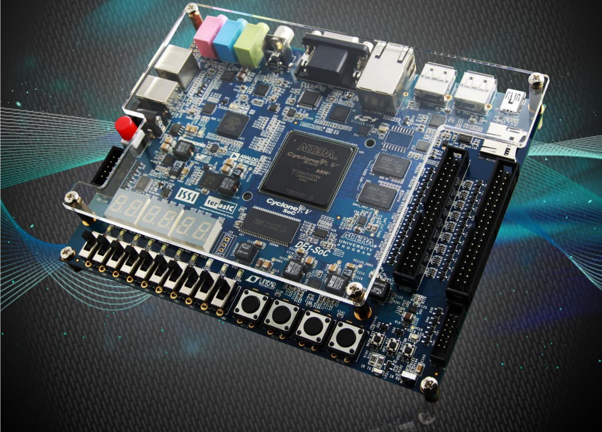

# Chapter 1 DE1-SoC Development Kit .. 4

1.1 Package Contents ... /   
1.2 DE1-SoC System CD ..   
1.3 Getting Help .. 5

# Chapter 2 Introduction of the DE1-SoC Board . 6

2.1 Layout and Components. 6   
2.2 Block Diagram of the DE1-SoC Board. 8

# Chapter 3 Using the DE1-SoC Board . . 12

3.1 Settings of FPGA Configuration Mode . .12   
3.2 Configuration of Cyclone V SoC FPGA on DE1-SoC. .13   
3.3 Board Status Elements. .19   
3.4 Board Reset Elements .20   
3.5 Clock Circuitry. .21   
3.6 Peripherals Connected to the FPGA.. .23   
3.6.1 User Push-buttons, Switches and LEDs . .23   
3.6.2 7-segment Displays . 26   
3.6.3 2x20 GPIO Expansion Headers.. .28   
3.6.4 24-bit Audio CODEC . .30   
3.6.5 I2C Multiplexer .. .31   
3.6.6 VGA . .32   
3.6.7 TV Decoder .. .35   
3.6.8 IR Receiver.. .37   
3.6.9 IR Emitter LED . .37

3.6.10 SDRAM Memory . . 38   
3.6.11 PS/2 Serial Port.. . 40   
3.6.12 A/D Converter and 2x5 Header . . 42   
3.7 Peripherals Connected to Hard Processor System (HPS).. .43   
3.7.1 User Push-buttons and LEDs. . 43   
3.7.2 Gigabit Ethernet.... .44   
3.7.3 UART . .45   
3.7.4 DDR3 Memory.. .. 46   
3.7.5 Micro SD Card Socket.. .48   
3.7.6 2-port USB Host .. .49   
3.7.7 G-sensor.. .50   
3.7.8 LTC Connector .. .51

# Chapter 4 DE1-SoC System Builder ..... . 53

4.1 Introduction . . 53   
4.2 Design Flow .. .53   
4.3 Using DE1-SoC System Builder . .54

# Chapter 5 Examples For FPGA . .. 60

5.1 DE1-SoC Factory Configuration. . 60   
5.2 Audio Recording and Playing ....... ... 61   
5.3 Karaoke Machine .. .. 64   
5.4 SDRAM Test in Nios II.. .. 66   
5.5 SDRAM Test in Verilog . .69   
5.6 TV Box Demonstration . .71   
5.7 PS/2 Mouse Demonstration. .73   
5.8 IR Emitter LED and Receiver Demonstration . .76   
5.9 ADC Reading . .82

# Chapter 6 Examples for HPS SoC .. . 87

6.1 Hello Program ..... .87   
6.2 Users LED and KEY. . 89   
6.3 I2C Interfaced G-sensor . . 95   
6.4 I2C MUX Test. .98

# Chapter 7 Examples for using both HPS SoC and FGPA .. . 101

7.1 HPS Control LED and HEX.. ..101   
7.2 DE1-SoC Control Panel . .105   
7.3 DE1-SoC Linux Frame Buffer Project. .105

# Chapter 8 Programming the EPCS Device ...... .. 107

8.1 Before Programming Begins. ..107   
8.2 Convert .SOF File to .JIC File.. .107   
8.3 Write JIC File into the EPCS Device . 112   
8.4 Erase the EPCS Device .. . 114   
8.5 Nios II Boot from EPCS Device in Quartus II v16.0 .. . 115

# Chapter 9 Appendix .... . 116

9.1 Revision History.. . 116   
9.2 Copyright Statement. . 116

# Chapter 1

# DE1-SoC

# Development Kit

The DE1-SoC Development Kit presents a robust hardware design platform built around the Altera System-on-Chip (SoC) FPGA, which combines the latest dual-core Cortex-A9 embedded cores with industry-leading programmable logic for ultimate design flexibility. Users can now leverage the power of tremendous re-configurability paired with a high-performance, low-power processor system. Altera’s SoC integrates an ARM-based hard processor system (HPS) consisting of processor, peripherals and memory interfaces tied seamlessly with the FPGA fabric using a high-bandwidth interconnect backbone. The DE1-SoC development board is equipped with high-speed DDR3 memory, video and audio capabilities, Ethernet networking, and much more that promise many exciting applications.

The DE1-SoC Development Kit contains all the tools needed to use the board in conjunction with a computer that runs the Microsoft Windows XP or later.

# 1.1 Package Contents

Figure 1-1 shows a photograph of the DE1-SoC package.

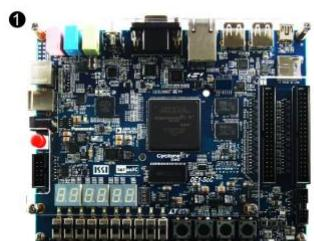

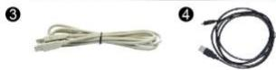

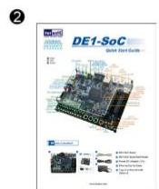

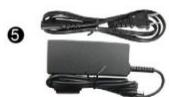  
Figure 1-1 The DE1-SoC package contents

DE1-SoC Board   
②DE1-SoC Quick Start Guide   
TypeAtoBUSB Cable   
TypeAtoMini-BUSBCable   
Power DC Adapter(12V)

The DE1-SoC package includes:

• The DE1-SoC development board   
• DE1-SoC Quick Start Guide   
• USB cable (Type A to B) for FPGA programming and control   
• USB cable (Type A to Mini-B) for UART control   
• 12V DC power adapter

# 1.2 DE1-SoC System CD

The DE1-SoC System CD contains all the documents and supporting materials associated with DE1-SoC, including the user manual, system builder, reference designs, and device datasheets. Users can download this system CD from the link: http://cd-de1-soc.terasic.com.

# 1.3 Getting Help

Here are the addresses where you can get help if you encounter any problems:

• Altera Corporation   
• 101 Innovation Drive San Jose, California, 95134 USA

Email: university@altera.com

• Terasic Technologies   
• 9F., No.176, Sec.2, Gongdao 5th Rd, East Dist, Hsinchu City, 30070. Taiwan

Email: support@terasic.com

Tel.: +886-3-575-0880

Website: de1-soc.terasic.com

This chapter provides an introduction to the features and design characteristics of the board.

# 2.1 Layout and Components

Figure 2-1 shows a photograph of the board. It depicts the layout of the board and indicates the location of the connectors and key components.

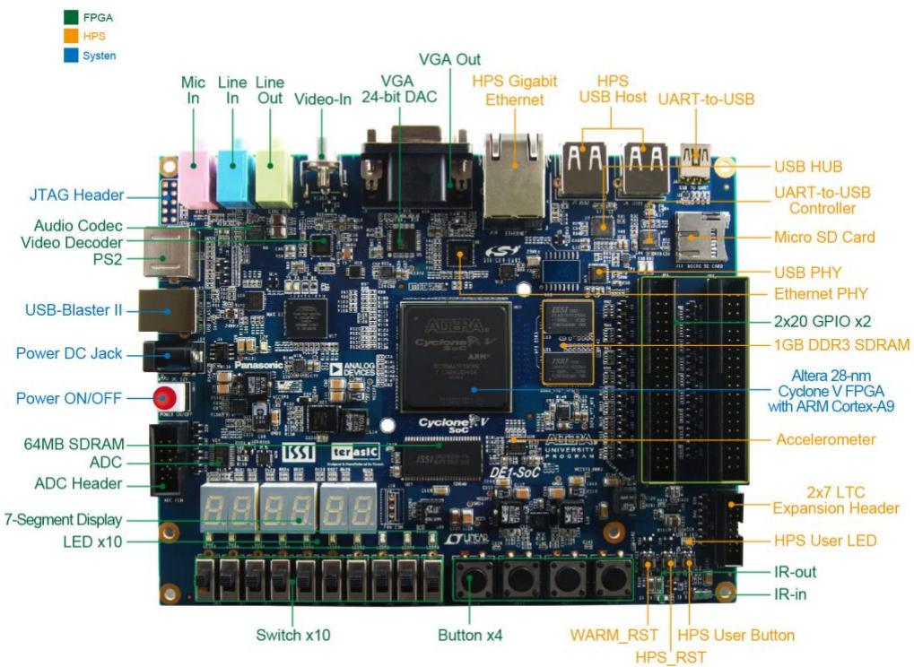  
Figure 2-1 DE1-SoC development board (top view)

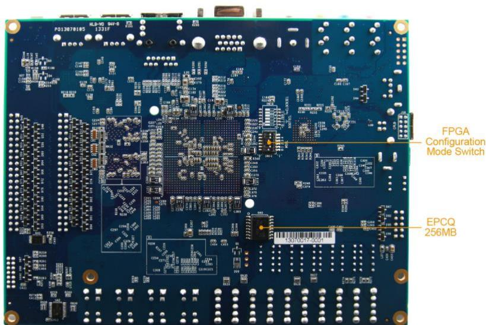  
Figure 2-2 De1-SoC development board (bottom view)

The DE1-SoC board has many features that allow users to implement a wide range of designed circuits, from simple circuits to various multimedia projects.

The following hardware is provided on the board:

# ◼ FPGA

• Altera Cyclone® V SE 5CSEMA5F31C6N device   
• Altera serial configuration device – EPCS128   
• USB-Blaster II onboard for programming; JTAG Mode   
• 64MB SDRAM (16-bit data bus)   
• 4 push-buttons   
• 10 slide switches   
• 10 red user LEDs   
• Six 7-segment displays   
• Four 50MHz clock sources from the clock generator   
• 24-bit CD-quality audio CODEC with line-in, line-out, and microphone-in jacks   
• VGA DAC (8-bit high-speed triple DACs) with VGA-out connector   
• TV decoder (NTSC/PAL/SECAM) and TV-in connector   
• PS/2 mouse/keyboard connector   
• IR receiver and IR emitter   
• Two 40-pin expansion header with diode protection   
• A/D converter, 4-pin SPI interface with FPGA

# ◼ HPS (Hard Processor System)

• 800MHz Dual-core ARM Cortex-A9 MPCore processor   
• 1GB DDR3 SDRAM (32-bit data bus)   
• 1 Gigabit Ethernet PHY with RJ45 connector   
• 2-port USB Host, normal Type-A USB connector   
• Micro SD card socket   
• Accelerometer (I2C interface $^ +$ interrupt)   
• UART to USB, USB Mini-B connector   
• Warm reset button and cold reset button   
• One user button and one user LED   
• LTC 2x7 expansion header

# 2.2 Block Diagram of the DE1-SoC Board

Figure 2-3 is the block diagram of the board. All the connections are established through the Cyclone V SoC FPGA device to provide maximum flexibility for users. Users can configure the FPGA to implement any system design.

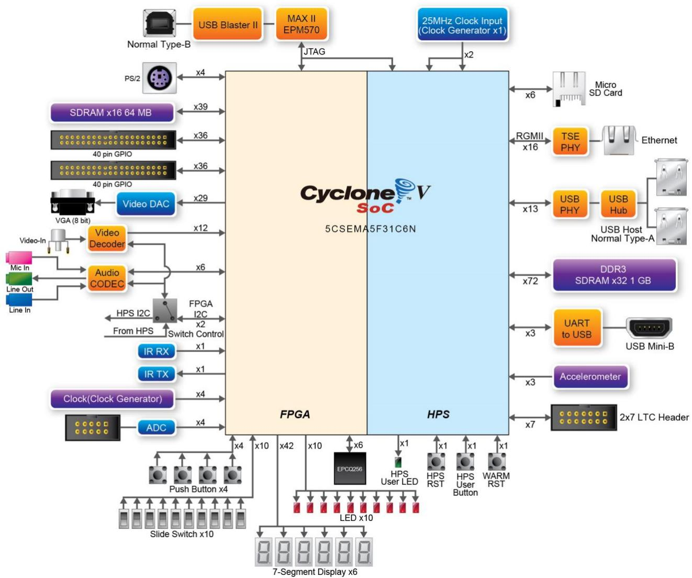  
Figure 2-3 Block diagram of DE1-SoC

Detailed information about Figure 2-3 are listed below.

# FPGA Device

• Cyclone V SoC 5CSEMA5F31 Device   
• Dual-core ARM Cortex-A9 (HPS)   
• 85K programmable logic elements   
• 4,450 Kbits embedded memory   
• 6 fractional PLLs   
• 2 hard memory controllers

# Configuration and Debug

• Quad serial configuration device – EPCS128 on FPGA   
• Onboard USB-Blaster II (normal type B USB connector)

# Memory Device

• 64MB (32Mx16) SDRAM on FPGA   
• 1GB (2x256Mx16) DDR3 SDRAM on HPS   
• Micro SD card socket on HPS

# Communication

• Two port USB 2.0 Host (ULPI interface with USB type A connector)   
• UART to USB (USB Mini-B connector)   
• 10/100/1000 Ethernet   
• PS/2 mouse/keyboard   
• IR emitter/receiver   
• I2C multiplexer

# Connectors

• Two 40-pin expansion headers   
• One 10-pin ADC input header   
• One LTC connector (one Serial Peripheral Interface (SPI) Master ,one I2C and one GPIO interface )

# Display

• 24-bit VGA DAC

# Audio

• 24-bit CODEC, Line-in, Line-out, and microphone-in jacks

# Video Input

• TV decoder (NTSC/PAL/SECAM) and TV-in connector

# ADC

• Interface: SPI   
• Fast throughput rate: 500 KSPS   
• Channel number: 8   
• Resolution: 12-bit   
• Analog input range : 0 ~ 4.096

# Switches, Buttons, and Indicators

• 5 user Keys (FPGA x4, HPS x1)   
• 10 user switches (FPGA x10)   
• 11 user LEDs (FPGA x10, HPS x 1)   
• 2 HPS reset buttons (HPS_RESET_n and HPS_WARM_RST_n)   
• Six 7-segment displays

# Sensors

• G-Sensor on HPS

# Power

• 12V DC input

This chapter provides an instruction to use the board and describes the peripherals.

# 3.1 Settings of FPGA Configuration Mode

When the DE1-SoC board is powered on, the FPGA can be configured from EPCS or HPS. The MSEL[4:0] pins are used to select the configuration scheme. It is implemented as a 6-pin DIP switch SW10 on the DE1-SoC board, as shown in Figure 3-1.

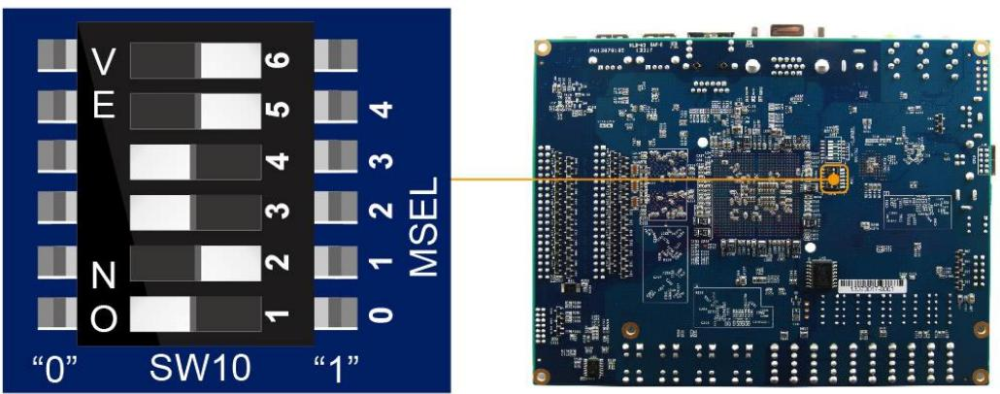  
Figure 3-1 DIP switch (SW10) setting of Active Serial (AS) mode at the back of DE1-SoC board

Table 3-1 shows the relation between MSEL[4:0] and DIP switch (SW10).

Table 3-1 FPGA Configuration Mode Switch (SW10)   

<table><tr><td>Board Reference</td><td>Signal Name</td><td>Description</td><td>Default</td></tr><tr><td>SW10.1</td><td>MSEL0</td><td rowspan="5">Use these pins to set the FPGA Configuration scheme</td><td>ON (“0”)</td></tr><tr><td>SW10.2</td><td>MSEL1</td><td>OFF (“1”)</td></tr><tr><td>SW10.3</td><td>MSEL2</td><td>ON (“0”)</td></tr><tr><td>SW10.4</td><td>MSEL3</td><td>ON (“0”)</td></tr><tr><td>SW10.5</td><td>MSEL4</td><td>OFF (“1”)</td></tr><tr><td>SW10.6</td><td>N/A</td><td>N/A</td><td>N/A</td></tr></table>

Figure 3-1 shows MSEL[4:0] setting of AS mode, which is also the default setting on DE1-SoC. When the board is powered on, the FPGA is configured from EPCS, which is pre-programmed with the default code. If developers wish to reconfigure FPGA from an application software running on Linux, the MSEL[4:0] needs to be set to $^ { 6 } 0 1 0 1 0 ^ { 9 }$ before the programming process begins. If developers using the "Linux Console with frame buffer" or "Linux LXDE Desktop" SD Card image, the MSEL[4:0] needs to be set to $" 0 0 0 0 0 "$ before the board is powered on.

Table 3-2 MSEL Pin Settings for FPGA Configure of DE1-SoC   

<table><tr><td>MSEL[4:0]</td><td>Configure Scheme</td><td>Description</td></tr><tr><td>10010</td><td>AS</td><td>FPGA configured from EPCS (default)</td></tr><tr><td>01010</td><td>FPPx32</td><td>FPGA configured from HPS software: Linux</td></tr><tr><td>00000</td><td>FPPx16</td><td>FPGA configured from HPS software: U-Boot, with image stored on the SD card, like LXDE Desktop or console Linux with frame buffer edition.</td></tr></table>

# 3.2 Configuration of Cyclone V SoC FPGA on DE1-SoC

There are two types of programming method supported by DE1-SoC:

1. JTAG programming: It is named after the IEEE standards Joint Test Action Group.

The configuration bit stream is downloaded directly into the Cyclone V SoC FPGA. The FPGA will retain its current status as long as the power keeps applying to the board; the configuration information will be lost when the power is off.

2. AS programming: The other programming method is Active Serial configuration.

The configuration bit stream is downloaded into the quad serial configuration device (EPCS128), which provides non-volatile storage for the bit stream. The information is retained within EPCS128

even if the DE1-SoC board is turned off. When the board is powered on, the configuration data in the EPCS128 device is automatically loaded into the Cyclone V SoC FPGA.

# JTAG Chain on DE1-SoC Board

The FPGA device can be configured through JTAG interface on DE1-SoC board, but the JTAG chain must form a closed loop, which allows Quartus II programmer to the detect FPGA device.

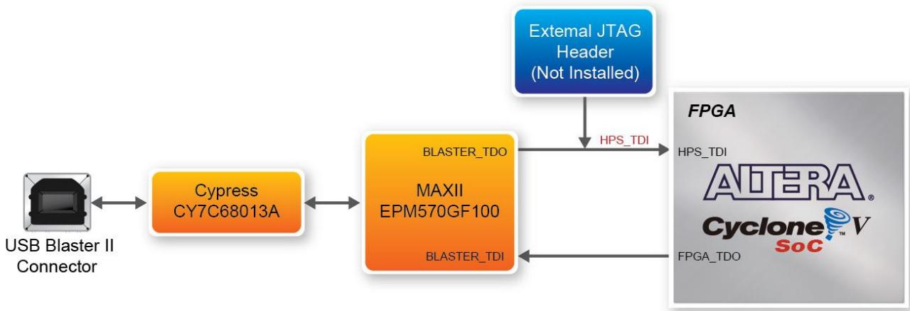  
Figure 3-2 illustrates the JTAG chain on DE1-SoC board.   
Figure 3-2 Path of the JTAG chain

# ◼ Configure the FPGA in JTAG Mode

There are two devices (FPGA and HPS) on the JTAG chain. The following shows how the FPGA is programmed in JTAG mode step by step.

1. Open the Quartus II programmer and click “Auto Detect”, as circled in Figure 3-3

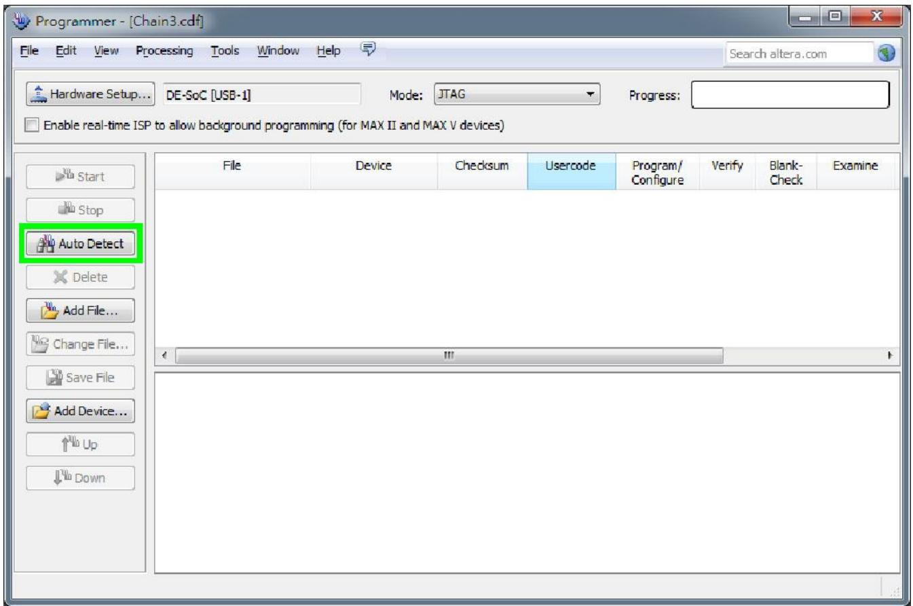  
Figure 3-3 Detect FPGA device in JTAG mode

2. Select detected device associated with the board, as circled in Figure 3-4.

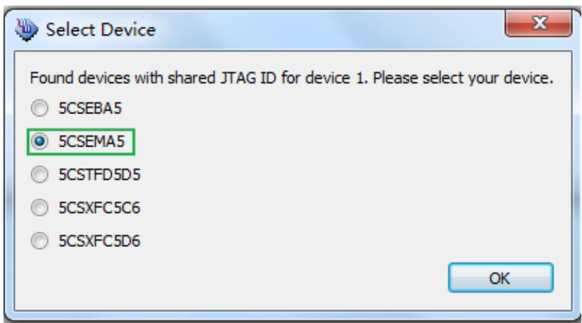  
Figure 3-4 Select 5CSEMA5 device

3. Both FPGA and HPS are detected, as shown in Figure 3-5.

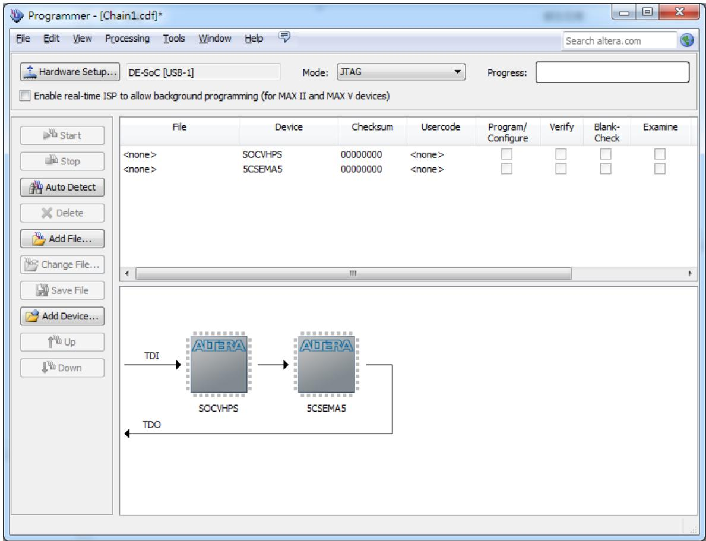  
Figure 3-5 FPGA and HPS detected in Quartus programmer

4. Right click on the FPGA device and open the .sof file to be programmed, as highlighted in Figure 3-6.

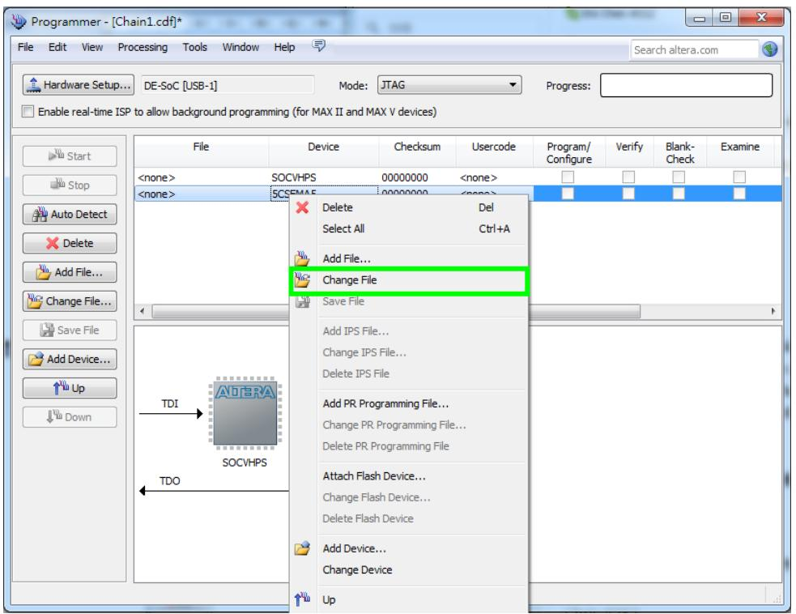  
Figure 3-6 Open the .sof file to be programmed into the FPGA device

5. Select the .sof file to be programmed, as shown in Figure 3-7.

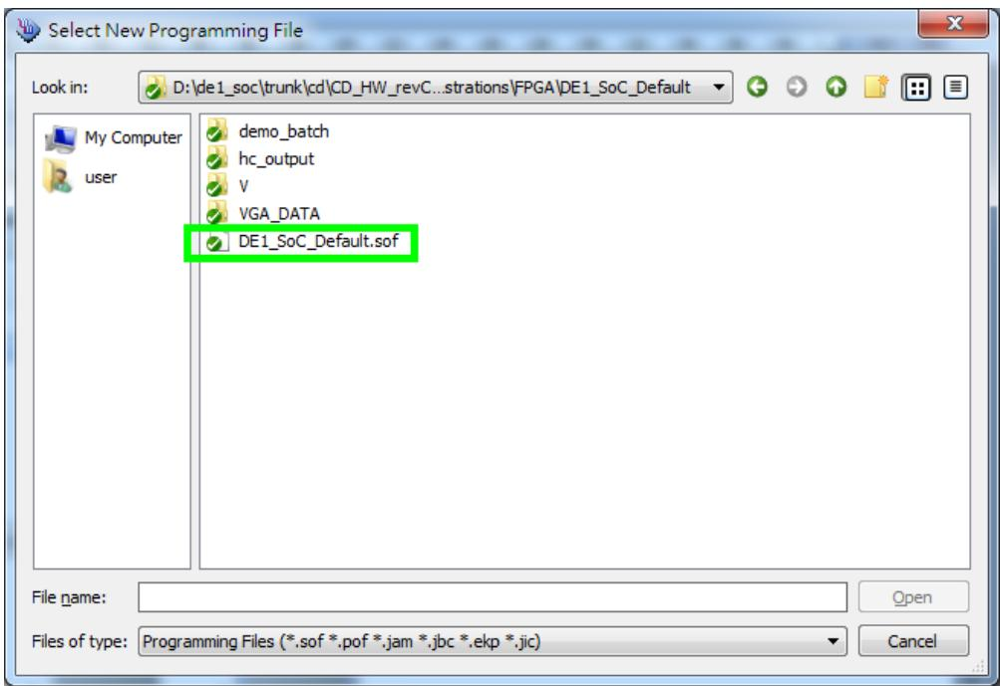  
Figure 3-7 Select the .sof file to be programmed into the FPGA device

6. Click “Program/Configure” check box and then click “Start” button to download the .sof file into the FPGA device, as shown in Figure 3-8.

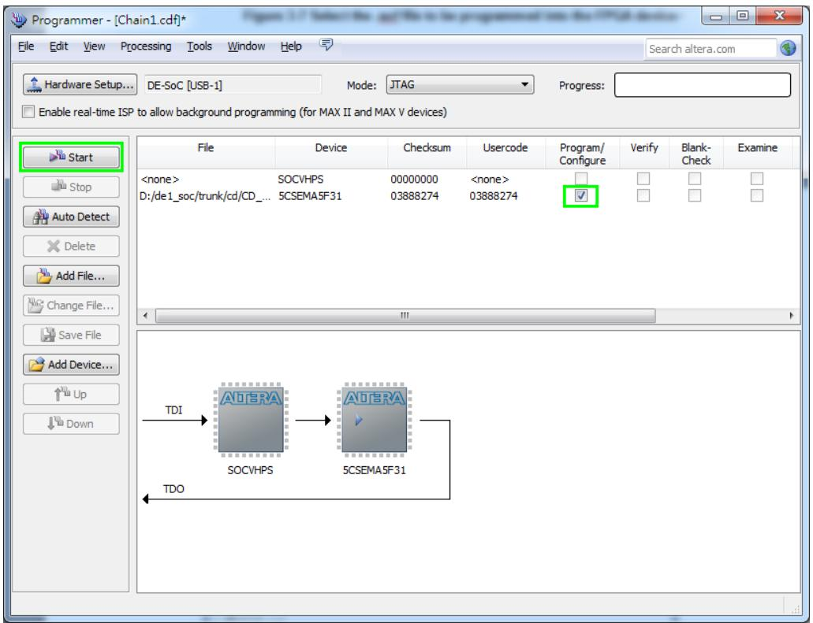  
Figure 3-8 Program .sof file into the FPGA device

# Configure the FPGA in AS Mode

• The DE1-SoC board uses a quad serial configuration device (EPCS128) to store configuration data for the Cyclone V SoC FPGA. This configuration data is automatically loaded from the quad serial configuration device chip into the FPGA when the board is powered up.   
• Users need to use Serial Flash Loader (SFL) to program the quad serial configuration device via JTAG interface. The FPGA-based SFL is a soft intellectual property (IP) core within the FPGA that bridge the JTAG and Flash interfaces. The SFL Megafunction is available in Quartus II. Figure 3-9 shows the programming method when adopting SFL solution.   
• Please refer to Chapter 9: Steps of Programming the Quad Serial Configuration Device for the basic programming instruction on the serial configuration device.

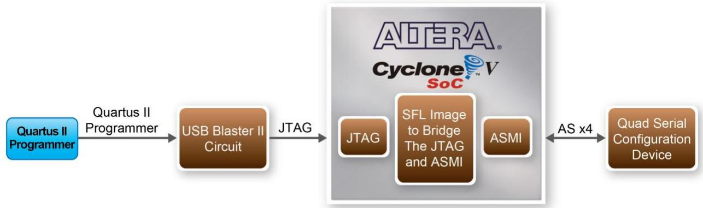  
Figure 3-9 Programming a quad serial configuration device with SFL solution

# 3.3 Board Status Elements

In addition to the 10 LEDs that FPGA device can control, there are 5 indicators which can indicate the board status (See Figure 3-10), please refer the details in Table 3-3

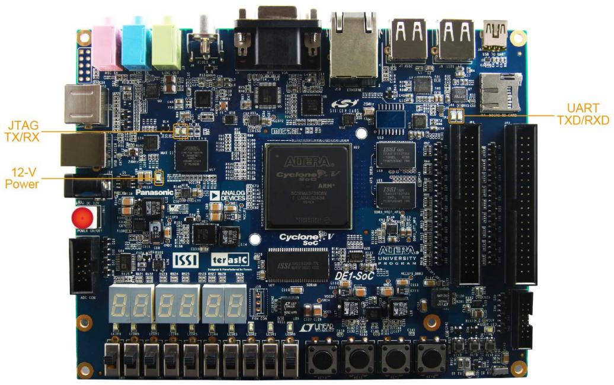  
Figure 3-10 LED Indicators on DE1-SoC

Table 3-3 LED Indicators   

<table><tr><td>Board Reference</td><td>LED Name</td><td>Description</td></tr><tr><td>D14</td><td>12-V Power</td><td>Illuminate when 12V power is active.</td></tr><tr><td>TXD</td><td>UART TXD</td><td>Illuminate when data is transferred from FT232R to USB Host.</td></tr><tr><td>RXD</td><td>UART RXD</td><td>Illuminate when data is transferred from USB Host to FT232R.</td></tr><tr><td>D5</td><td>JTAG_RX</td><td rowspan="2">Reserved</td></tr><tr><td>D4</td><td>JTAG_TX</td></tr></table>

# 3.4 Board Reset Elements

There are two HPS reset buttons on DE1-SoC, HPS (cold) reset and HPS warm reset, as shown in Figure 3-11. Table 3-4 describes the purpose of these two HPS reset buttons. Figure 3-12 is the reset tree for DE1-SoC.

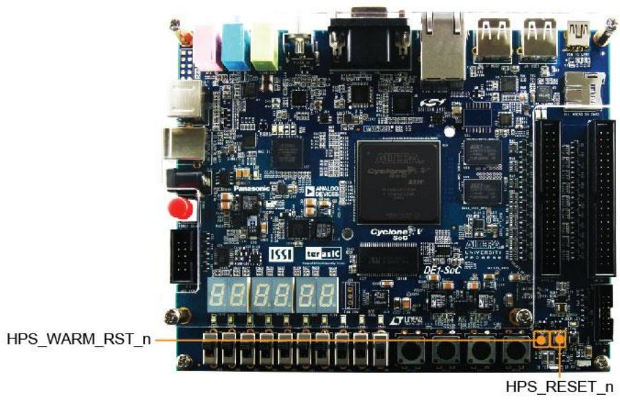  
Figure 3-11 HPS cold reset and warm reset buttons on DE1-SoC

Table 3-4 Description of Two HPS Reset Buttons on DE1-SoC   

<table><tr><td>Board Reference</td><td>Signal Name</td><td>Description</td></tr><tr><td>KEY5</td><td>HPS_RESET_N</td><td>Cold reset to the HPS, Ethernet PHY and USB host device. Active low input which resets all HPS logics that can be reset.</td></tr><tr><td>KEY7</td><td>HPS_WARM_RST_N</td><td>Warm reset to the HPS block. Active low input affects the system reset domain for debug purpose.</td></tr></table>

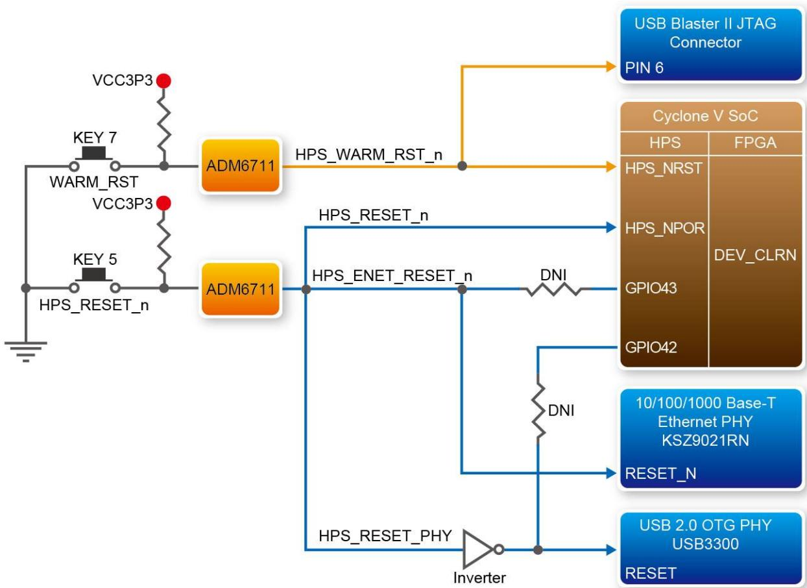  
Figure 3-12 HPS reset tree on DE1-SoC board

# 3.5 Clock Circuitry

Figure 3-13 shows the default frequency of all external clocks to the Cyclone V SoC FPGA. A clock generator is used to distribute clock signals with low jitter. The four 50MHz clock signals connected to the FPGA are used as clock sources for user logic. One 25MHz clock signal is connected to two HPS clock inputs, and the other one is connected to the clock input of Gigabit

Ethernet Transceiver. Two 24MHz clock signals are connected to the clock inputs of USB Host/OTG PHY and USB hub controller. The associated pin assignment for clock inputs to FPGA I/O pins is listed in Table 3-5.

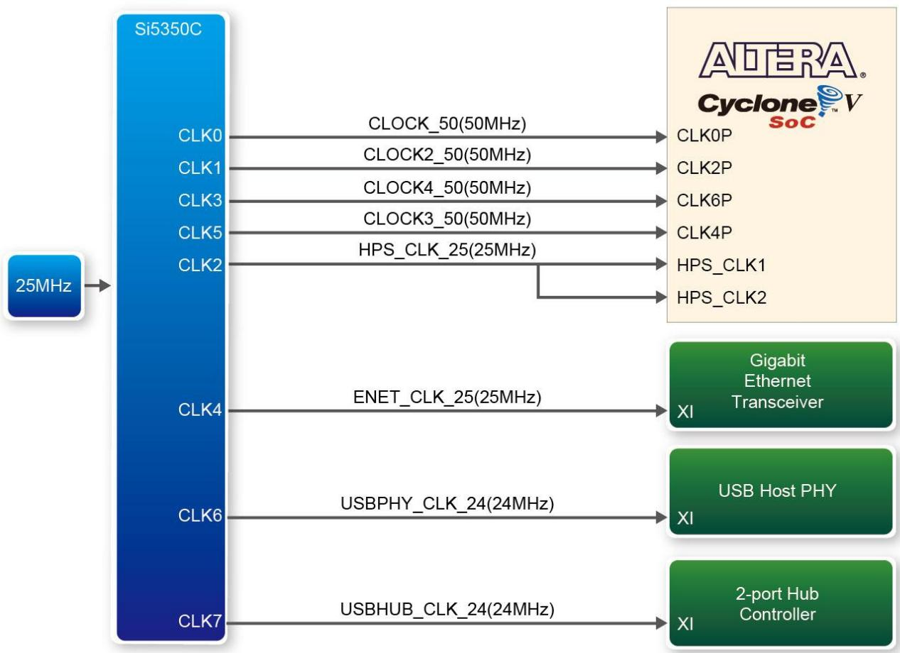  
Figure 3-13 Block diagram of the clock distribution on DE1-SoC

Table 3-5 Pin Assignment of Clock Inputs   

<table><tr><td>Signal Name</td><td>FPGA Pin No.</td><td>Description</td><td>I/O Standard</td></tr><tr><td>CLOCK_50</td><td>PIN_AF14</td><td>50 MHz clock input</td><td>3.3V</td></tr><tr><td>CLOCK2_50</td><td>PIN_AA16</td><td>50 MHz clock input</td><td>3.3V</td></tr><tr><td>CLOCK3_50</td><td>PIN_Y26</td><td>50 MHz clock input</td><td>3.3V</td></tr><tr><td>CLOCK4_50</td><td>PIN_K14</td><td>50 MHz clock input</td><td>3.3V</td></tr><tr><td>HPS_CLOCK1_25</td><td>PIN_D25</td><td>25 MHz clock input</td><td>3.3V</td></tr><tr><td>HPS_CLOCK2_25</td><td>PIN_F25</td><td>25 MHz clock input</td><td>3.3V</td></tr></table>

# 3.6 Peripherals Connected to the FPGA

This section describes the interfaces connected to the FPGA. Users can control or monitor different interfaces with user logic from the FPGA.

# 3.6.1 User Push-buttons, Switches and LEDs

The board has four push-buttons connected to the FPGA, as shown in Figure 3-14 Connections between the push-buttons and the Cyclone V SoC FPGA. Schmitt trigger circuit is implemented and act as switch debounce in Figure 3-15 for the push-buttons connected. The four push-buttons named KEY0, KEY1, KEY2, and KEY3 coming out of the Schmitt trigger device are connected directly to the Cyclone V SoC FPGA. The push-button generates a low logic level or high logic level when it is pressed or not, respectively. Since the push-buttons are debounced, they can be used as clock or reset inputs in a circuit.

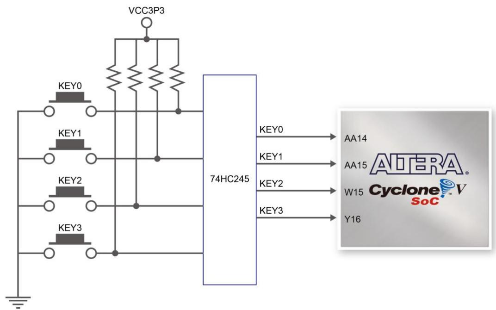  
Figure 3-14 Connections between the push-buttons and the Cyclone V SoC FPGA

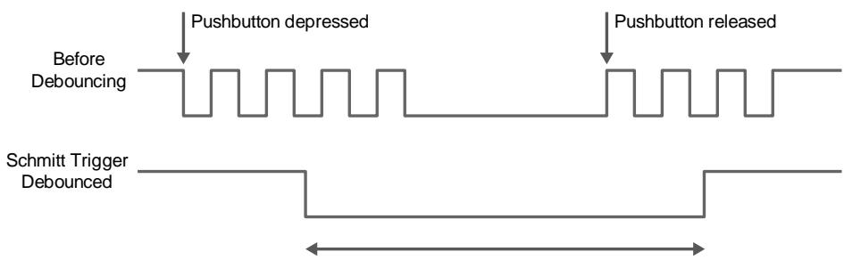  
Figure 3-15 Switch debouncing

There are ten slide switches connected to the FPGA, as shown in Figure 3-16. These switches are not debounced and to be used as level-sensitive data inputs to a circuit. Each switch is connected directly and individually to the FPGA. When the switch is set to the DOWN position (towards the edge of the board), it generates a low logic level to the FPGA. When the switch is set to the UP position, a high logic level is generated to the FPGA.

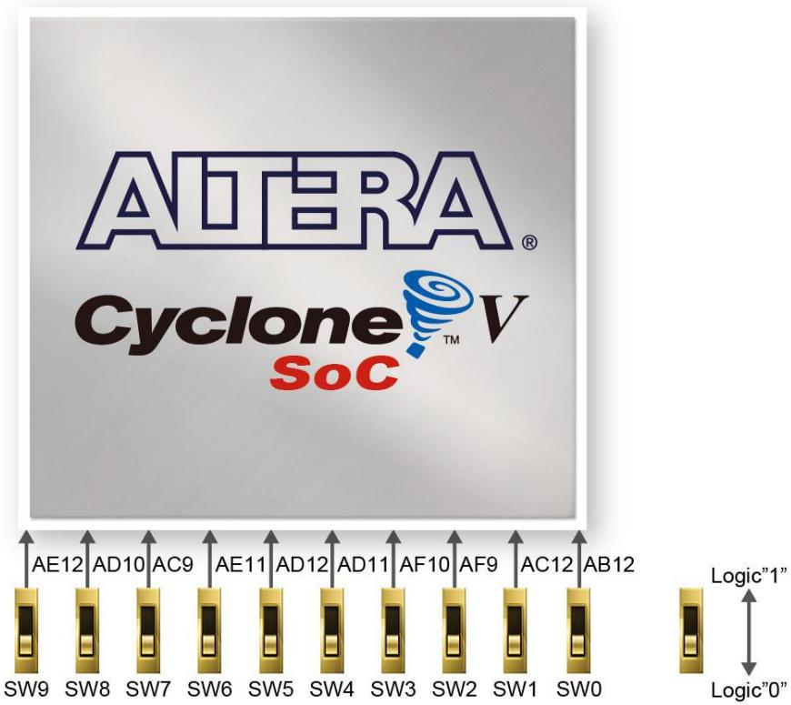  
Figure 3-16 Connections between the slide switches and the Cyclone V SoC FPGA

There are also ten user-controllable LEDs connected to the FPGA. Each LED is driven directly and individually by the Cyclone V SoC FPGA; driving its associated pin to a high logic level or low

level to turn the LED on or off, respectively. Figure 3-17 shows the connections between LEDs and Cyclone V SoC FPGA. Table 3-6, Table 3-7 and Table 3-8 list the pin assignment of user push-buttons, switches, and LEDs.

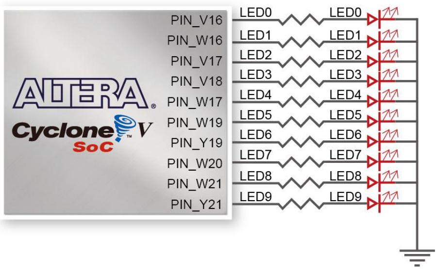  
Figure 3-17 Connections between the LEDs and the Cyclone V SoC FPGA

Table 3-6 Pin Assignment of Slide Switches   

<table><tr><td>Signal Name</td><td>FPGA Pin No.</td><td>Description</td><td>I/O Standard</td></tr><tr><td>SW[0]</td><td>PIN_AB12</td><td>Slide Switch[0]</td><td>3.3V</td></tr><tr><td>SW[1]</td><td>PIN ACPI12</td><td>Slide Switch[1]</td><td>3.3V</td></tr><tr><td>SW[2]</td><td>PIN_AF9</td><td>Slide Switch[2]</td><td>3.3V</td></tr><tr><td>SW[3]</td><td>PIN_AF10</td><td>Slide Switch[3]</td><td>3.3V</td></tr><tr><td>SW[4]</td><td>PIN_AD11</td><td>Slide Switch[4]</td><td>3.3V</td></tr><tr><td>SW[5]</td><td>PIN_AD12</td><td>Slide Switch[5]</td><td>3.3V</td></tr><tr><td>SW[6]</td><td>PIN_AE11</td><td>Slide Switch[6]</td><td>3.3V</td></tr><tr><td>SW[7]</td><td>PIN ACPI9</td><td>Slide Switch[7]</td><td>3.3V</td></tr><tr><td>SW[8]</td><td>PIN_AD10</td><td>Slide Switch[8]</td><td>3.3V</td></tr><tr><td>SW[9]</td><td>PIN_AE12</td><td>Slide Switch[9]</td><td>3.3V</td></tr></table>

Table 3-7 Pin Assignment of Push-buttons   

<table><tr><td>Signal Name</td><td>FPGA Pin No.</td><td>Description</td><td>I/O Standard</td></tr><tr><td>KEY[0]</td><td>PIN_AA14</td><td>Push-button[0]</td><td>3.3V</td></tr><tr><td>KEY[1]</td><td>PIN_AA15</td><td>Push-button[1]</td><td>3.3V</td></tr><tr><td>KEY[2]</td><td>PIN_W15</td><td>Push-button[2]</td><td>3.3V</td></tr><tr><td>KEY[3]</td><td>PIN_Y16</td><td>Push-button[3]</td><td>3.3V</td></tr></table>

Table 3-8 Pin Assignment of LEDs   

<table><tr><td>Signal Name</td><td>FPGA Pin No.</td><td>Description</td><td>I/O Standard</td></tr><tr><td>LEDR[0]</td><td>PIN_V16</td><td>LED [0]</td><td>3.3V</td></tr><tr><td>LEDR[1]</td><td>PIN_W16</td><td>LED [1]</td><td>3.3V</td></tr><tr><td>LEDR[2]</td><td>PIN_V17</td><td>LED [2]</td><td>3.3V</td></tr><tr><td>LEDR[3]</td><td>PIN_V18</td><td>LED [3]</td><td>3.3V</td></tr><tr><td>LEDR[4]</td><td>PIN_W17</td><td>LED [4]</td><td>3.3V</td></tr><tr><td>LEDR[5]</td><td>PIN_W19</td><td>LED [5]</td><td>3.3V</td></tr><tr><td>LEDR[6]</td><td>PIN_Y19</td><td>LED [6]</td><td>3.3V</td></tr><tr><td>LEDR[7]</td><td>PIN_W20</td><td>LED [7]</td><td>3.3V</td></tr><tr><td>LEDR[8]</td><td>PIN_W21</td><td>LED [8]</td><td>3.3V</td></tr><tr><td>LEDR[9]</td><td>PIN_Y21</td><td>LED [9]</td><td>3.3V</td></tr></table>

# 3.6.2 7-segment Displays

The DE1-SoC board has six 7-segment displays. These displays are paired to display numbers in various sizes. Figure 3-18 shows the connection of seven segments (common anode) to pins on Cyclone V SoC FPGA. The segment can be turned on or off by applying a low logic level or high logic level from the FPGA, respectively.

Each segment in a display is indexed from 0 to 6, with corresponding positions given in Figure 3-18. Table 3-9 shows the pin assignment of FPGA to the 7-segment displays.

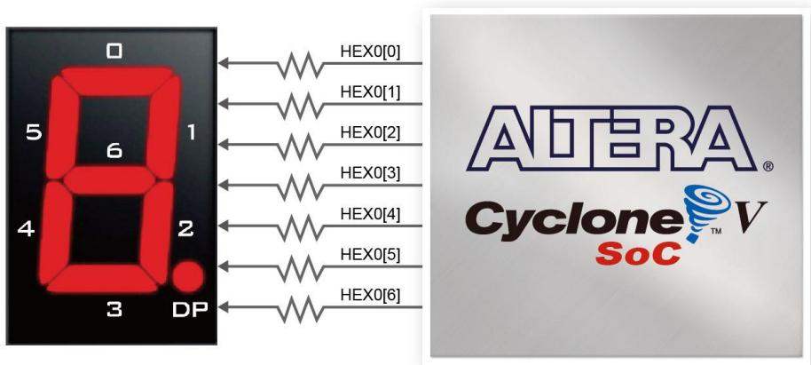  
Figure 3-18 Connections between the 7-segment display HEX0 and the Cyclone V SoC FPGA

Table 3-9 Pin Assignment of 7-segment Displays   

<table><tr><td>Signal Name</td><td>FPGA Pin No.</td><td>Description</td><td>I/O Standard</td></tr><tr><td>HEX0[0]</td><td>PIN_AE26</td><td>Seven Segment Digit 0[0]</td><td>3.3V</td></tr><tr><td>HEX0[1]</td><td>PIN_AE27</td><td>Seven Segment Digit 0[1]</td><td>3.3V</td></tr><tr><td>HEX0[2]</td><td>PIN_AE28</td><td>Seven Segment Digit 0[2]</td><td>3.3V</td></tr><tr><td>HEX0[3]</td><td>PIN_AG27</td><td>Seven Segment Digit 0[3]</td><td>3.3V</td></tr><tr><td>HEX0[4]</td><td>PIN_AF28</td><td>Seven Segment Digit 0[4]</td><td>3.3V</td></tr><tr><td>HEX0[5]</td><td>PIN_AG28</td><td>Seven Segment Digit 0[5]</td><td>3.3V</td></tr><tr><td>HEX0[6]</td><td>PIN_AH28</td><td>Seven Segment Digit 0[6]</td><td>3.3V</td></tr><tr><td>HEX1[0]</td><td>PIN_AJ29</td><td>Seven Segment Digit 1[0]</td><td>3.3V</td></tr><tr><td>HEX1[1]</td><td>PIN_AH29</td><td>Seven Segment Digit 1[1]</td><td>3.3V</td></tr><tr><td>HEX1[2]</td><td>PIN_AH30</td><td>Seven Segment Digit 1[2]</td><td>3.3V</td></tr><tr><td>HEX1[3]</td><td>PIN_AG30</td><td>Seven Segment Digit 1[3]</td><td>3.3V</td></tr><tr><td>HEX1[4]</td><td>PIN_AF29</td><td>Seven Segment Digit 1[4]</td><td>3.3V</td></tr><tr><td>HEX1[5]</td><td>PIN_AF30</td><td>Seven Segment Digit 1[5]</td><td>3.3V</td></tr><tr><td>HEX1[6]</td><td>PIN_AD27</td><td>Seven Segment Digit 1[6]</td><td>3.3V</td></tr><tr><td>HEX2[0]</td><td>PIN_AB23</td><td>Seven Segment Digit 2[0]</td><td>3.3V</td></tr><tr><td>HEX2[1]</td><td>PIN_AE29</td><td>Seven Segment Digit 2[1]</td><td>3.3V</td></tr><tr><td>HEX2[2]</td><td>PIN_AD29</td><td>Seven Segment Digit 2[2]</td><td>3.3V</td></tr><tr><td>HEX2[3]</td><td>PIN_AC28</td><td>Seven Segment Digit 2[3]</td><td>3.3V</td></tr><tr><td>HEX2[4]</td><td>PIN_AD30</td><td>Seven Segment Digit 2[4]</td><td>3.3V</td></tr><tr><td>HEX2[5]</td><td>PIN_AC29</td><td>Seven Segment Digit 2[5]</td><td>3.3V</td></tr><tr><td>HEX2[6]</td><td>PIN_AC30</td><td>Seven Segment Digit 2[6]</td><td>3.3V</td></tr><tr><td>HEX3[0]</td><td>PIN_AD26</td><td>Seven Segment Digit 3[0]</td><td>3.3V</td></tr><tr><td>HEX3[1]</td><td>PIN_AC27</td><td>Seven Segment Digit 3[1]</td><td>3.3V</td></tr><tr><td>HEX3[2]</td><td>PIN_AD25</td><td>Seven Segment Digit 3[2]</td><td>3.3V</td></tr><tr><td>HEX3[3]</td><td>PIN_AC25</td><td>Seven Segment Digit 3[3]</td><td>3.3V</td></tr><tr><td>HEX3[4]</td><td>PIN_AB28</td><td>Seven Segment Digit 3[4]</td><td>3.3V</td></tr><tr><td>HEX3[5]</td><td>PIN_AB25</td><td>Seven Segment Digit 3[5]</td><td>3.3V</td></tr><tr><td>HEX3[6]</td><td>PIN_AB22</td><td>Seven Segment Digit 3[6]</td><td>3.3V</td></tr><tr><td>HEX4[0]</td><td>PIN_AA24</td><td>Seven Segment Digit 4[0]</td><td>3.3V</td></tr><tr><td>HEX4[1]</td><td>PIN_Y23</td><td>Seven Segment Digit 4[1]</td><td>3.3V</td></tr><tr><td>HEX4[2]</td><td>PIN_Y24</td><td>Seven Segment Digit 4[2]</td><td>3.3V</td></tr><tr><td>HEX4[3]</td><td>PIN_W22</td><td>Seven Segment Digit 4[3]</td><td>3.3V</td></tr><tr><td>HEX4[4]</td><td>PIN_W24</td><td>Seven Segment Digit 4[4]</td><td>3.3V</td></tr><tr><td>HEX4[5]</td><td>PIN_V23</td><td>Seven Segment Digit 4[5]</td><td>3.3V</td></tr><tr><td>HEX4[6]</td><td>PIN_W25</td><td>Seven Segment Digit 4[6]</td><td>3.3V</td></tr><tr><td>HEX5[0]</td><td>PIN_V25</td><td>Seven Segment Digit 5[0]</td><td>3.3V</td></tr><tr><td>HEX5[1]</td><td>PIN_AA28</td><td>Seven Segment Digit 5[1]</td><td>3.3V</td></tr><tr><td>HEX5[2]</td><td>PIN_Y27</td><td>Seven Segment Digit 5[2]</td><td>3.3V</td></tr><tr><td>HEX5[3]</td><td>PIN_AB27</td><td>Seven Segment Digit 5[3]</td><td>3.3V</td></tr><tr><td>HEX5[4]</td><td>PIN_AB26</td><td>Seven Segment Digit 5[4]</td><td>3.3V</td></tr><tr><td>HEX5[5]</td><td>PIN_AA26</td><td>Seven Segment Digit 5[5]</td><td>3.3V</td></tr><tr><td>HEX5[6]</td><td>PIN_AA25</td><td>Seven Segment Digit 5[6]</td><td>3.3V</td></tr></table>

# 3.6.3 2x20 GPIO Expansion Headers

The board has two 40-pin expansion headers. Each header has 36 user pins connected directly to the Cyclone V SoC FPGA. It also comes with DC $+ 5 \mathrm { V }$ (VCC5), DC $+ 3 . 3 \mathrm { V }$ (VCC3P3), and two GND pins. The maximum power consumption allowed for a daughter card connected to one or two GPIO ports is shown in Table 3-10.

Table 3-10 Voltage and Max. Current Limit of Expansion Header(s)   

<table><tr><td>Supplied Voltage</td><td>Max. Current Limit</td></tr><tr><td>5V</td><td>1A</td></tr><tr><td>3.3V</td><td>1.5A</td></tr></table>

Each pin on the expansion headers is connected to two diodes and a resistor for protection against high or low voltage level. Figure 3-19 shows the protection circuitry applied to all $2 \mathrm { x } 3 6$ data pins.

Table 3-11 shows the pin assignment of two GPIO headers.

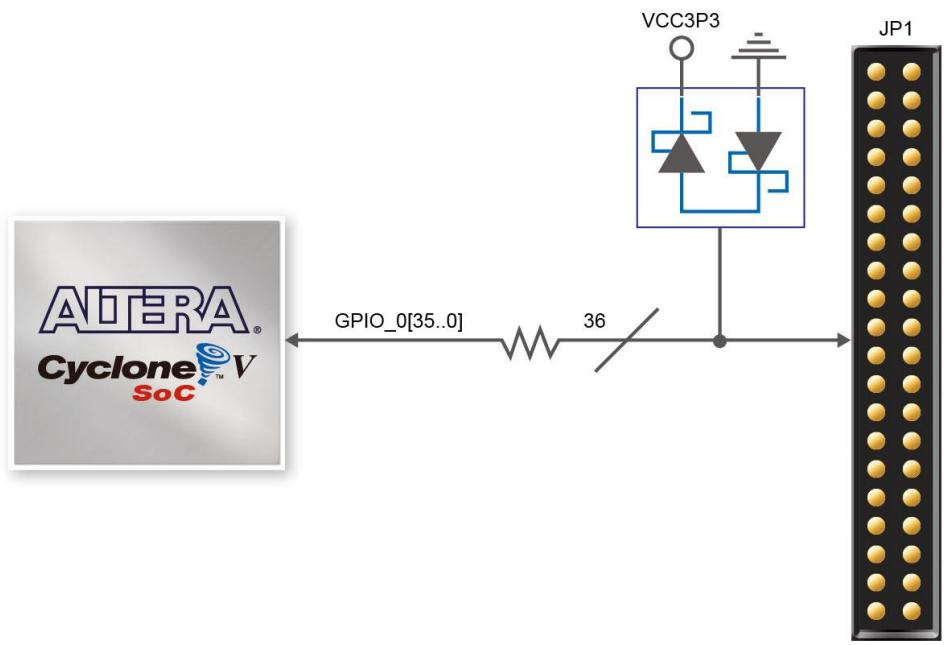  
Figure 3-19 Connections between the GPIO header and Cyclone V SoC FPGA

Table 3-11 Pin Assignment of Expansion Headers   

<table><tr><td>Signal Name</td><td>FPGA Pin No.</td><td>Description</td><td>I/O Standard</td></tr><tr><td>GPIO_0[0]</td><td>PIN_AC18</td><td>GPIO Connection 0[0]</td><td>3.3V</td></tr><tr><td>GPIO_0 [1]</td><td>PIN_Y17</td><td>GPIO Connection 0[1]</td><td>3.3V</td></tr><tr><td>GPIO_0 [2]</td><td>PIN_AD17</td><td>GPIO Connection 0[2]</td><td>3.3V</td></tr><tr><td>GPIO_0 [3]</td><td>PIN_Y18</td><td>GPIO Connection 0[3]</td><td>3.3V</td></tr><tr><td>GPIO_0 [4]</td><td>PIN_AK16</td><td>GPIO Connection 0[4]</td><td>3.3V</td></tr><tr><td>GPIO_0 [5]</td><td>PIN_AK18</td><td>GPIO Connection 0[5]</td><td>3.3V</td></tr><tr><td>GPIO_0 [6]</td><td>PIN_AK19</td><td>GPIO Connection 0[6]</td><td>3.3V</td></tr><tr><td>GPIO_0 [7]</td><td>PIN_AJ19</td><td>GPIO Connection 0[7]</td><td>3.3V</td></tr><tr><td>GPIO_0 [8]</td><td>PIN_AJ17</td><td>GPIO Connection 0[8]</td><td>3.3V</td></tr><tr><td>GPIO_0 [9]</td><td>PIN_AJ16</td><td>GPIO Connection 0[9]</td><td>3.3V</td></tr><tr><td>GPIO_0 [10]</td><td>PIN_AH18</td><td>GPIO Connection 0[10]</td><td>3.3V</td></tr><tr><td>GPIO_0 [11]</td><td>PIN_AH17</td><td>GPIO Connection 0[11]</td><td>3.3V</td></tr><tr><td>GPIO_0 [12]</td><td>PIN_AG16</td><td>GPIO Connection 0[12]</td><td>3.3V</td></tr><tr><td>GPIO_0 [13]</td><td>PIN_AE16</td><td>GPIO Connection 0[13]</td><td>3.3V</td></tr><tr><td>GPIO_0 [14]</td><td>PIN_AF16</td><td>GPIO Connection 0[14]</td><td>3.3V</td></tr><tr><td>GPIO_0 [15]</td><td>PIN_AG17</td><td>GPIO Connection 0[15]</td><td>3.3V</td></tr><tr><td>GPIO_0 [16]</td><td>PIN_AA18</td><td>GPIO Connection 0[16]</td><td>3.3V</td></tr><tr><td>GPIO_0 [17]</td><td>PIN_AA19</td><td>GPIO Connection 0[17]</td><td>3.3V</td></tr><tr><td>GPIO_0 [18]</td><td>PIN_AE17</td><td>GPIO Connection 0[18]</td><td>3.3V</td></tr><tr><td>GPIO_0 [19]</td><td>PIN_AC20</td><td>GPIO Connection 0[19]</td><td>3.3V</td></tr><tr><td>GPIO_0 [20]</td><td>PIN_AH19</td><td>GPIO Connection 0[20]</td><td>3.3V</td></tr><tr><td>GPIO_0 [21]</td><td>PIN_AJ20</td><td>GPIO Connection 0[21]</td><td>3.3V</td></tr><tr><td>GPIO_0 [22]</td><td>PIN_AH20</td><td>GPIO Connection 0[22]</td><td>3.3V</td></tr><tr><td>GPIO_0 [23]</td><td>PIN_AK21</td><td>GPIO Connection 0[23]</td><td>3.3V</td></tr><tr><td>GPIO_0 [24]</td><td>PIN_AD19</td><td>GPIO Connection 0[24]</td><td>3.3V</td></tr><tr><td>GPIO_0 [25]</td><td>PIN_AD20</td><td>GPIO Connection 0[25]</td><td>3.3V</td></tr><tr><td>GPIO_0 [26]</td><td>PIN_AE18</td><td>GPIO Connection 0[26]</td><td>3.3V</td></tr><tr><td>GPIO_0 [27]</td><td>PIN_AE19</td><td>GPIO Connection 0[27]</td><td>3.3V</td></tr><tr><td>GPIO_0 [28]</td><td>PIN_AF20</td><td>GPIO Connection 0[28]</td><td>3.3V</td></tr><tr><td>GPIO_0 [29]</td><td>PIN_AF21</td><td>GPIO Connection 0[29]</td><td>3.3V</td></tr><tr><td>GPIO_0 [30]</td><td>PIN_AF19</td><td>GPIO Connection 0[30]</td><td>3.3V</td></tr><tr><td>GPIO_0 [31]</td><td>PIN_AG21</td><td>GPIO Connection 0[31]</td><td>3.3V</td></tr><tr><td>GPIO_0 [32]</td><td>PIN_AF18</td><td>GPIO Connection 0[32]</td><td>3.3V</td></tr><tr><td>GPIO_0 [33]</td><td>PIN_AG20</td><td>GPIO Connection 0[33]</td><td>3.3V</td></tr><tr><td>GPIO_0 [34]</td><td>PIN_AG18</td><td>GPIO Connection 0[34]</td><td>3.3V</td></tr><tr><td>GPIO_0 [35]</td><td>PIN_AJ21</td><td>GPIO Connection 0[35]</td><td>3.3V</td></tr><tr><td>GPIO_1[0]</td><td>PIN_AB17</td><td>GPIO Connection 1[0]</td><td>3.3V</td></tr><tr><td>GPIO_1[1]</td><td>PIN_AA21</td><td>GPIO Connection 1[1]</td><td>3.3V</td></tr><tr><td>GPIO_1 [2]</td><td>PIN_AB21</td><td>GPIO Connection 1[2]</td><td>3.3V</td></tr><tr><td>GPIO_1 [3]</td><td>PIN ACPI23</td><td>GPIO Connection 1[3]</td><td>3.3V</td></tr><tr><td>GPIO_1 [4]</td><td>PIN_AD24</td><td>GPIO Connection 1[4]</td><td>3.3V</td></tr><tr><td>GPIO_1 [5]</td><td>PIN_AE23</td><td>GPIO Connection 1[5]</td><td>3.3V</td></tr><tr><td>GPIO_1 [6]</td><td>PIN_AE24</td><td>GPIO Connection 1[6]</td><td>3.3V</td></tr><tr><td>GPIO_1 [7]</td><td>PIN_AF25</td><td>GPIO Connection 1[7]</td><td>3.3V</td></tr><tr><td>GPIO_1 [8]</td><td>PIN_AF26</td><td>GPIO Connection 1[8]</td><td>3.3V</td></tr><tr><td>GPIO_1 [9]</td><td>PIN_AG25</td><td>GPIO Connection 1[9]</td><td>3.3V</td></tr><tr><td>GPIO_1[10]</td><td>PIN_AG26</td><td>GPIO Connection 1[10]</td><td>3.3V</td></tr><tr><td>GPIO_1 [11]</td><td>PIN_AH24</td><td>GPIO Connection 1[11]</td><td>3.3V</td></tr><tr><td>GPIO_1 [12]</td><td>PIN_AH27</td><td>GPIO Connection 1[12]</td><td>3.3V</td></tr><tr><td>GPIO_1 [13]</td><td>PIN_AJ27</td><td>GPIO Connection 1[13]</td><td>3.3V</td></tr><tr><td>GPIO_1 [14]</td><td>PIN_AK29</td><td>GPIO Connection 1[14]</td><td>3.3V</td></tr><tr><td>GPIO_1 [15]</td><td>PIN_AK28</td><td>GPIO Connection 1[15]</td><td>3.3V</td></tr><tr><td>GPIO_1 [16]</td><td>PIN_AK27</td><td>GPIO Connection 1[16]</td><td>3.3V</td></tr><tr><td>GPIO_1 [17]</td><td>PIN_AJ26</td><td>GPIO Connection 1[17]</td><td>3.3V</td></tr><tr><td>GPIO_1 [18]</td><td>PIN_AK26</td><td>GPIO Connection 1[18]</td><td>3.3V</td></tr><tr><td>GPIO_1 [19]</td><td>PIN_AH25</td><td>GPIO Connection 1[19]</td><td>3.3V</td></tr><tr><td>GPIO_1 [20]</td><td>PIN_AJ25</td><td>GPIO Connection 1[20]</td><td>3.3V</td></tr><tr><td>GPIO_1 [21]</td><td>PIN_AJ24</td><td>GPIO Connection 1[21]</td><td>3.3V</td></tr><tr><td>GPIO_1 [22]</td><td>PIN_AK24</td><td>GPIO Connection 1[22]</td><td>3.3V</td></tr><tr><td>GPIO_1 [23]</td><td>PIN(ag23)</td><td>GPIO Connection 1[23]</td><td>3.3V</td></tr><tr><td>GPIO_1 [24]</td><td>PIN_AK23</td><td>GPIO Connection 1[24]</td><td>3.3V</td></tr><tr><td>GPIO_1 [25]</td><td>PIN_AH23</td><td>GPIO Connection 1[25]</td><td>3.3V</td></tr><tr><td>GPIO_1 [26]</td><td>PIN_AK22</td><td>GPIO Connection 1[26]</td><td>3.3V</td></tr><tr><td>GPIO_1 [27]</td><td>PIN_AJ22</td><td>GPIO Connection 1[27]</td><td>3.3V</td></tr><tr><td>GPIO_1 [28]</td><td>PIN_AH22</td><td>GPIO Connection 1[28]</td><td>3.3V</td></tr><tr><td>GPIO_1 [29]</td><td>PIN(ag22)</td><td>GPIO Connection 1[29]</td><td>3.3V</td></tr><tr><td>GPIO_1 [30]</td><td>PIN_AF24</td><td>GPIO Connection 1[30]</td><td>3.3V</td></tr><tr><td>GPIO_1 [31]</td><td>PIN_AF23</td><td>GPIO Connection 1[31]</td><td>3.3V</td></tr><tr><td>GPIO_1 [32]</td><td>PIN_AE22</td><td>GPIO Connection 1[32]</td><td>3.3V</td></tr><tr><td>GPIO_1 [33]</td><td>PIN_AD21</td><td>GPIO Connection 1[33]</td><td>3.3V</td></tr><tr><td>GPIO_1 [34]</td><td>PIN_AA20</td><td>GPIO Connection 1[34]</td><td>3.3V</td></tr><tr><td>GPIO_1 [35]</td><td>PIN ACPI22</td><td>GPIO Connection 1[35]</td><td>3.3V</td></tr></table>

# 3.6.4 24-bit Audio CODEC

The DE1-SoC board offers high-quality 24-bit audio via the Wolfson WM8731 audio CODEC (Encoder/Decoder). This chip supports microphone-in, line-in, and line-out ports, with adjustable sample rate from $8 \ \mathrm { k H z }$ to $9 6 ~ \mathrm { k H z }$ . The WM8731 is controlled via serial I2C bus, which is connected to HPS or Cyclone V SoC FPGA through an I2C multiplexer. The connection of the audio circuitry to the FPGA is shown in Figure 3-20, and the associated pin assignment to the FPGA is listed in Table 3-12. More information about the WM8731 codec is available in its datasheet, which can be found on the manufacturer’s website, or in the directory \DE1_SOC_datasheets\Audio CODEC of DE1-SoC System CD.

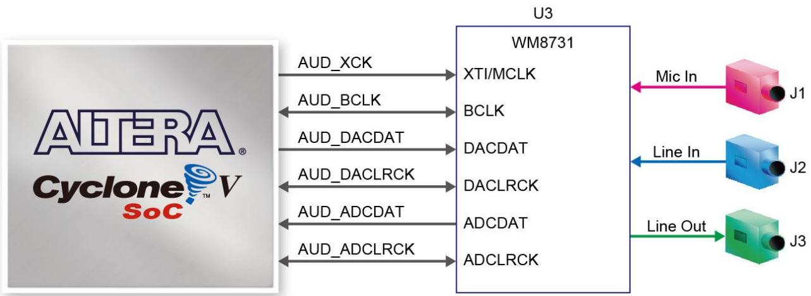  
Figure 3-20 Connections between the FPGA and audio CODEC

Table 3-12 Pin Assignment of Audio CODEC

<table><tr><td>Signal Name</td><td>FPGA Pin No.</td><td>Description</td><td>I/O Standard</td></tr><tr><td>AUD_ADCLRCK</td><td>PIN_K8</td><td>Audio CODEC ADC LR Clock</td><td>3.3V</td></tr><tr><td>AUD_ADCDAT</td><td>PIN_K7</td><td>Audio CODEC ADC Data</td><td>3.3V</td></tr><tr><td>AUD_DACLRCK</td><td>PIN_H8</td><td>Audio CODEC DAC LR Clock</td><td>3.3V</td></tr><tr><td>AUD_DACDAT</td><td>PIN_J7</td><td>Audio CODEC DAC Data</td><td>3.3V</td></tr><tr><td>AUD_XCK</td><td>PIN_G7</td><td>Audio CODEC Chip Clock</td><td>3.3V</td></tr><tr><td>AUD_BCLK</td><td>PIN_H7</td><td>Audio CODEC Bit-stream Clock</td><td>3.3V</td></tr><tr><td>I2C_SCLK</td><td>PIN_J12 or PIN_E23</td><td>I2C Clock</td><td>3.3V</td></tr><tr><td>I2C_SDAT</td><td>PIN_K12 or PIN_C24</td><td>I2C Data</td><td>3.3V</td></tr></table>

# 3.6.5 I2C Multiplexer

The DE1-SoC board implements an I2C multiplexer for HPS to access the I2C bus originally owned by FPGA. Figure 3-21 shows the connection of I2C multiplexer to the FPGA and HPS. HPS can access Audio CODEC and TV Decoder if and only if the HPS_I2C_CONTROL signal is set to high. The pin assignment of I2C bus is listed in Table 3-13 .

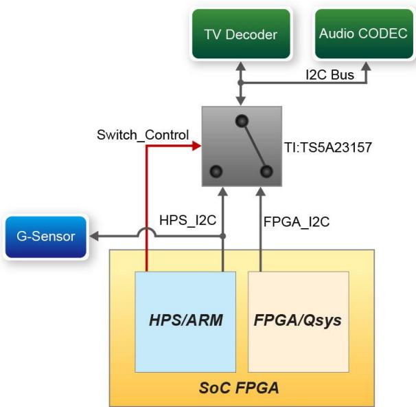  
Figure 3-21 Control mechanism for the I2C multiplexer

Table 3-13 Pin Assignment of I2C Bus   

<table><tr><td>Signal Name</td><td>FPGA Pin No.</td><td>Description</td><td>I/O Standard</td></tr><tr><td>FPGA_I2C_SCLK</td><td>PIN_J12</td><td>FPGA I2C Clock</td><td>3.3V</td></tr><tr><td>FPGA_I2C_SDAT</td><td>PIN_K12</td><td>FPGA I2C Data</td><td>3.3V</td></tr><tr><td>HPS_I2C1_SCLK</td><td>PIN_E23</td><td>I2C Clock of the first HPS I2C conncntroller</td><td>3.3V</td></tr><tr><td>HPS_I2C1_SDAT</td><td>PIN_C24</td><td>I2C Data of the first HPS I2C conncntroller</td><td>3.3V</td></tr><tr><td>HPS_I2C2_SCLK</td><td>PIN_H23</td><td>I2C Clock of the second HPS I2C conncntroller</td><td>3.3V</td></tr><tr><td>HPS_I2C2_SDAT</td><td>PIN_A25</td><td>I2C Data of the second HPS I2C conncntroller</td><td>3.3V</td></tr></table>

# 3.6.6 VGA

The DE1-SoC board has a 15-pin D-SUB connector populated for VGA output. The VGA synchronization signals are generated directly from the Cyclone V SoC FPGA, and the Analog Devices ADV7123 triple 10-bit high-speed video DAC (only the higher 8-bits are used) transforms signals from digital to analog to represent three fundamental colors (red, green, and blue). It can support up to SXGA standard $( 1 2 8 0 ^ { * } 1 0 2 4 )$ with signals transmitted at 100MHz. Figure 3-22 shows the signals connected between the FPGA and VGA.

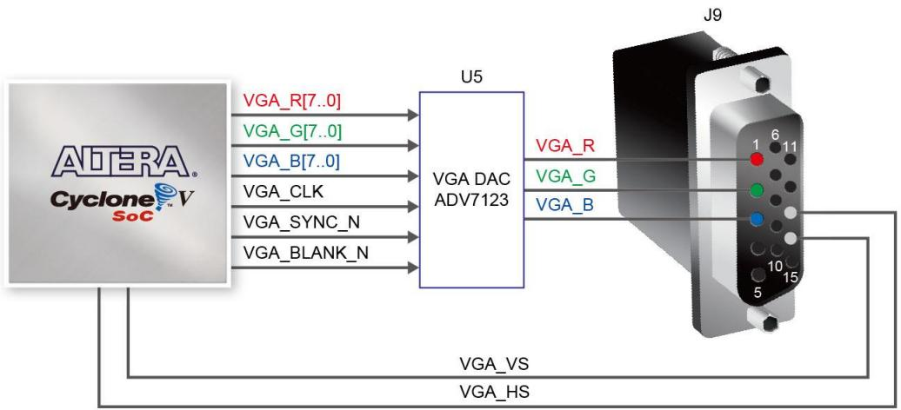  
Figure 3-22 Connections between the FPGA and VGA

The timing specification for VGA synchronization and RGB (red, green, blue) data can be easily found on website nowadays. Figure 3-22 illustrates the basic timing requirements for each row (horizontal) displayed on a VGA monitor. An active-low pulse of specific duration is applied to the horizontal synchronization (hsync) input of the monitor, which signifies the end of one row of data and the start of the next. The data (RGB) output to the monitor must be off (driven to 0 V) for a time period called the back porch (b) after the hsync pulse occurs, which is followed by the display interval (c). During the data display interval the RGB data drives each pixel in turn across the row being displayed. Finally, there is a time period called the front porch (d) where the RGB signals must again be off before the next hsync pulse can occur. The timing of vertical synchronization (vsync) is similar to the one shown in Figure 3-23, except that a vsync pulse signifies the end of one frame and the start of the next, and the data refers to the set of rows in the frame (horizontal timing). Table 3-14 and Table 3-15 show different resolutions and durations of time period a, b, c, and d for both horizontal and vertical timing.

More information about the ADV7123 video DAC is available in its datasheet, which can be found on the manufacturer’s website, or in the directory \Datasheets\VIDEO DAC of DE1-SoC System CD. The pin assignment between the Cyclone V SoC FPGA and the ADV7123 is listed in Table 3-16.

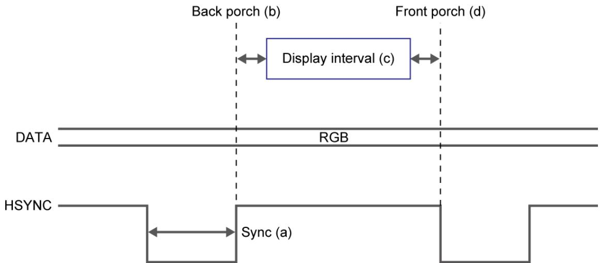  
Figure 3-23 VGA horizontal timing specification

Table 3-14 VGA Horizontal Timing Specification   

<table><tr><td colspan="2">VGA mode</td><td colspan="5">Horizontal Timing Spec</td></tr><tr><td>Configuration</td><td>Resolution(HxV)</td><td>a(us)</td><td>b(us)</td><td>c(us)</td><td>d(us)</td><td>Pixel clock(MHz)</td></tr><tr><td>VGA(60Hz)</td><td>640x480</td><td>3.8</td><td>1.9</td><td>25.4</td><td>0.6</td><td>25</td></tr><tr><td>VGA(85Hz)</td><td>640x480</td><td>1.6</td><td>2.2</td><td>17.8</td><td>1.6</td><td>36</td></tr><tr><td>SVGA(60Hz)</td><td>800x600</td><td>3.2</td><td>2.2</td><td>20</td><td>1</td><td>40</td></tr><tr><td>SVGA(75Hz)</td><td>800x600</td><td>1.6</td><td>3.2</td><td>16.2</td><td>0.3</td><td>49</td></tr><tr><td>SVGA(85Hz)</td><td>800x600</td><td>1.1</td><td>2.7</td><td>14.2</td><td>0.6</td><td>56</td></tr><tr><td>XGA(60Hz)</td><td>1024x768</td><td>2.1</td><td>2.5</td><td>15.8</td><td>0.4</td><td>65</td></tr><tr><td>XGA(70Hz)</td><td>1024x768</td><td>1.8</td><td>1.9</td><td>13.7</td><td>0.3</td><td>75</td></tr><tr><td>XGA(85Hz)</td><td>1024x768</td><td>1.0</td><td>2.2</td><td>10.8</td><td>0.5</td><td>95</td></tr><tr><td>1280x1024(60Hz)</td><td>1280x1024</td><td>1.0</td><td>2.3</td><td>11.9</td><td>0.4</td><td>108</td></tr></table>

Table 3-15 VGA Vertical Timing Specification   

<table><tr><td colspan="2">VGA mode</td><td colspan="5">Vertical Timing Spec</td></tr><tr><td>Configuration</td><td>Resolution(HxV)</td><td>a lines)</td><td>b lines)</td><td>c lines)</td><td>d lines)</td><td>Pixel clock(MHz)</td></tr><tr><td>VGA(60Hz)</td><td>640x480</td><td>2</td><td>33</td><td>480</td><td>10</td><td>25</td></tr><tr><td>VGA(85Hz)</td><td>640x480</td><td>3</td><td>25</td><td>480</td><td>1</td><td>36</td></tr><tr><td>SVGA(60Hz)</td><td>800x600</td><td>4</td><td>23</td><td>600</td><td>1</td><td>40</td></tr><tr><td>SVGA(75Hz)</td><td>800x600</td><td>3</td><td>21</td><td>600</td><td>1</td><td>49</td></tr><tr><td>SVGA(85Hz)</td><td>800x600</td><td>3</td><td>27</td><td>600</td><td>1</td><td>56</td></tr><tr><td>XGA(60Hz)</td><td>1024x768</td><td>6</td><td>29</td><td>768</td><td>3</td><td>65</td></tr><tr><td>XGA(70Hz)</td><td>1024x768</td><td>6</td><td>29</td><td>768</td><td>3</td><td>75</td></tr><tr><td>XGA(85Hz)</td><td>1024x768</td><td>3</td><td>36</td><td>768</td><td>1</td><td>95</td></tr><tr><td>1280x1024(60Hz)</td><td>1280x1024</td><td>3</td><td>38</td><td>1024</td><td>1</td><td>108</td></tr></table>

Table 3-16 Pin Assignment of VGA   

<table><tr><td>Signal Name</td><td>FPGA Pin No.</td><td>Description</td><td>I/O Standard</td></tr><tr><td>VGA_R[0]</td><td>PIN_A13</td><td>VGA Red[0]</td><td>3.3V</td></tr><tr><td>VGA_R[1]</td><td>PIN_C13</td><td>VGA Red[1]</td><td>3.3V</td></tr><tr><td>VGA_R[2]</td><td>PIN_E13</td><td>VGA Red[2]</td><td>3.3V</td></tr><tr><td>VGA_R[3]</td><td>PIN_B12</td><td>VGA Red[3]</td><td>3.3V</td></tr><tr><td>VGA_R[4]</td><td>PIN_C12</td><td>VGA Red[4]</td><td>3.3V</td></tr><tr><td>VGA_R[5]</td><td>PIN_D12</td><td>VGA Red[5]</td><td>3.3V</td></tr><tr><td>VGA_R[6]</td><td>PIN_E12</td><td>VGA Red[6]</td><td>3.3V</td></tr><tr><td>VGA_R[7]</td><td>PIN_F13</td><td>VGA Red[7]</td><td>3.3V</td></tr><tr><td>VGA_G[0]</td><td>PIN_J9</td><td>VGA Green[0]</td><td>3.3V</td></tr><tr><td>VGA_G[1]</td><td>PIN_J10</td><td>VGA Green[1]</td><td>3.3V</td></tr><tr><td>VGA_G[2]</td><td>PIN_H12</td><td>VGA Green[2]</td><td>3.3V</td></tr><tr><td>VGA_G[3]</td><td>PIN_G10</td><td>VGA Green[3]</td><td>3.3V</td></tr><tr><td>VGA_G[4]</td><td>PIN_G11</td><td>VGA Green[4]</td><td>3.3V</td></tr><tr><td>VGA_G[5]</td><td>PIN_G12</td><td>VGA Green[5]</td><td>3.3V</td></tr><tr><td>VGA_G[6]</td><td>PIN_F11</td><td>VGA Green[6]</td><td>3.3V</td></tr><tr><td>VGA_G[7]</td><td>PIN_E11</td><td>VGA Green[7]</td><td>3.3V</td></tr><tr><td>VGA_B[0]</td><td>PIN_B13</td><td>VGA Blue[0]</td><td>3.3V</td></tr><tr><td>VGA_B[1]</td><td>PIN_G13</td><td>VGA Blue[1]</td><td>3.3V</td></tr><tr><td>VGA_B[2]</td><td>PIN_H13</td><td>VGA Blue[2]</td><td>3.3V</td></tr><tr><td>VGA_B[3]</td><td>PIN_F14</td><td>VGA Blue[3]</td><td>3.3V</td></tr><tr><td>VGA_B[4]</td><td>PIN_H14</td><td>VGA Blue[4]</td><td>3.3V</td></tr><tr><td>VGA_B[5]</td><td>PIN_F15</td><td>VGA Blue[5]</td><td>3.3V</td></tr><tr><td>VGA_B[6]</td><td>PIN_G15</td><td>VGA Blue[6]</td><td>3.3V</td></tr><tr><td>VGA_B[7]</td><td>PIN_J14</td><td>VGA Blue[7]</td><td>3.3V</td></tr><tr><td>VGA_CLK</td><td>PIN_A11</td><td>VGA Clock</td><td>3.3V</td></tr><tr><td>VGA_BLANK_N</td><td>PIN_F10</td><td>VGA BLANK</td><td>3.3V</td></tr><tr><td>VGA_HS</td><td>PIN_B11</td><td>VGA H_SYNC</td><td>3.3V</td></tr><tr><td>VGA_VS</td><td>PIN_D11</td><td>VGA V_SYNC</td><td>3.3V</td></tr><tr><td>VGA_SYNC_N</td><td>PIN_C10</td><td>VGA SYNC</td><td>3.3V</td></tr></table>

# 3.6.7 TV Decoder

The DE1-SoC board is equipped with an Analog Device ADV7180 TV decoder chip. The ADV7180 is an integrated video decoder which automatically detects and converts a standard analog baseband television signals (NTSC, PAL, and SECAM) into 4:2:2 component video data, which is compatible with the 8-bit ITU-R BT.656 interface standard. The ADV7180 is compatible with wide range of video devices, including DVD players, tape-based sources, broadcast sources, and security/surveillance cameras.

The registers in the TV decoder can be accessed and set through serial I2C bus by the Cyclone V SoC FPGA or HPS. Note that the I2C address W/R of the TV decoder (U4) is $0 \mathrm { x } 4 0 / 0 \mathrm { x } 4 1$ . The pin assignment of TV decoder is listed in Table 3-17. More information about the ADV7180 is available on the manufacturer’s website, or in the directory \DE1_SOC_datasheets\Video Decoder of DE1-SoC System CD.

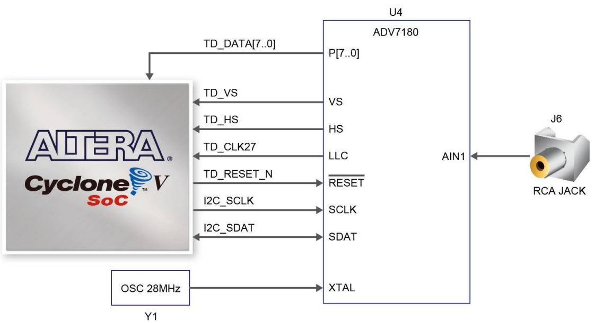  
Figure 3-24 Connections between the FPGA and TV Decoder

Table 3-17 Pin Assignment of TV Decoder   

<table><tr><td>Signal Name</td><td>FPGA Pin No.</td><td colspan="2">Description</td><td>I/O Standard</td></tr><tr><td>TD_DATA [0]</td><td>PIN_D2</td><td>TV Decoder</td><td>Data[0]</td><td>3.3V</td></tr><tr><td>TD_DATA [1]</td><td>PIN_B1</td><td>TV Decoder</td><td>Data[1]</td><td>3.3V</td></tr><tr><td>TD_DATA [2]</td><td>PIN_E2</td><td>TV Decoder</td><td>Data[2]</td><td>3.3V</td></tr><tr><td>TD_DATA [3]</td><td>PIN_B2</td><td>TV Decoder</td><td>Data[3]</td><td>3.3V</td></tr><tr><td>TD_DATA [4]</td><td>PIN_D1</td><td>TV Decoder</td><td>Data[4]</td><td>3.3V</td></tr><tr><td>TD_DATA [5]</td><td>PIN_E1</td><td>TV Decoder</td><td>Data[5]</td><td>3.3V</td></tr><tr><td>TD_DATA [6]</td><td>PIN_C2</td><td>TV Decoder</td><td>Data[6]</td><td>3.3V</td></tr><tr><td>TD_DATA [7]</td><td>PIN_B3</td><td>TV Decoder</td><td>Data[7]</td><td>3.3V</td></tr><tr><td>TD_HS</td><td>PIN_A5</td><td>TV Decoder</td><td>H_SYNC</td><td>3.3V</td></tr><tr><td>TD_VS</td><td>PIN_A3</td><td>TV Decoder</td><td>V_SYNC</td><td>3.3V</td></tr><tr><td>TD_CLK27</td><td>PIN_H15</td><td>TV Decoder</td><td>Clock Input.</td><td>3.3V</td></tr><tr><td>TD_RESET_N</td><td>PIN_F6</td><td>TV Decoder</td><td>Reset</td><td>3.3V</td></tr><tr><td>I2C_SCLK</td><td>PIN_J12 or PIN_E23</td><td colspan="2">I2C Clock</td><td>3.3V</td></tr><tr><td>I2C_SDAT</td><td>PIN_K12 or PIN_C24</td><td colspan="2">I2C Data</td><td>3.3V</td></tr></table>

# 3.6.8 IR Receiver

The board comes with an infrared remote-control receiver module (model: IRM-V538/TR1), whose datasheet is provided in the directory \Datasheets\ IR Receiver and Emitter of DE1-SoC system CD. The remote control, which is optional and can be ordered from the website, has an encoding chip (uPD6121G) built-in for generating infrared signals. Figure 3-25 shows the connection of IR receiver to the FPGA. Table 3-18 shows the pin assignment of IR receiver to the FPGA.

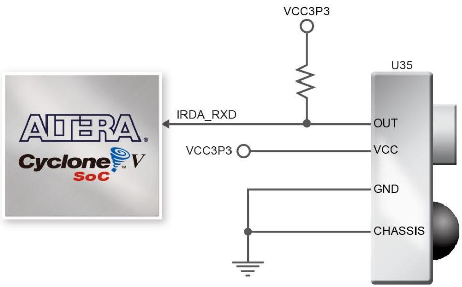  
Figure 3-25 Connection between the FPGA and IR Receiver

Table 3-18 Pin Assignment of IR Receiver   

<table><tr><td>Signal Name</td><td>FPGA Pin No.</td><td>Description</td><td>I/O Standard</td></tr><tr><td>IRDA_RXD</td><td>PIN_AA30</td><td>IR Receiver</td><td>3.3V</td></tr></table>

# 3.6.9 IR Emitter LED

The board has an IR emitter LED for IR communication, which is widely used for operating television device wirelessly from a short line-of-sight distance. It can also be used to communicate with other systems by matching this IR emitter LED with another IR receiver on the other side.

Figure 3-26 shows the connection of IR emitter LED to the FPGA. Table 3-19 shows the pin assignment of IR emitter LED to the FPGA.

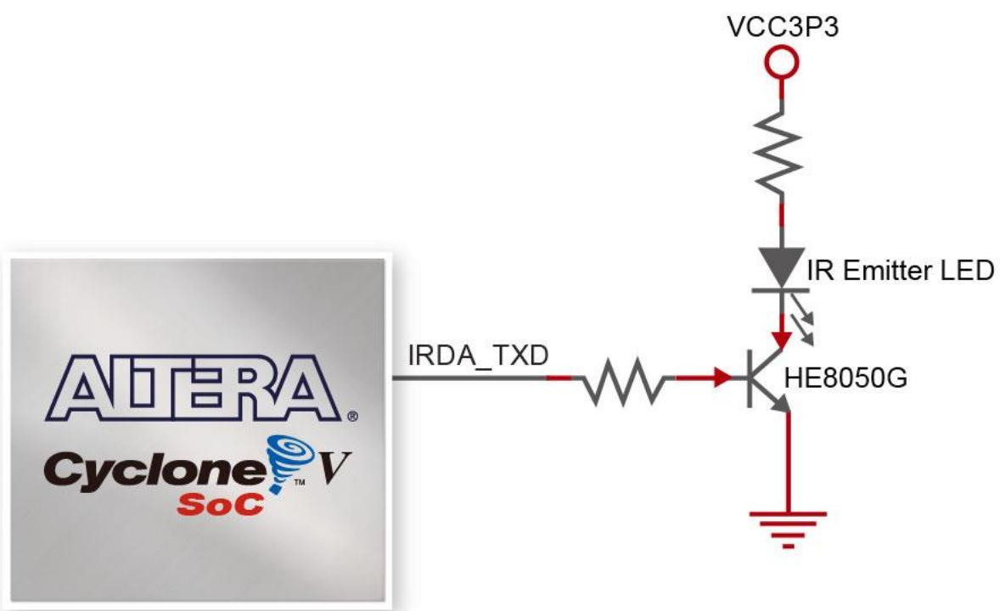  
Figure 3-26 Connection between the FPGA and IR emitter LED

Table 3-19 Pin Assignment of IR Emitter LED   

<table><tr><td>Signal Name</td><td>FPGA Pin No.</td><td>Description</td><td>I/O Standard</td></tr><tr><td>IRDA_TXD</td><td>PIN_AB30</td><td>IR Emitter</td><td>3.3V</td></tr></table>

# 3.6.10 SDRAM Memory

The board features 64MB of SDRAM with a single 64MB (32Mx16) SDRAM chip. The chip consists of 16-bit data line, control line, and address line connected to the FPGA. This chip uses the 3.3V LVCMOS signaling standard. Connections between the FPGA and SDRAM are shown in Figure 3-27, and the pin assignment is listed in Table 3-20.

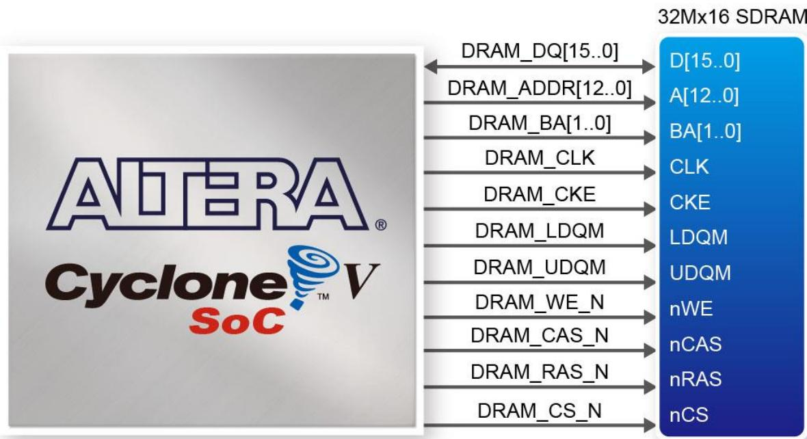  
Figure 3-27 Connections between the FPGA and SDRAM

Table 3-20 Pin Assignment of SDRAM   

<table><tr><td>Signal Name</td><td>FPGA Pin No.</td><td>Description</td><td>I/O Standard</td></tr><tr><td>DRAM_ADDR[0]</td><td>PIN_AK14</td><td>SDRAM Address[0]</td><td>3.3V</td></tr><tr><td>DRAM_ADDR[1]</td><td>PIN_AH14</td><td>SDRAM Address[1]</td><td>3.3V</td></tr><tr><td>DRAM_ADDR[2]</td><td>PIN(ag15</td><td>SDRAM Address[2]</td><td>3.3V</td></tr><tr><td>DRAM_ADDR[3]</td><td>PIN_AE14</td><td>SDRAM Address[3]</td><td>3.3V</td></tr><tr><td>DRAM_ADDR[4]</td><td>PIN_AB15</td><td>SDRAM Address[4]</td><td>3.3V</td></tr><tr><td>DRAM_ADDR[5]</td><td>PIN_AC14</td><td>SDRAM Address[5]</td><td>3.3V</td></tr><tr><td>DRAM_ADDR[6]</td><td>PIN_AD14</td><td>SDRAM Address[6]</td><td>3.3V</td></tr><tr><td>DRAM_ADDR[7]</td><td>PIN_AF15</td><td>SDRAM Address[7]</td><td>3.3V</td></tr><tr><td>DRAM_ADDR[8]</td><td>PIN_AH15</td><td>SDRAM Address[8]</td><td>3.3V</td></tr><tr><td>DRAM_ADDR[9]</td><td>PIN(ag13</td><td>SDRAM Address[9]</td><td>3.3V</td></tr><tr><td>DRAM_ADDR[10]</td><td>PIN(ag12</td><td>SDRAM Address[10]</td><td>3.3V</td></tr><tr><td>DRAM_ADDR[11]</td><td>PIN_AH13</td><td>SDRAM Address[11]</td><td>3.3V</td></tr><tr><td>DRAM_ADDR[12]</td><td>PIN_AJ14</td><td>SDRAM Address[12]</td><td>3.3V</td></tr><tr><td>DRAM_DQ[0]</td><td>PIN_AK6</td><td>SDRAM Data[0]</td><td>3.3V</td></tr><tr><td>DRAM_DQ[1]</td><td>PIN_AJ7</td><td>SDRAM Data[1]</td><td>3.3V</td></tr><tr><td>DRAM_DQ[2]</td><td>PIN_AK7</td><td>SDRAM Data[2]</td><td>3.3V</td></tr><tr><td>DRAM_DQ[3]</td><td>PIN_AK8</td><td>SDRAM Data[3]</td><td>3.3V</td></tr><tr><td>DRAM_DQ[4]</td><td>PIN_AK9</td><td>SDRAM Data[4]</td><td>3.3V</td></tr><tr><td>DRAM_DQ[5]</td><td>PIN(ag10</td><td>SDRAM Data[5]</td><td>3.3V</td></tr><tr><td>DRAM_DQ[6]</td><td>PIN_AK11</td><td>SDRAM_Data[6]</td><td>3.3V</td></tr><tr><td>DRAM_DQ[7]</td><td>PIN_AJ11</td><td>SDRAM_Data[7]</td><td>3.3V</td></tr><tr><td>DRAM_DQ[8]</td><td>PIN_AH10</td><td>SDRAM_Data[8]</td><td>3.3V</td></tr><tr><td>DRAM_DQ[9]</td><td>PIN_AJ10</td><td>SDRAM_Data[9]</td><td>3.3V</td></tr><tr><td>DRAM_DQ[10]</td><td>PIN_AJ9</td><td>SDRAM_Data[10]</td><td>3.3V</td></tr><tr><td>DRAM_DQ[11]</td><td>PIN_AH9</td><td>SDRAM_Data[11]</td><td>3.3V</td></tr><tr><td>DRAM_DQ[12]</td><td>PIN_AH8</td><td>SDRAM_Data[12]</td><td>3.3V</td></tr><tr><td>DRAM_DQ[13]</td><td>PIN_AH7</td><td>SDRAM_Data[13]</td><td>3.3V</td></tr><tr><td>DRAM_DQ[14]</td><td>PIN_AJ6</td><td>SDRAM_Data[14]</td><td>3.3V</td></tr><tr><td>DRAM_DQ[15]</td><td>PIN_AJ5</td><td>SDRAM_Data[15]</td><td>3.3V</td></tr><tr><td>DRAM_BA[0]</td><td>PIN_AF13</td><td>SDRAM_Bank_Address[0]</td><td>3.3V</td></tr><tr><td>DRAM_BA[1]</td><td>PIN_AJ12</td><td>SDRAM_Bank_Address[1]</td><td>3.3V</td></tr><tr><td>DRAM_LDQM</td><td>PIN_AB13</td><td>SDRAM_byte_Data_Mask[0]</td><td>3.3V</td></tr><tr><td>DRAM_UDQM</td><td>PIN_AK12</td><td>SDRAM-byte Data_Mask[1]</td><td>3.3V</td></tr><tr><td>DRAM_RAS_N</td><td>PIN_AE13</td><td>SDRAM_Row_Address_S strobe</td><td>3.3V</td></tr><tr><td>DRAM_CAS_N</td><td>PIN_AF11</td><td>SDRAM Column_Address_S strobe</td><td>3.3V</td></tr><tr><td>DRAM_CKE</td><td>PIN_AK13</td><td>SDRAM_Clock_Enable</td><td>3.3V</td></tr><tr><td>DRAM_CLK</td><td>PIN_AH12</td><td>SDRAM_Clock</td><td>3.3V</td></tr><tr><td>DRAM_WE_N</td><td>PIN_AA13</td><td>SDRAM_Write_Enable</td><td>3.3V</td></tr><tr><td>DRAM_CS_N</td><td>PIN_AG11</td><td>SDRAM_Chip_Select</td><td>3.3V</td></tr></table>

# 3.6.11 PS/2 Serial Port

The DE1-SoC board comes with a standard PS/2 interface and a connector for a PS/2 keyboard or mouse. Figure 3-28 shows the connection of PS/2 circuit to the FPGA. Users can use the PS/2 keyboard and mouse on the DE1-SoC board simultaneously by a PS/2 Y-Cable, as shown in Figure 3-29. Instructions on how to use PS/2 mouse and/or keyboard can be found on various educational websites. The pin assignment associated to this interface is shown in Table 3-21.


Note: If users connect only one PS/2 equipment, the PS/2 signals connected to the FPGA I/O

should be “PS2_CLK"and “PS2_DAT".

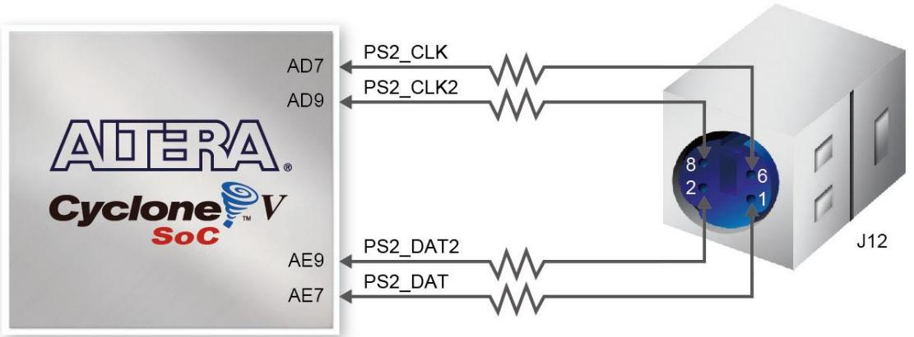  
Figure 3-28 Connections between the FPGA and PS/2

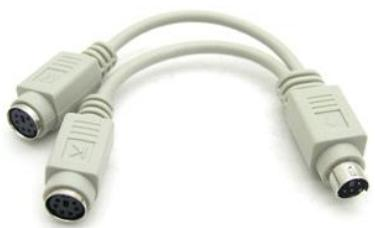  
Figure 3-29 Y-Cable for using keyboard and mouse simultaneously

Table 3-21 Pin Assignment of PS/2   

<table><tr><td>Signal Name</td><td>FPGA Pin No.</td><td>Description</td><td>I/O Standard</td></tr><tr><td>PS2_CLK</td><td>PIN_AD7</td><td>PS/2 Clock</td><td>3.3V</td></tr><tr><td>PS2_DAT</td><td>PIN_AE7</td><td>PS/2 Data</td><td>3.3V</td></tr><tr><td>PS2_CLK2</td><td>PIN_AD9</td><td>PS/2 Clock (reserved for second PS/2 device)</td><td>3.3V</td></tr><tr><td>PS2_DAT2</td><td>PIN_AE9</td><td>PS/2 Data (reserved for second PS/2 device)</td><td>3.3V</td></tr></table>

# 3.6.12 A/D Converter and 2x5 Header

The DE1-SoC has an analog-to-digital converter (LTC2308), which features low noise, eight-channel CMOS 12-bit. This ADC offers conversion throughput rate up to 500KSPS. The analog input range for all input channels can be 0 V to 4.096V. The internal conversion clock allows the external serial output data clock (SCLK) to operate at any frequency up to 40MHz. It can be configured to accept eight input signals at inputs ADC_IN0 through ADC_IN7. These eight input signals are connected to a 2x5 header, as shown in Figure 3-30.

More information about the A/D converter chip is available in its datasheet. It can be found on manufacturer’s website or in the directory \datasheet of De1-SoC system CD.

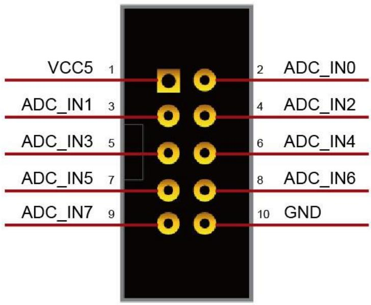  
Figure 3-30 Signals of the 2x5 Header

Figure 3-31 shows the connections between the FPGA, 2x5 header, and the A/D converter.

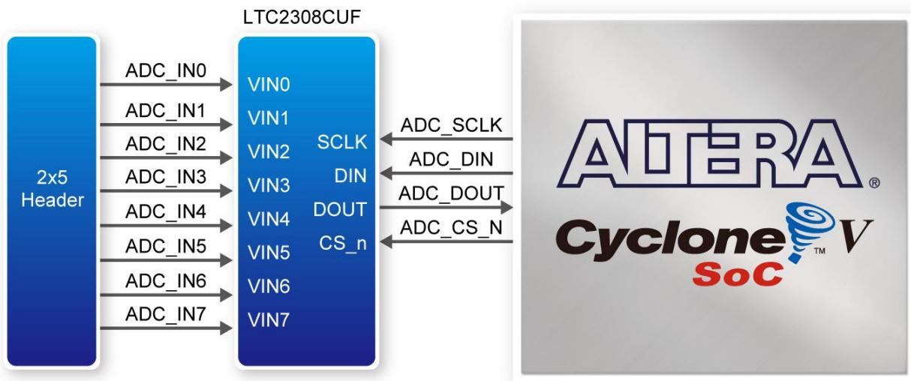  
Figure 3-31 Connections between the FPGA, 2x5 header, and the A/D converter

Table 3-22 Pin Assignment of ADC   

<table><tr><td>Signal Name</td><td>FPGA Pin No.</td><td>Description</td><td>I/O Standard</td></tr><tr><td>ADC_CS_N</td><td>PIN_AJ4</td><td>Chip select</td><td>3.3V</td></tr><tr><td>ADC_DOUT</td><td>PIN_AK3</td><td>Digital data input</td><td>3.3V</td></tr><tr><td>ADC_DIN</td><td>PIN_AK4</td><td>Digital data output</td><td>3.3V</td></tr><tr><td>ADC_SCLK</td><td>PIN_AK2</td><td>Digital clock input</td><td>3.3V</td></tr></table>

# 3.7 Peripherals Connected to Hard Processor System (HPS)

This section introduces the interfaces connected to the HPS section of the Cyclone V SoC FPGA. Users can access these interfaces via the HPS processor.

# 3.7.1 User Push-buttons and LEDs

Similar to the FPGA, the HPS also has its set of switches, buttons, LEDs, and other interfaces connected exclusively. Users can control these interfaces to monitor the status of HPS.

Table 3-23 gives the pin assignment of all the LEDs, switches, and push-buttons.

Table 3-23 Pin Assignment of LEDs, Switches and Push-buttons   

<table><tr><td>Signal Name</td><td>HPS GPIO</td><td>Register/bit</td><td>Function</td></tr><tr><td>HPS_KEY</td><td>GPIO54</td><td>GPIO1[25]</td><td>I/O</td></tr><tr><td>HPS_LED</td><td>GPIO53</td><td>GPIO1[24]</td><td>I/O</td></tr></table>

# 3.7.2 Gigabit Ethernet

The board supports Gigabit Ethernet transfer by an external Micrel KSZ9021RN PHY chip and HPS Ethernet MAC function. The KSZ9021RN chip with integrated 10/100/1000 Mbps Gigabit Ethernet transceiver also supports RGMII MAC interface. Figure 3-32 shows the connections between the HPS, Gigabit Ethernet PHY, and RJ-45 connector.

The pin assignment associated to Gigabit Ethernet interface is listed in Table 3-24. More information about the KSZ9021RN PHY chip and its datasheet, as well as the application notes, which are available on the manufacturer’s website.

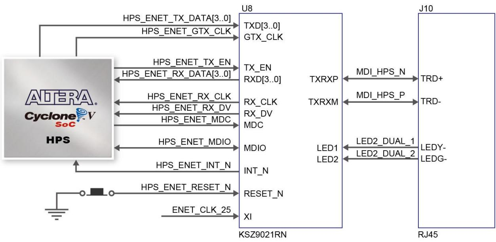  
Figure 3-32 Connections between the HPS and Gigabit Ethernet

Table 3-24 Pin Assignment of Gigabit Ethernet PHY   

<table><tr><td>Signal Name</td><td>FPGA Pin No.</td><td>Description</td><td>I/O Standard</td></tr><tr><td>HPS_ENET_TX_EN</td><td>PIN_A20</td><td>GMII and MII transmit enable</td><td>3.3V</td></tr><tr><td>HPS_ENET_TX_DATA[0]</td><td>PIN_F20</td><td>MII transmit data[0]</td><td>3.3V</td></tr><tr><td>HPS_ENET_TX_DATA[1]</td><td>PIN_J19</td><td>MII transmit data[1]</td><td>3.3V</td></tr><tr><td>HPS_ENET_TX_DATA[2]</td><td>PIN_F21</td><td>MII transmit data[2]</td><td>3.3V</td></tr><tr><td>HPS_ENET_TX_DATA[3]</td><td>PIN_F19</td><td>MII transmit data[3]</td><td>3.3V</td></tr><tr><td>HPS_ENET_RX_DV</td><td>PIN_K17</td><td>GMII and MII receive data valid</td><td>3.3V</td></tr><tr><td>HPS_ENET_RX_DATA[0]</td><td>PIN_A21</td><td>GMII and MII receive data[0]</td><td>3.3V</td></tr><tr><td>HPS_ENET_RX_DATA[1]</td><td>PIN_B20</td><td>GMII and MII receive data[1]</td><td>3.3V</td></tr><tr><td>HPS_ENET_RX_DATA[2]</td><td>PIN_B18</td><td>GMII and MII receive data[2]</td><td>3.3V</td></tr><tr><td>HPS_ENET_RX_DATA[3]</td><td>PIN_D21</td><td>GMII and MII receive data[3]</td><td>3.3V</td></tr><tr><td>HPS_ENET_RX_CLK</td><td>PIN_G20</td><td>GMII and MII receive clock</td><td>3.3V</td></tr><tr><td>HPS_ENET_RESET_N</td><td>PIN_E18</td><td>Hardware Reset Signal</td><td>3.3V</td></tr><tr><td>HPS_ENET_MDIO</td><td>PIN_E21</td><td>Management Data</td><td>3.3V</td></tr><tr><td>HPS_ENET_MDC</td><td>PIN_B21</td><td>Management Data Clock Reference</td><td>3.3V</td></tr><tr><td>HPS_ENET_INT_N</td><td>PIN_C19</td><td>Interrupt Open Drain Output</td><td>3.3V</td></tr><tr><td>HPS_ENET_GTX_CLK</td><td>PIN_H19</td><td>GMII Transmit Clock</td><td>3.3V</td></tr></table>

There are two LEDs, green LED (LEDG) and yellow LED (LEDY), which represent the status of Ethernet PHY (KSZ9021RNI). The LED control signals are connected to the LEDs on the RJ45 connector. The state and definition of LEDG and LEDY are listed in Table 3-25. For instance, the connection from board to Gigabit Ethernet is established once the LEDG lights on.

Table 3-25 State and Definition of LED Mode Pins   

<table><tr><td colspan="2">LED (State)</td><td colspan="2">LED (Definition)</td><td rowspan="2">Link /Activity</td></tr><tr><td>LEDG</td><td>LEDY</td><td>LEDG</td><td>LEDY</td></tr><tr><td>H</td><td>H</td><td>OFF</td><td>OFF</td><td>Link off</td></tr><tr><td>L</td><td>H</td><td>ON</td><td>OFF</td><td>1000 Link / No Activity</td></tr><tr><td>Toggle</td><td>H</td><td>Blinking</td><td>OFF</td><td>1000 Link / Activity (RX, TX)</td></tr><tr><td>H</td><td>L</td><td>OFF</td><td>ON</td><td>100 Link / No Activity</td></tr><tr><td>H</td><td>Toggle</td><td>OFF</td><td>Blinking</td><td>100 Link / Activity (RX, TX)</td></tr><tr><td>L</td><td>L</td><td>ON</td><td>ON</td><td>10 Link/ No Activity</td></tr><tr><td>Toggle</td><td>Toggle</td><td>Blinking</td><td>Blinking</td><td>10 Link / Activity (RX, TX)</td></tr></table>

# 3.7.3 UART

The board has one UART interface connected for communication with the HPS. This interface doesn’t support HW flow control signals. The physical interface is implemented by UART-USB onboard bridge from a FT232R chip to the host with an USB Mini-B connector. More information about the chip is available on the manufacturer’s website, or in the directory \Datasheets\UART TO

USB of DE1-SoC system CD. Figure 3-33 shows the connections between the HPS, FT232R chip, and the USB Mini-B connector. Table 3-26 lists the pin assignment of UART interface connected to the HPS.

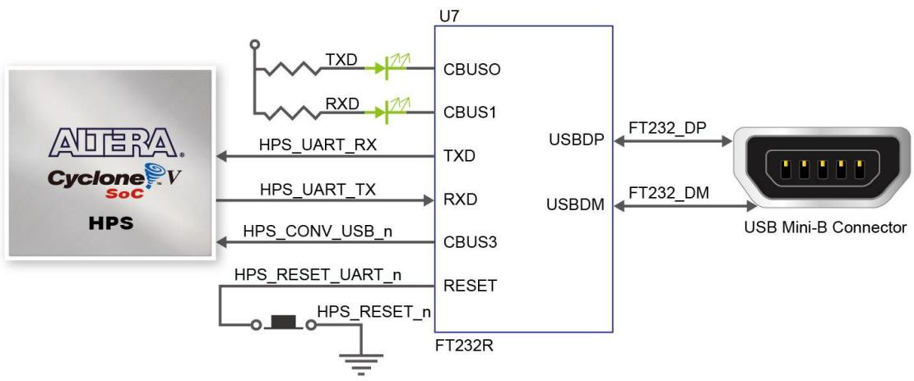  
Figure 3-33 Connections between the HPS and FT232R Chip

Table 3-26 Pin Assignment of UART Interface   

<table><tr><td>Signal Name</td><td>FPGA Pin No.</td><td>Description</td><td>I/O Standard</td></tr><tr><td>HPS_UART_RX</td><td>PIN_B25</td><td>HPS UART Receiver</td><td>3.3V</td></tr><tr><td>HPS_UART_TX</td><td>PIN_C25</td><td>HPS UART Transmitter</td><td>3.3V</td></tr><tr><td>HPS_CONV_USB_N</td><td>PIN_B15</td><td>Reserve</td><td>3.3V</td></tr></table>

# 3.7.4 DDR3 Memory

The board supports 1GB of DDR3 SDRAM comprising of two x16 bit DDR3 devices on HPS side. The signals are connected to the dedicated Hard Memory Controller for HPS I/O banks and the target speed is 400 MHz. Table 3-27 lists the pin assignment of DDR3 and its description with I/O standard.

Table 3-27 Pin Assignment of DDR3 Memory   

<table><tr><td>Signal Name</td><td>FPGA Pin No.</td><td>Description</td><td>I/O Standard</td></tr><tr><td>HPS_DDR3_A[0]</td><td>PIN_F26</td><td>HPS DDR3 Address[0]</td><td>SSTL-15 Class I</td></tr><tr><td>HPS_DDR3_A[1]</td><td>PIN_G30</td><td>HPS DDR3 Address[1]</td><td>SSTL-15 Class I</td></tr><tr><td>HPS_DDR3_A[2]</td><td>PIN_F28</td><td>HPS DDR3 Address[2]</td><td>SSTL-15 Class I</td></tr><tr><td>HPS_DDR3_A[3]</td><td>PIN_F30</td><td>HPS DDR3 Address[3]</td><td>SSTL-15 Class I</td></tr><tr><td>HPS_DDR3_A[4]</td><td>PIN_J25</td><td>HPS DDR3 Address[4]</td><td>SSTL-15 Class I</td></tr><tr><td>HPS_DDR3_A[5]</td><td>PIN_J27</td><td>HPS DDR3 Address[5]</td><td>SSTL-15 Class I</td></tr><tr><td>HPS_DDR3_A[6]</td><td>PIN_F29</td><td>HPS DDR3 Address[6]</td><td>SSTL-15 Class I</td></tr><tr><td>HPS_DDR3A[7]</td><td>PIN_E28</td><td>HPS DDR3 Address[7]</td><td>SSTL-15 Class I</td></tr><tr><td>HPS_DDR3A[8]</td><td>PIN_H27</td><td>HPS DDR3 Address[8]</td><td>SSTL-15 Class I</td></tr><tr><td>HPS_DDR3A[9]</td><td>PIN_G26</td><td>HPS DDR3 Address[9]</td><td>SSTL-15 Class I</td></tr><tr><td>HPS_DDR3A[10]</td><td>PIN_D29</td><td>HPS DDR3 Address[10]</td><td>SSTL-15 Class I</td></tr><tr><td>HPS_DDR3A[11]</td><td>PIN_C30</td><td>HPS DDR3 Address[11]</td><td>SSTL-15 Class I</td></tr><tr><td>HPS_DDR3A[12]</td><td>PIN_B30</td><td>HPS DDR3 Address[12]</td><td>SSTL-15 Class I</td></tr><tr><td>HPS_DDR3A[13]</td><td>PIN_C29</td><td>HPS DDR3 Address[13]</td><td>SSTL-15 Class I</td></tr><tr><td>HPS_DDR3A[14]</td><td>PIN_H25</td><td>HPS DDR3 Address[14]</td><td>SSTL-15 Class I</td></tr><tr><td>HPS_DDR3BA[0]</td><td>PIN_E29</td><td>HPS DDR3 Bank Address[0]</td><td>SSTL-15 Class I</td></tr><tr><td>HPS_DDR3BA[1]</td><td>PIN_J24</td><td>HPS DDR3 Bank Address[1]</td><td>SSTL-15 Class I</td></tr><tr><td>HPS_DDR3BA[2]</td><td>PIN_J23</td><td>HPS DDR3 Bank Address[2]</td><td>SSTL-15 Class I</td></tr><tr><td>HPS_DDR3CAS_n</td><td>PIN_E27</td><td>DDR3 Column Address Strobe</td><td>SSTL-15 Class I</td></tr><tr><td>HPS_DDR3CKE</td><td>PIN_L29</td><td>HPS DDR3 Clock Enable</td><td>SSTL-15 Class I</td></tr><tr><td>HPS_DDR3CK_n</td><td>PIN_L23</td><td>HPS DDR3 Clock</td><td>Differential 1.5-V SSTL Class I</td></tr><tr><td>HPS_DDR3CK_p</td><td>PIN_M23</td><td>HPS DDR3 Clock p</td><td>Differential 1.5-V SSTL Class I</td></tr><tr><td>HPS_DDR3CS_n</td><td>PIN_H24</td><td>HPS DDR3 Chip Select</td><td>SSTL-15 Class I</td></tr><tr><td>HPS_DDR3DM[0]</td><td>PIN_K28</td><td>HPS DDR3 Data Mask[0]</td><td>SSTL-15 Class I</td></tr><tr><td>HPS_DDR3DM[1]</td><td>PIN_M28</td><td>HPS DDR3 Data Mask[1]</td><td>SSTL-15 Class I</td></tr><tr><td>HPS_DDR3DM[2]</td><td>PIN_R28</td><td>HPS DDR3 Data Mask[2]</td><td>SSTL-15 Class I</td></tr><tr><td>HPS_DDR3DM[3]</td><td>PIN_W30</td><td>HPS DDR3 Data Mask[3]</td><td>SSTL-15 Class I</td></tr><tr><td>HPS_DDR3DQ[0]</td><td>PIN_K23</td><td>HPS DDR3 Data[0]</td><td>SSTL-15 Class I</td></tr><tr><td>HPS_DDR3DQ[1]</td><td>PIN_K22</td><td>HPS DDR3 Data[1]</td><td>SSTL-15 Class I</td></tr><tr><td>HPS_DDR3DQ[2]</td><td>PIN_H30</td><td>HPS DDR3 Data[2]</td><td>SSTL-15 Class I</td></tr><tr><td>HPS_DDR3DQ[3]</td><td>PIN_G28</td><td>HPS DDR3 Data[3]</td><td>SSTL-15 Class I</td></tr><tr><td>HPS_DDR3DQ[4]</td><td>PIN_L25</td><td>HPS DDR3 Data[4]</td><td>SSTL-15 Class I</td></tr><tr><td>HPS_DDR3DQ[5]</td><td>PIN_L24</td><td>HPS DDR3 Data[5]</td><td>SSTL-15 Class I</td></tr><tr><td>HPS_DDR3DQ[6]</td><td>PIN_J30</td><td>HPS DDR3 Data[6]</td><td>SSTL-15 Class I</td></tr><tr><td>HPS_DDR3DQ[7]</td><td>PIN_J29</td><td>HPS DDR3 Data[7]</td><td>SSTL-15 Class I</td></tr><tr><td>HPS_DDR3DQ[8]</td><td>PIN_K26</td><td>HPS DDR3 Data[8]</td><td>SSTL-15 Class I</td></tr><tr><td>HPS_DDR3DQ[9]</td><td>PIN_L26</td><td>HPS DDR3 Data[9]</td><td>SSTL-15 Class I</td></tr><tr><td>HPS_DDR3DQ[10]</td><td>PIN_K29</td><td>HPS DDR3 Data[10]</td><td>SSTL-15 Class I</td></tr><tr><td>HPS_DDR3DQ[11]</td><td>PIN_K27</td><td>HPS DDR3 Data[11]</td><td>SSTL-15 Class I</td></tr><tr><td>HPS_DDR3DQ[12]</td><td>PIN_M26</td><td>HPS DDR3 Data[12]</td><td>SSTL-15 Class I</td></tr><tr><td>HPS_DDR3DQ[13]</td><td>PIN_M27</td><td>HPS DDR3 Data[13]</td><td>SSTL-15 Class I</td></tr><tr><td>HPS_DDR3DQ[14]</td><td>PIN_L28</td><td>HPS DDR3 Data[14]</td><td>SSTL-15 Class I</td></tr><tr><td>HPS_DDR3DQ[15]</td><td>PIN_M30</td><td>HPS DDR3 Data[15]</td><td>SSTL-15 Class I</td></tr><tr><td>HPS_DDR3DQ[16]</td><td>PIN_U26</td><td>HPS DDR3 Data[16]</td><td>SSTL-15 Class I</td></tr><tr><td>HPS_DDR3DQ[17]</td><td>PIN_T26</td><td>HPS DDR3 Data[17]</td><td>SSTL-15 Class I</td></tr><tr><td>HPS_DDR3DQ[18]</td><td>PIN_N29</td><td>HPS DDR3 Data[18]</td><td>SSTL-15 Class I</td></tr><tr><td>HPS_DDR3DQ[19]</td><td>PIN_N28</td><td>HPS DDR3 Data[19]</td><td>SSTL-15 Class I</td></tr><tr><td>HPS_DDR3DQ[20]</td><td>PIN_P26</td><td>HPS DDR3 Data[20]</td><td>SSTL-15 Class I</td></tr><tr><td>HPS_DDR3DQ[21]</td><td>PIN_P27</td><td>HPS DDR3 Data[21]</td><td>SSTL-15 Class I</td></tr><tr><td>HPS_DDR3DQ[22]</td><td>PIN_N27</td><td>HPS DDR3 Data[22]</td><td>SSTL-15 Class I</td></tr><tr><td>HPS_DDR3DQ[23]</td><td>PIN_R29</td><td>HPS DDR3 Data[23]</td><td>SSTL-15 Class I</td></tr><tr><td>HPS_DDR3_DQ[24]</td><td>PIN_P24</td><td>HPS DDR3 Data[24]</td><td>SSTL-15 Class I</td></tr><tr><td>HPS_DDR3_DQ[25]</td><td>PIN_P25</td><td>HPS DDR3 Data[25]</td><td>SSTL-15 Class I</td></tr><tr><td>HPS_DDR3_DQ[26]</td><td>PIN_T29</td><td>HPS DDR3 Data[26]</td><td>SSTL-15 Class I</td></tr><tr><td>HPS_DDR3_DQ[27]</td><td>PIN_T28</td><td>HPS DDR3 Data[27]</td><td>SSTL-15 Class I</td></tr><tr><td>HPS_DDR3_DQ[28]</td><td>PIN_R27</td><td>HPS DDR3 Data[28]</td><td>SSTL-15 Class I</td></tr><tr><td>HPS_DDR3_DQ[29]</td><td>PIN_R26</td><td>HPS DDR3 Data[29]</td><td>SSTL-15 Class I</td></tr><tr><td>HPS_DDR3_DQ[30]</td><td>PIN_V30</td><td>HPS DDR3 Data[30]</td><td>SSTL-15 Class I</td></tr><tr><td>HPS_DDR3_DQ[31]</td><td>PIN_W29</td><td>HPS DDR3 Data[31]</td><td>SSTL-15 Class I</td></tr><tr><td>HPS_DDR3_DQS_n[0]</td><td>PIN_M19</td><td>HPS DDR3 Data Strobe n[0]</td><td>Differential 1.5-V SSTL Class I</td></tr><tr><td>HPS_DDR3_DQS_n[1]</td><td>PIN_N24</td><td>HPS DDR3 Data Strobe n[1]</td><td>Differential 1.5-V SSTL Class I</td></tr><tr><td>HPS_DDR3_DQS_n[2]</td><td>PIN_R18</td><td>HPS DDR3 Data Strobe n[2]</td><td>Differential 1.5-V SSTL Class I</td></tr><tr><td>HPS_DDR3_DQS_n[3]</td><td>PIN_R21</td><td>HPS DDR3 Data Strobe n[3]</td><td>Differential 1.5-V SSTL Class I</td></tr><tr><td>HPS_DDR3_DQS_p[0]</td><td>PIN_N18</td><td>HPS DDR3 Data Strobe p[0]</td><td>Differential 1.5-V SSTL Class I</td></tr><tr><td>HPS_DDR3_DQS_p[1]</td><td>PIN_N25</td><td>HPS DDR3 Data Strobe p[1]</td><td>Differential 1.5-V SSTL Class I</td></tr><tr><td>HPS_DDR3_DQS_p[2]</td><td>PIN_R19</td><td>HPS DDR3 Data Strobe p[2]</td><td>Differential 1.5-V SSTL Class I</td></tr><tr><td>HPS_DDR3_DQS_p[3]</td><td>PIN_R22</td><td>HPS DDR3 Data Strobe p[3]</td><td>Differential 1.5-V SSTL Class I</td></tr><tr><td>HPS_DDR3_ODT</td><td>PIN_H28</td><td>HPS DDR3 On-die Termination</td><td>SSTL-15 Class I</td></tr><tr><td>HPS_DDR3_RAS_n</td><td>PIN_D30</td><td>DDR3 Row Address Strobe</td><td>SSTL-15 Class I</td></tr><tr><td>HPS_DDR3_RESET_n</td><td>PIN_P30</td><td>HPS DDR3 Reset</td><td>SSTL-15 Class I</td></tr><tr><td>HPS_DDR3_WE_n</td><td>PIN_C28</td><td>HPS DDR3 Write Enable</td><td>SSTL-15 Class I</td></tr><tr><td>HPS_DDR3_RZQ</td><td>PIN_D27</td><td>External reference ball for output drive calibration</td><td>1.5 V</td></tr></table>

# 3.7.5 Micro SD Card Socket

The board supports Micro SD card interface with x4 data lines. It serves not only an external storage for the HPS, but also an alternative boot option for DE1-SoC board. Figure 3-34 shows signals connected between the HPS and Micro SD card socket.

Table 3-28 lists the pin assignment of Micro SD card socket to the HPS.

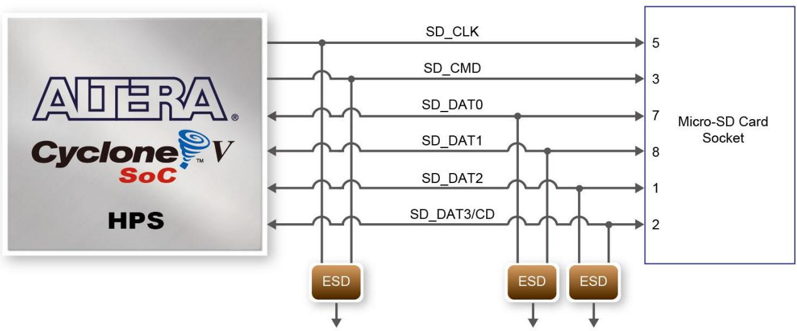  
Figure 3-34 Connections between the FPGA and SD card socket

Table 3-28 Pin Assignment of Micro SD Card Socket   

<table><tr><td>Signal Name</td><td>FPGA Pin No.</td><td>Description</td><td>I/O Standard</td></tr><tr><td>HPS_SD_CLK</td><td>PIN_A16</td><td>HPS SD Clock</td><td>3.3V</td></tr><tr><td>HPS_SD_CMD</td><td>PIN_F18</td><td>HPS SD Command Line</td><td>3.3V</td></tr><tr><td>HPS_SD_DATA[0]</td><td>PIN_G18</td><td>HPS SD Data[0]</td><td>3.3V</td></tr><tr><td>HPS_SD_DATA[1]</td><td>PIN_C17</td><td>HPS SD Data[1]</td><td>3.3V</td></tr><tr><td>HPS_SD_DATA[2]</td><td>PIN_D17</td><td>HPS SD Data[2]</td><td>3.3V</td></tr><tr><td>HPS_SD_DATA[3]</td><td>PIN_B16</td><td>HPS SD Data[3]</td><td>3.3V</td></tr></table>

# 3.7.6 2-port USB Host

The board has two USB 2.0 type-A ports with a SMSC USB3300 controller and a 2-port hub controller. The SMSC USB3300 device in 32-pin QFN package interfaces with the SMSC USB2512B hub controller. This device supports UTMI+ Low Pin Interface (ULPI), which communicates with the USB 2.0 controller in HPS. The PHY operates in Host mode by connecting the ID pin of USB3300 to ground. When operating in Host mode, the device is powered by the two USB type-A ports. Figure 3-35 shows the connections of USB PTG PHY to the HPS. Table 3-29 lists the pin assignment of USBOTG PHY to the HPS.

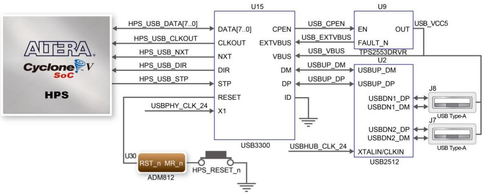  
Figure 3-35 Connections between the HPS and USB OTG PHY

Table 3-29 Pin Assignment of USB OTG PHY   

<table><tr><td>Signal Name</td><td>FPGA Pin No.</td><td>Description</td><td>I/O Standard</td></tr><tr><td>HPS_USB_CLKOUT</td><td>PIN_N16</td><td>60MHz Reference Clock Output</td><td>3.3V</td></tr><tr><td>HPS_USB_DATA[0]</td><td>PIN_E16</td><td>HPS USB_DATA[0]</td><td>3.3V</td></tr><tr><td>HPS_USB_DATA[1]</td><td>PIN_G16</td><td>HPS USB_DATA[1]</td><td>3.3V</td></tr><tr><td>HPS_USB_DATA[2]</td><td>PIN_D16</td><td>HPS USB_DATA[2]</td><td>3.3V</td></tr><tr><td>HPS_USB_DATA[3]</td><td>PIN_D14</td><td>HPS USB_DATA[3]</td><td>3.3V</td></tr><tr><td>HPS_USB_DATA[4]</td><td>PIN_A15</td><td>HPS USB_DATA[4]</td><td>3.3V</td></tr><tr><td>HPS_USB_DATA[5]</td><td>PIN_C14</td><td>HPS USB_DATA[5]</td><td>3.3V</td></tr><tr><td>HPS_USB_DATA[6]</td><td>PIN_D15</td><td>HPS USB_DATA[6]</td><td>3.3V</td></tr><tr><td>HPS_USB_DATA[7]</td><td>PIN_M17</td><td>HPS USB_DATA[7]</td><td>3.3V</td></tr><tr><td>HPS_USB_DIR</td><td>PIN_E14</td><td>Direction of the Data Bus</td><td>3.3V</td></tr><tr><td>HPS_USB_NXT</td><td>PIN_A14</td><td>Throttle the Data</td><td>3.3V</td></tr><tr><td>HPS_USB_RESET</td><td>PIN_G17</td><td>HPS USB PHY Reset</td><td>3.3V</td></tr><tr><td>HPS_USB_STP</td><td>PIN_C15</td><td>Stop Data Stream on the Bus</td><td>3.3V</td></tr></table>

# 3.7.7 G-sensor

The board comes with a digital accelerometer sensor module (ADXL345), commonly known as G-sensor. This G-sensor is a small, thin, ultralow power assumption 3-axis accelerometer with high-resolution measurement. Digitalized output is formatted as 16-bit in two’s complement and can be accessed through I2C interface. The I2C address of G-sensor is 0xA6/0xA7. More information about this chip can be found in its datasheet, which is available on manufacturer’s website or in the directory \Datasheet folder of DE1-SoC system CD. Figure 3-36 shows the connections between the HPS and G-sensor. Table 3-30 lists the pin assignment of G-senor to the HPS.

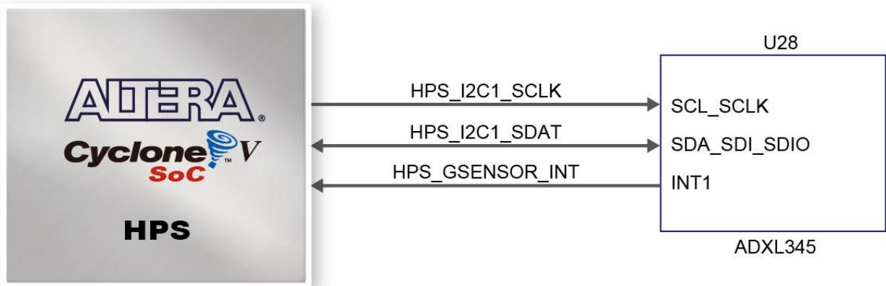  
Figure 3-36 Connections between Cyclone V SoC FPGA and G-Sensor

Table 3-30 Pin Assignment of G-senor   

<table><tr><td>Signal Name</td><td>FPGA Pin No.</td><td>Description</td><td>I/O Standard</td></tr><tr><td>HPS_GSENSOR_INT</td><td>PIN_B22</td><td>HPS GSENSOR Interrupt Output</td><td>3.3V</td></tr><tr><td>HPS_I2C1_SCLK</td><td>PIN_E23</td><td>HPS I2C Clock (share bus with LTC)</td><td>3.3V</td></tr><tr><td>HPS_I2C1_SDAT</td><td>PIN_C24</td><td>HPS I2C Data (share bus)</td><td>3.3V</td></tr></table>

# 3.7.8 LTC Connector

The board has a 14-pin header, which is originally used to communicate with various daughter cards from Linear Technology. It is connected to the SPI Master and I2C ports of HPS. The communication with these two protocols is bi-directional. The 14-pin header can also be used for GPIO, SPI, or I2C based communication with the HPS. Connections between the HPS and LTC connector are shown in Figure 3-37, and the pin assignment of LTC connector is listed in Table 3-31.

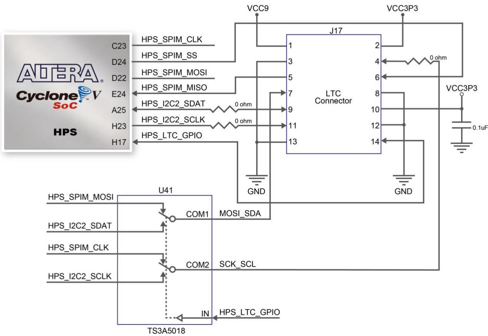  
Figure 3-37 Connections between the HPS and LTC connector

Table 3-31 Pin Assignment of LTC Connector   

<table><tr><td>Signal Name</td><td>FPGA Pin No.</td><td>Description</td><td>I/O Standard</td></tr><tr><td>HPS_LTC_GPIO</td><td>PIN_H17</td><td>HPS LTC GPIO</td><td>3.3V</td></tr><tr><td>HPS_I2C2_SCLK</td><td>PIN_H23</td><td>HPS I2C2 Clock (share bus with G-Sensor)</td><td>3.3V</td></tr><tr><td>HPS_I2C2_SDAT</td><td>PIN_A25</td><td>HPS I2C2 Data (share bus with G-Sensor)</td><td>3.3V</td></tr><tr><td>HPS_SPIM_CLK</td><td>PIN_C23</td><td>SPI Clock</td><td>3.3V</td></tr><tr><td>HPS_SPIM_MISO</td><td>PIN_E24</td><td>SPI Master Input/Slave Output</td><td>3.3V</td></tr><tr><td>HPS_SPIM_MOSI</td><td>PIN_D22</td><td>SPI Master Output /Slave Input</td><td>3.3V</td></tr><tr><td>HPS_SPIM_SS</td><td>PIN_D24</td><td>SPI Slave Select</td><td>3.3V</td></tr></table>

This chapter describes how users can create a custom design project with the tool named DE1-SoC System Builder.

# 4.1 Introduction

The DE1-SoC System Builder is a Windows-based utility. It is designed to help users create a Quartus II project for DE1-SoC within minutes. The generated Quartus II project files include:

• Quartus II project file (.qpf)   
• Quartus II setting file (.qsf)   
• Top-level design file (.v)   
• Synopsis design constraints file (.sdc)   
• Pin assignment document (.htm)

The above files generated by the DE1-SoC System Builder can also prevent occurrence of situations that are prone to compilation error when users manually edit the top-level design file or place pin assignment. The common mistakes that users encounter are:

• Board is damaged due to incorrect bank voltage setting or pin assignment.   
• Board is malfunctioned because of wrong device chosen, declaration of pin location or direction is incorrect or forgotten.   
• Performance degradation due to improper pin assignment.

# 4.2 Design Flow

This section provides an introduction to the design flow of building a Quartus II project for DE1-SoC under the DE1-SoC System Builder. The design flow is illustrated in Figure 4-1.

The DE1-SoC System Builder will generate two major files, a top-level design file (.v) and a Quartus II setting file (.qsf) after users launch the DE1-SoC System Builder and create a new project according to their design requirements

The top-level design file contains a top-level Verilog HDL wrapper for users to add their own design/logic. The Quartus II setting file contains information such as FPGA device type, top-level pin assignment, and the I/O standard for each user-defined I/O pin.

Finally, the Quartus II programmer is used to download .sof file to the development board via JTAG interface.

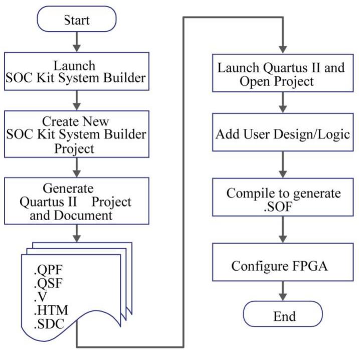  
Figure 4-1 Design flow of building a project from the beginning to the end

# 4.3 Using DE1-SoC System Builder

This section provides the procedures in details on how to use the DE1-SoC System Builder.

# ◼ Install and Launch the DE1-SoC System Builder

The DE1-SoC System Builder is located in the directory: “Tools\SystemBuilder” of the DE1-SoC System CD. Users can copy the entire folder to a host computer without installing the utility. A window will pop up, as shown in Figure 4-2, after executing the DE1-SoC SystemBuilder.exe on the host computer.

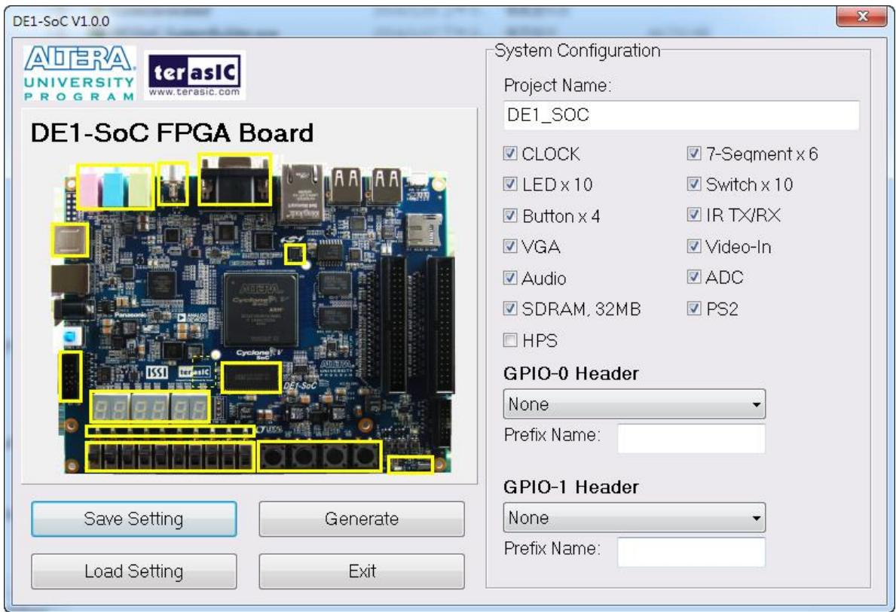  
Figure 4-2 The GUI of DE1-SoC System Builder

# ◼ Enter Project Name

Enter the project name in the circled area, as shown in Figure 4-3.

The project name typed in will be assigned automatically as the name of your top-level design entity.

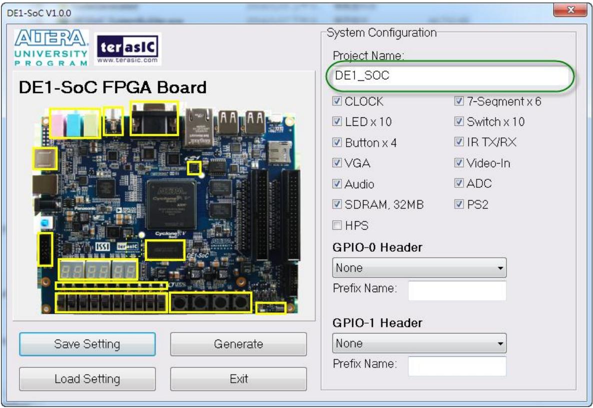  
Figure 4-3 Enter the project name

# ◼ System Configuration

Users are given the flexibility in the System Configuration to include their choice of components in the project, as shown in Figure 4-4. Each component onboard is listed and users can enable or disable one or more components at will. If a component is enabled, the DE1-SoC System Builder will automatically generate its associated pin assignment, including the pin name, pin location, pin direction, and I/O standard.

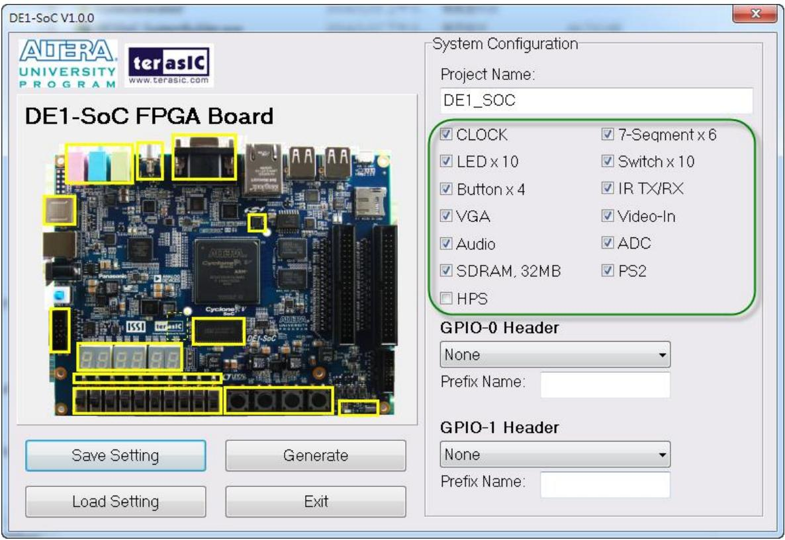  
Figure 4-4 System configuration group

# ◼ GPIO Expansion

If users connect any Terasic GPIO-based daughter card to the GPIO connector(s) on DE1-SoC, the DE1-SoC System Builder can generate a project that include the corresponding module, as shown in Figure 4-5. It will also generate the associated pin assignment automatically, including pin name, pin location, pin direction, and I/O standard.

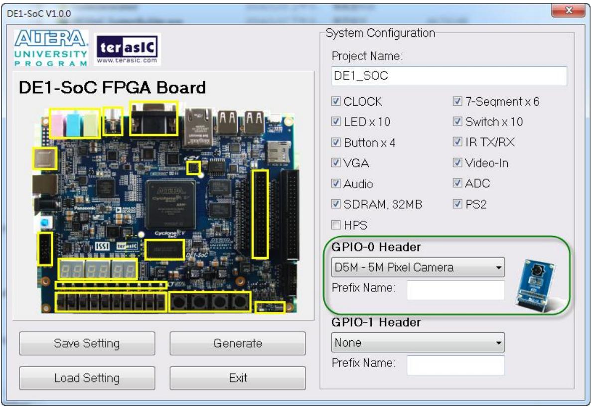  
Figure 4-5 GPIO expansion group

The “Prefix Name” is an optional feature that denote the pin name of the daughter card assigned in your design. Users may leave this field blank.

# ◼ Project Setting Management

The DE1-SoC System Builder also provides the option to load a setting or save users’ current board configuration in .cfg file, as shown in Figure 4-6.

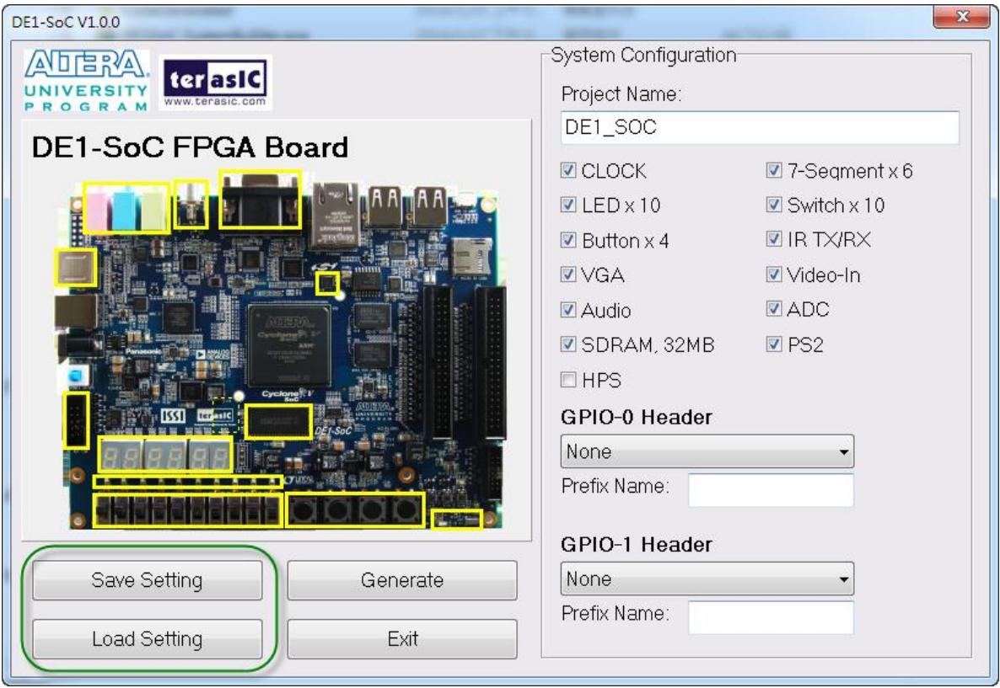  
Figure 4-6 Project Settings

# ◼ Project Generation

When users press the Generate button, the DE1-SoC System Builder will generate the corresponding Quartus II files and documents, as listed in Table 4-1:

Table 4-1 Files generated by the DE1-SoC System Builder   

<table><tr><td>No.</td><td>Filename</td><td>Description</td></tr><tr><td>1</td><td>&lt;Project name&gt;.v</td><td>Top level Verilog HDL file for Quartus II</td></tr><tr><td>2</td><td>&lt;Project name&gt;.qpf</td><td>Quartus II Project File</td></tr><tr><td>3</td><td>&lt;Project name&gt;.qsf</td><td>Quartus II Setting File</td></tr><tr><td>4</td><td>&lt;Project name&gt;.sdc</td><td>Synopsis Design Constraints file for Quartus II</td></tr><tr><td>5</td><td>&lt;Project name&gt;.htm</td><td>Pin Assignment Document</td></tr></table>

Users can add custom logic into the project in Quartus II and compile the project to generate the SRAM Object File (.sof).

This chapter provides examples of advanced designs implemented by RTL or Qsys on the DE1-SoC board. These reference designs cover the features of peripherals connected to the FPGA, such as audio, SDRAM, and IR receiver. All the associated files can be found in the directory \Demonstrations\FPGA of DE1-SoC System CD.

# ◼ Installation of Demonstrations

To install the demonstrations on your computer:

Copy the folder Demonstrations to a local directory of your choice. It is important to make sure the path to your local directory contains NO space. Otherwise it will lead to error in Nios II. Note Quartus II v16.0 or later is required for all DE1-SoC demonstrations to support Cyclone V SoC device.

# 5.1 DE1-SoC Factory Configuration

The DE1-SoC board has a default configuration bit-stream pre-programmed, which demonstrates some of the basic features onboard. The setup required for this demonstration and the location of its files are shown below.

# ◼ Demonstration Setup, File Locations, and Instructions

• Project directory: DE1_SoC_Default   
• Bitstream used: DE1_SoC_Default.sof or DE1_SoC_Default.jic   
• Power on the DE1-SoC board with the USB cable connected to the USB-Blaster II port. If necessary (that is, if the default factory configuration is not currently stored in the EPCS device), download the bit stream to the board via JTAG interface.   
• You should now be able to observe the 7-segment displays are showing a sequence of characters, and the red LEDs are blinking.

• If the VGA D-SUB connector is connected to a VGA display, it would show a color picture.   
• If the stereo line-out jack is connected to a speaker and KEY[1] is pressed, a $1 \mathrm { k H z }$ humming sound will come out of the line-out port .   
• For the ease of execution, a demo_batch folder is provided in the project. It is able to not only load the bit stream into the FPGA in command line, but also program or erase .jic file to the EPCS by executing the test.bat file shown in Figure 5-1.

If users want to program a new design into the EPCS device, the easiest method is to copy the new .sof file into the demo_batch folder and execute the test.bat. Option “2” will convert the .sof to .jic and option”3” will program .jic file into the EPCS device.

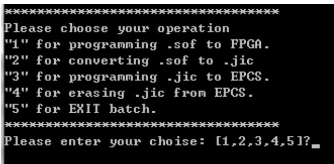  
Figure 5-1 Command line of the batch file to program the FPGA and EPCS device

# 5.2 Audio Recording and Playing

This demonstration shows how to implement an audio recorder and player on DE1-SoC board with the built-in audio CODEC chip. It is developed based on Qsys and Eclipse. Figure 5-2 shows the buttons and slide switches used to interact this demonstration onboard. Users can configure this audio system through two push-buttons and four slide switches:

• SW0 is used to specify the recording source to be Line-in or MIC-In.   
• SW1, SW2, and SW3 are used to specify the recording sample rate such as 96K, 48K, 44.1K, 32K, or 8K.   
• Table 5-1 and Table 5-2 summarize the usage of slide switches for configuring the audio recorder and player.

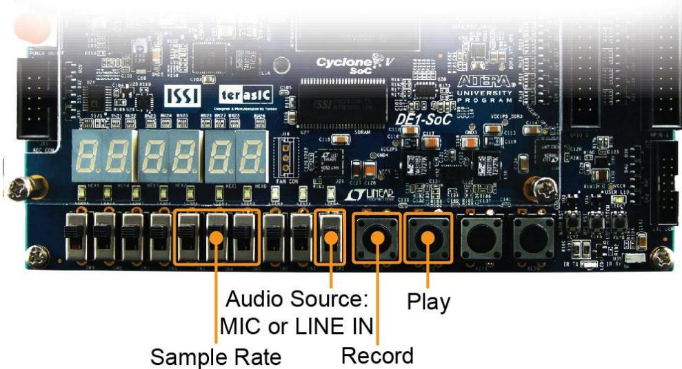  
Figure 5-2 Buttons and switches for the audio recorder and player

Figure 5-3 shows the block diagram of audio recorder and player design. There are hardware and software parts in the block diagram. The software part stores the Nios II program in the on-chip memory. The software part is built under Eclipse in C programming language. The hardware part is built under Qsys in Quartus II. The hardware part includes all the other blocks such as the “AUDIO Controller”, which is a user-defined Qsys component and it is designed to send audio data to the audio chip or receive audio data from the audio chip.

The audio chip is programmed through I2C protocol, which is implemented in C code. The I2C pins from the audio chip are connected to Qsys system interconnect fabric through PIO controllers. The audio chip is configured in master mode in this demonstration. The audio interface is configured as 16-bit I2S mode. 18.432MHz clock generated by the PLL is connected to the MCLK/XTI pin of the audio chip through the audio controller.

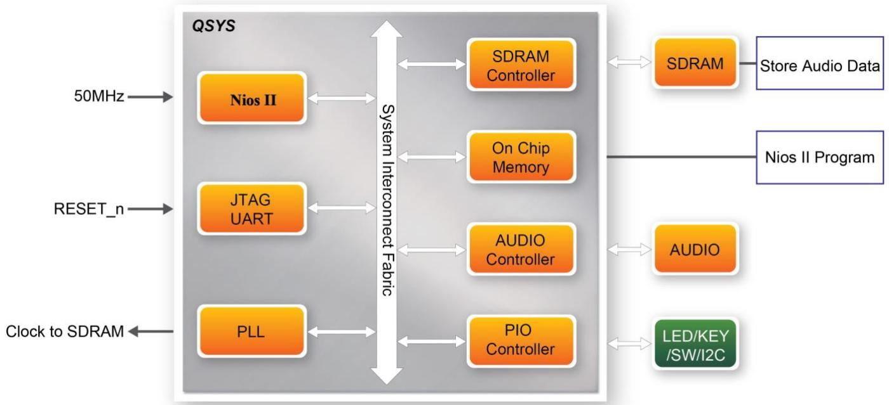  
Figure 5-3 Block diagram of the audio recorder and player

# ◼ Demonstration Setup, File Locations, and Instructions

• Hardware project directory: DE1_SoC _Audio   
• Bitstream used: DE1_SoC_Audio.sof   
• Software project directory: DE1_SoC _Audio\software   
• Connect an audio source to the Line-in port   
• Connect a Microphone to the MIC-in port   
• Connect a speaker or headset to the Line-out port   
• Load the bitstream into the FPGA. (note $^ { * 1 }$ )   
• Load the software execution file into the FPGA. (note $^ { * 1 }$ )   
• Configure the audio with SW0, as shown in Table 5-1.   
• Press KEY3 to start/stop audio recording (note $^ { * 2 }$ )   
• Press KEY2 to start/stop audio playing (note $^ { * 3 }$ )

Table 5-1 Slide switches usage for audio source   

<table><tr><td>Slide Switches</td><td>0 – DOWN Position</td><td>1 – UP Position</td></tr><tr><td>SW0</td><td>Audio is from MIC-in</td><td>Audio is from Line-in</td></tr></table>

Table 5-2 Settings of switches for the sample rate of audio recorder and player   

<table><tr><td>SW5
(0 – DOWN;
1- UP)</td><td>SW4
(0 – DOWN;
1-UP)</td><td>SW3
(0 – DOWN;
1-UP)</td><td>Sample Rate</td></tr><tr><td>0</td><td>0</td><td>0</td><td>96K</td></tr><tr><td>0</td><td>0</td><td>1</td><td>48K</td></tr><tr><td>0</td><td>1</td><td>0</td><td>44.1K</td></tr><tr><td>0</td><td>1</td><td>1</td><td>32K</td></tr><tr><td>1</td><td>0</td><td>0</td><td>8K</td></tr><tr><td colspan="3">Unlisted combination</td><td>96K</td></tr></table>


# Note:

(1). Execute DE1_SoC_Audio ldemo_batchl DE1-SoC_Audio.bat to download .sof and .elf files.   
(2). Recording process will stop if the audio buffer is full.   
(3). Playing process will stop if the audio data is played completely.

# 5.3 Karaoke Machine

This demonstration uses the microphone-in, line-in, and line-out ports on DE1-SoC to create a Karaoke machine. The WM8731 CODEC is configured in master mode. The audio CODEC generates AD/DA serial bit clock (BCK) and the left/right channel clock (LRCK) automatically. The I2C interface is used to configure the audio CODEC, as shown in Figure 5-4. The sample rate and gain of the CODEC are set in a similar manner, and the data input from the line-in port is then mixed with the microphone-in port. The result is sent out to the line-out port.

The sample rate is set to $4 8 ~ \mathrm { \ k H z }$ in this demonstration. The gain of the audio CODEC is reconfigured via I2C bus by pressing the pushbutton KEY0, cycling within ten predefined gain values (volume levels) provided by the device.

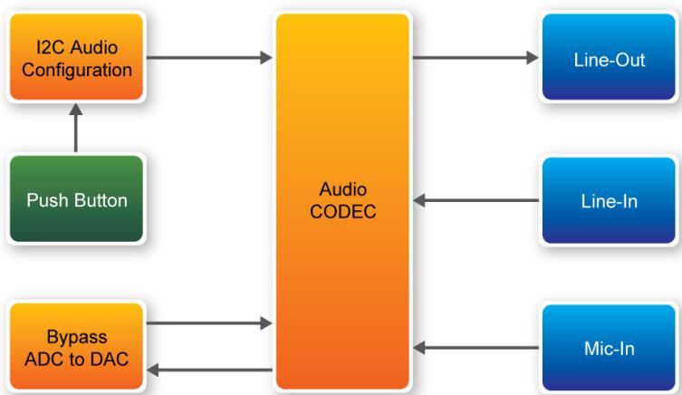  
Figure 5-4 Block diagram of the Karaoke machine demonstration

# ◼ Demonstration Setup, File Locations, and Instructions

• Project directory: DE1_SOC_i2sound   
• Bitstream used: DE1_SOC_i2sound.sof   
• Connect a microphone to the microphone-in port (pink color)   
• Connect the audio output of a music player, such as a MP3 player or computer, to the line-in port (blue color)   
• Connect a headset/speaker to the line-out port (green color)   
• Load the bitstream into the FPGA by executing the batch file ‘DE1_SOC_i2sound’ in the directory DE1_SOC_i2sound\demo_batch   
• Users should be able to hear a mixture of microphone sound and the sound from the music player   
• Press KEY0 to adjust the volume; it cycles between volume level 0 to 9

Figure 5-5 illustrates the setup for this demonstration.

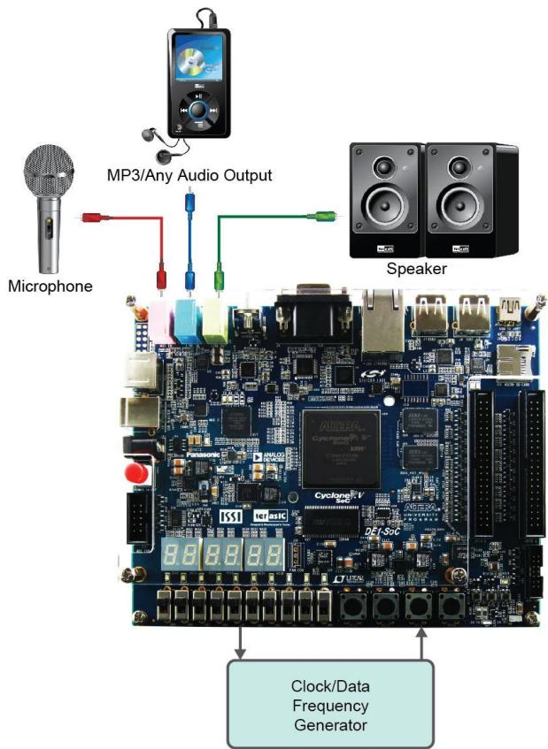  
Figure 5-5 Setup for the Karaoke machine

# 5.4 SDRAM Test in Nios II

There are many applications use SDRAM as a temporary storage. Both hardware and software designs are provided to illustrate how to perform memory access in Qsys in this demonstration. It also shows how Altera’s SDRAM controller IP accesses SDRAM and how the Nios II processor reads and writes the SDRAM for hardware verification. The SDRAM controller handles complex aspects of accessing SDRAM such as initializing the memory device, managing SDRAM banks, and keeping the devices refreshed at certain interval.

# ◼ System Block Diagram

Figure 5-6 shows the system block diagram of this demonstration. The system requires a ${ 5 0 } \mathrm { M H z }$ clock input from the board. The SDRAM controller is configured as a 64MB controller. The working frequency of the SDRAM controller is 100MHz, and the Nios II program is running on the on-chip memory.

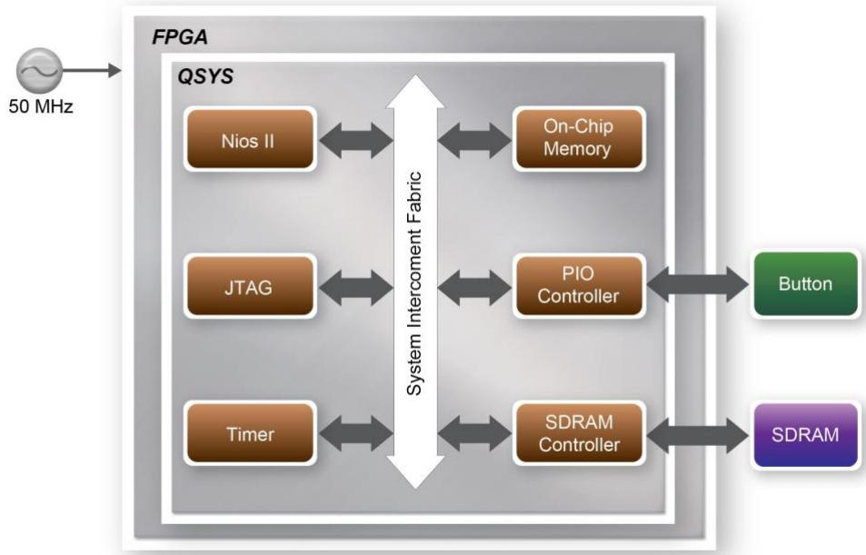  
Figure 5-6 Block diagram of the SDRAM test in Nios II

The system flow is controlled by a program running in Nios II. The Nios II program writes test patterns into the entire 64MB of SDRAM first before calling the Nios II system function, alt_dcache_flush_all, to make sure all the data are written to the SDRAM. It then reads data from the SDRAM for data verification. The program will show the progress in nios-terminal when writing/reading data to/from the SDRAM. When the verification process reaches $1 0 0 \%$ , the result will be displayed in nios-terminal.

# ◼ Design Tools

• Quartus II v16.0   
• Nios II Eclipse v16.0

# ◼ Demonstration Source Code

• Quartus project directory: DE1_SoC_SDRAM_Nios_Test   
• Nios II Eclipse directory: DE1_SoC_SDRAM_Nios_Test \Software

# ◼ Nios II Project Compilation

• Click “Clean” from the “Project” menu of Nios II Eclipse before compiling the reference design in Nios II Eclipse.

# ◼ Demonstration Batch File

The files are located in the directory \DE1_SoC_SDRAM_Nios_Test \demo_batch.

The folder includes the following files:

• Batch file for USB-Blaster II : DE1_SoC_SDRAM_Nios_Test.bat and DE1_SoC_SDRAM_Nios_Test_bashrc   
• FPGA configuration file : DE1_SoC_SDRAM_Nios_Test.sof   
• Nios II program: DE1_SoC_SDRAM_Nios_Test.elf

# ◼ Demonstration Setup

• Quartus II v16.0 and Nios II v16.0 must be pre-installed on the host PC.   
• Power on the DE1-SoC board.   
• Connect the DE1-SoC board (J13) to the host PC with a USB cable and install the USB-Blaster driver if necessary.   
• Execute the demo batch file “DE1_SoC_SDRAM_Nios_Test.bat” from the directory DE1_SoC_SDRAM_Nios_Test\demo_batch   
• After the program is downloaded and executed successfully, a prompt message will be displayed in nios2-terminal.   
• Press any button (KEY3~KEY0) to start the SDRAM verification process. Press KEY0 to run the test continuously.   
• The program will display the test progress and result, as shown in Figure 5-7.

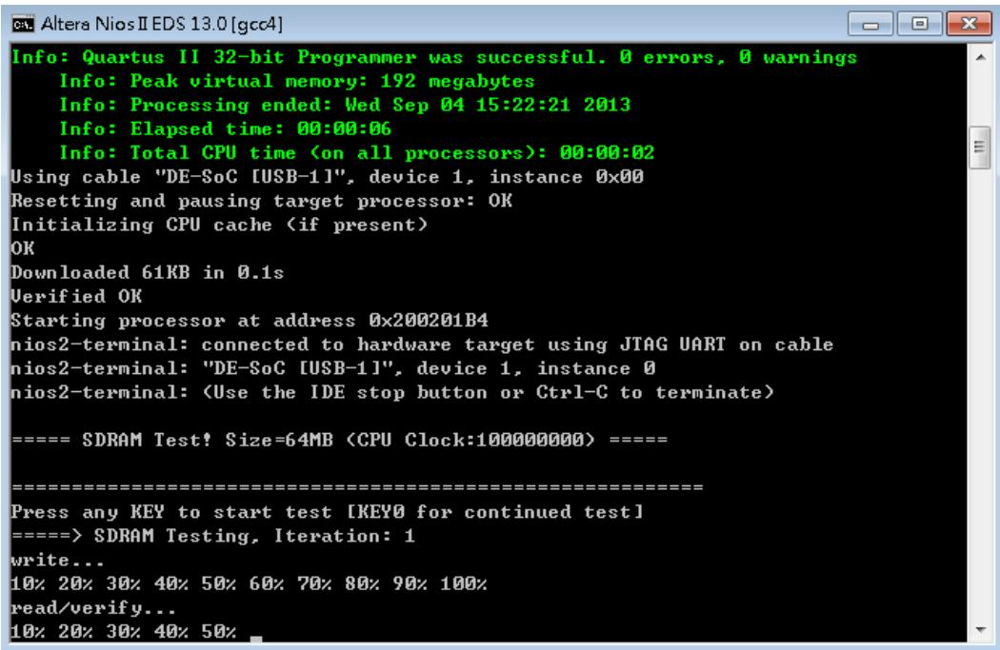  
Figure 5-7 Display of progress and result for the SDRAM test in Nios II

# 5.5 SDRAM Test in Verilog

DE1-SoC system CD offers another SDRAM test with its test code written in Verilog HDL. The memory size of the SDRAM bank tested is still 64MB.

# ◼ Function Block Diagram

Figure 5-8 shows the function block diagram of this demonstration. The SDRAM controller uses 50 MHz as a reference clock and generates 100 MHz as the memory clock.

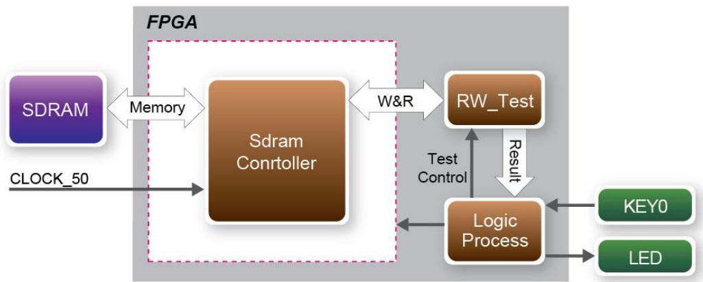  
Figure 5-8 Block diagram of the SDRAM test in Verilog

RW_test module writes the entire memory with a test sequence first before comparing the data read back with the regenerated test sequence, which is same as the data written to the memory. KEY0 triggers test control signals for the SDRAM, and the LEDs will indicate the test result according to Table 5-3.

# Design Tools

• Quartus II v16.0

# ◼ Demonstration Source Code

• Project directory: DE1_SoC_SDRAM_RTL_Test   
• Bitstream used: DE1_SoC_SDRAM_RTL_Test.sof

# ◼ Demonstration Batch File

Demo batch file folder: \DE1_SoC_SDRAM_RTL_Test\demo_batch

The directory includes the following files:

• Batch file: DE1_SoC_SDRAM_RTL_Test.bat   
• FPGA configuration file: DE1_SoC_SDRAM_RTL_Test.sof

# ◼ Demonstration Setup

• Quartus II v16.0 must be pre-installed to the host PC.   
• Connect the DE1-SoC board (J13) to the host PC with a USB cable and install the USB-Blaster II driver if necessary   
• Power on the DE1_SoC board.   
• Execute the demo batch file “ DE1_SoC_SDRAM_RTL_Test.bat” from the directoy \DE1_SoC_SDRAM_RTL_Test \demo_batch.   
• Press KEY0 on the DE1_SoC board to start the verification process. When KEY0 is pressed, the LEDR [2:0] should turn on. When KEY0 is then released, LEDR1 and LEDR2 should start blinking.   
• After approximately 8 seconds, LEDR1 should stop blinking and stay ON to indicate the test is PASS. Table 5-3 lists the status of LED indicators.   
• If LEDR2 is not blinking, it means 50MHz clock source is not working.   
• If LEDR1 failed to remain ON after approximately 8 seconds, the SDRAM test is NG.   
• Press KEY0 again to repeat the SDRAM test.

Table 5-3 Status of LED Indicators   

<table><tr><td>Name</td><td>Description</td></tr><tr><td>LEDR0</td><td>Reset</td></tr><tr><td>LEDR1</td><td>ON if the test is PASS after releasing KEY0</td></tr><tr><td>LEDR2</td><td>Blinks</td></tr></table>

# 5.6 TV Box Demonstration

This demonstration turns DE1-SoC board into a TV box by playing video and audio from a DVD player using the VGA output, audio CODEC and the TV decoder on the DE1-SoC board. Figure 5-9 shows the block diagram of the design. There are two major blocks in the system called I2C_AV_Config and TV_to_VGA. The TV_to_VGA block consists of the ITU-R 656 Decoder, SDRAM Frame Buffer, YUV422 to YUV444, YCbCr to RGB, and VGA Controller. The figure also shows the TV decoder (ADV7180) and the VGA DAC (ADV7123) chip used.

The register values of the TV decoder are used to configure the TV decoder via the I2C_AV_Config block, which uses the I2C protocol to communicate with the TV decoder. The TV decoder will be unstable for a time period upon power up, and the Lock Detector block is responsible for detecting this instability.

The ITU-R 656 Decoder block extracts YcrCb 4:2:2 (YUV 4:2:2) video signals from the ITU-R 656 data stream sent from the TV decoder. It also generates a data valid control signal, which indicates the valid period of data output. De-interlacing needs to be performed on the data source because the video signal for the TV decoder is interlaced. The SDRAM Frame Buffer and a field selection multiplexer (MUX), which is controlled by the VGA Controller, are used to perform the de-interlacing operation. The VGA Controller also generates data request and odd/even selection signals to the SDRAM Frame Buffer and filed selection multiplexer (MUX). The YUV422 to YUV444 block converts the selected YcrCb 4:2:2 (YUV 4:2:2) video data to the YcrCb 4:4:4 (YUV 4:4:4) video data format.

Finally, the YcrCb_to_RGB block converts the YcrCb data into RGB data output. The VGA Controller block generates standard VGA synchronous signals VGA_HS and VGA_VS to enable the display on a VGA monitor.

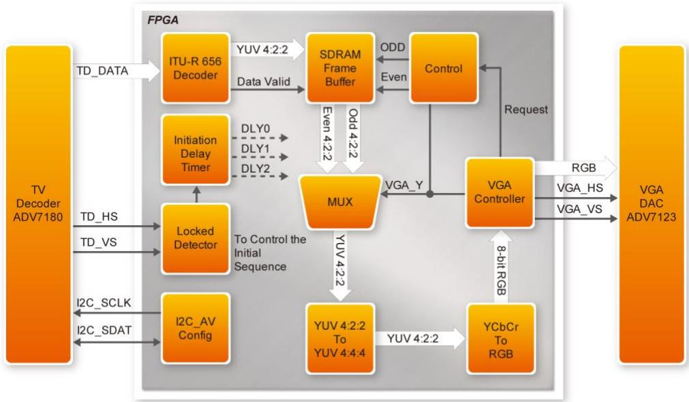  
Figure 5-9 Block diagram of the TV box demonstration

# Demonstration Source Code

• Project directory: DE1_SoC_TV   
• Bitstream used: DE1_SoC_TV.sof

# Demonstration Batch File

Demo batch directory: \DE1_SoC_TV \demo_batch

The folder includes the following files:

• Batch file: DE1_SoC_TV.bat   
• FPGA configuration file : DE1_SoC_TV.sof

# Demonstration Setup, File Locations, and Instructions

• Connect a DVD player’s composite video output (yellow plug) to the Video-in RCA jack (J6) on the DE1-SoC board, as shown in Figure 5-10. The DVD player has to be configured to provide:   
• NTSC output   
• 60Hz refresh rate   
• 4:3 aspect ratio   
• Non-progressive video

• Connect the VGA output of the DE1-SoC board to a VGA monitor.   
• Connect the audio output of the DVD player to the line-in port of the DE1-SoC board and connect a speaker to the line-out port. If the audio output jacks from the DVD player are RCA type, an adaptor is needed to convert to the mini-stereo plug supported on the DE1-SoC board.   
• Load the bitstream into the FPGA by executing the batch file ‘DE1_SoC_TV.bat’ from the directory \DE1_SoC_TV \demo_batch\. Press KEY0 on the DE1-SoC board to reset the demonstration.

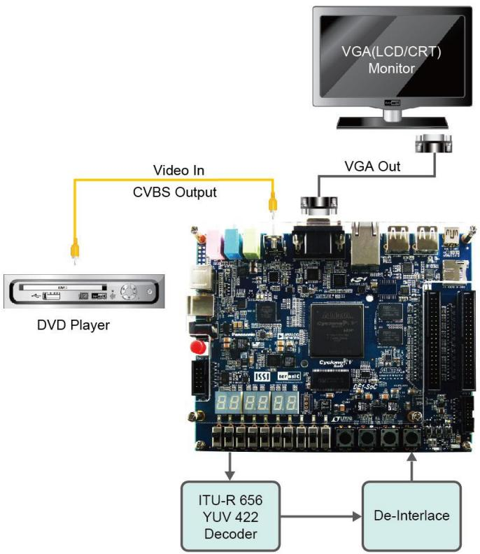  
Figure 5-10 Setup for the TV box demonstration

# 5.7 PS/2 Mouse Demonstration

A simply PS/2 controller coded in Verilog HDL is provided to demonstrate bi-directional communication with a PS/2 mouse. A comprehensive PS/2 controller can be developed based on it and more sophisticated functions can be implemented such as setting the sampling rate or resolution, which needs to transfer two data bytes at once.

More information about the PS/2 protocol can be found on various websites.

# ◼ Introduction

PS/2 protocol uses two wires for bi-directional communication. One is the clock line and the other one is the data line. The PS/2 controller always has total control over the transmission line, but it is the PS/2 device which generates the clock signal during data transmission.

# ◼ Data Transmission from Device to the Controller

After the PS/2 mouse receives an enabling signal at stream mode, it will start sending out displacement data, which consists of 33 bits. The frame data is cut into three sections and each of them contains a start bit (always zero), eight data bits (with LSB first), one parity check bit (odd check), and one stop bit (always one).

The PS/2 controller samples the data line at the falling edge of the PS/2 clock signal. This is implemented by a shift register, which consists of 33 bits.

easily be implemented using a shift register of 33 bits, but be cautious with the clock domain crossing problem.

# ◼ Data Transmission from the Controller to Device

When the PS/2 controller wants to transmit data to device, it first pulls the clock line low for more than one clock cycle to inhibit the current transmission process or to indicate the start of a new transmission process, which is usually called as inhibit state. It then pulls low the data line before releasing the clock line. This is called the request state. The rising edge on the clock line formed by the release action can also be used to indicate the sample time point as for a 'start bit. The device will detect this succession and generates a clock sequence in less than 10ms time. The transmit data consists of 12bits, one start bit (as explained before), eight data bits, one parity check bit (odd check), one stop bit (always one), and one acknowledge bit (always zero). After sending out the parity check bit, the controller should release the data line, and the device will detect any state change on the data line in the next clock cycle. If there’s no change on the data line for one clock cycle, the device will pull low the data line again as an acknowledgement which means that the data is correctly received.

After the power on cycle of the PS/2 mouse, it enters into stream mode automatically and disable data transmit unless an enabling instruction is received. Figure 5-11 shows the waveform while communication happening on two lines.

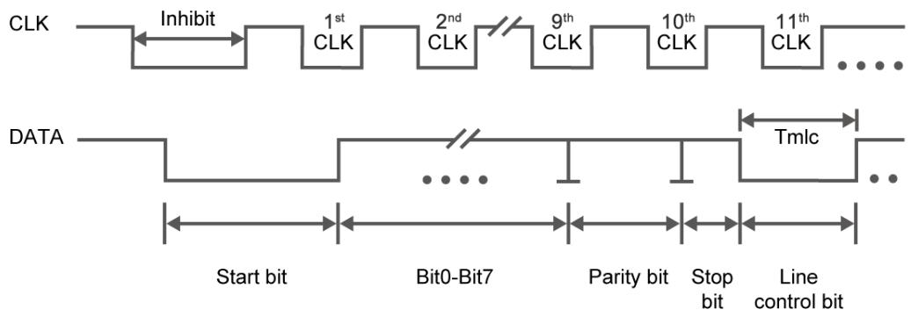  
Sending command

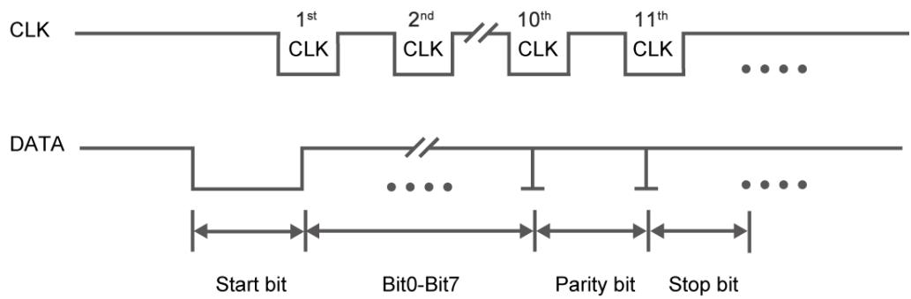  
Receiving data   
Figure 5-11 Waveform of clock and data signals during data transmission

# Demonstration Source Code

• Project directory: DE1_SoC_PS2_DEMO   
• Bitstream used: DE1_SoC_PS2_DEMO.sof

# Demonstration Batch File

Demo batch file directoy: \DE1_SoC_PS2_DEMO \demo_batch

The folder includes the following files:

• Batch file: DE1_SoC_PS2_DEMO.bat   
• FPGA configuration file : DE1_SoC_PS2_DEMO.sof

# Demonstration Setup, File Locations, and Instructions

• Load the bitstream into the FPGA by executing \DE1_SoC_PS2_DEMO \demo_batch\ DE1_SoC_PS2_DEMO.bat   
• Plug in the PS/2 mouse   
• Press KEY[0] to enable data transfer   
• Press KEY[1] to clear the display data cache   
• The 7-segment display should change when the PS/2 mouse moves. The LEDR[2:0] will blink according to Table 5-4 when the left-button, right-button, and/or middle-button is pressed.

Table 5-4 Description of 7-segment Display and LED Indicators   

<table><tr><td>Indicator Name</td><td>Description</td></tr><tr><td>LEDR[0]</td><td>Left button press indicator</td></tr><tr><td>LEDR[1]</td><td>Right button press indicator</td></tr><tr><td>LEDR[2]</td><td>Middle button press indicator</td></tr><tr><td>HEX0</td><td>Low byte of X displacement</td></tr><tr><td>HEX1</td><td>High byte of X displacement</td></tr><tr><td>HEX2</td><td>Low byte of Y displacement</td></tr><tr><td>HEX3</td><td>High byte of Y displacement</td></tr></table>

# 5.8 IR Emitter LED and Receiver Demonstration

DE1-SoC system CD has an example of using the IR Emitter LED and IR receiver. This demonstration is coded in Verilog HDL.

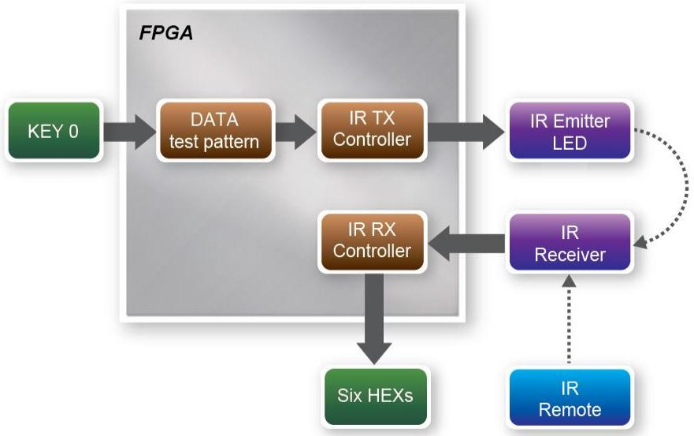  
Figure 5-12 Block diagram of the IR emitter LED and receiver demonstration

Figure 5-12 shows the block diagram of the design. It implements a IR TX Controller and a IR RX Controller. When KEY0 is pressed, data test pattern generator will generate data to the IR TX Controller continuously. When IR TX Controller is active, it will format the data to be compatible with NEC IR transmission protocol and send it out through the IR emitter LED. The IR receiver will decode the received data and display it on the six HEXs. Users can also use a remote control to send data to the IR Receiver. The main function of IR TX /RX controller and IR remote control in this demonstration is described in the following sections.

# ◼ IR TX Controller

Users can input 8-bit address and 8-bit command into the IR TX Controller. The IR TX Controller will encode the address and command first before sending it out according to NEC IR transmission protocol through the IR emitter LED. The input clock of IR TX Controller should be 50MHz.

The NEC IR transmission protocol uses pulse distance to encode the message bits. Each pulse burst is $5 6 2 . 5 \mu \mathrm { s }$ in length with a carrier frequency of 38kHz (26.3µs).

Figure 5-13 shows the duration of logical “1” and “0”. Logical bits are transmitted as follows:

Logical '0' – a 562.5µs pulse burst followed by a $5 6 2 . 5 \mu \mathrm { s }$ space with a total transmit time of 1.125ms

Logical '1' – a 562.5µs pulse burst followed by a 1.6875ms space with a total transmit time of 2.25ms

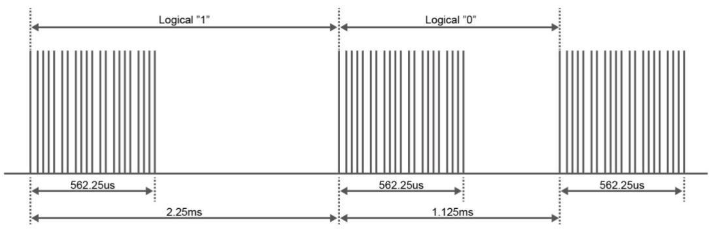  
Figure 5-13 Duration of logical “1”and logical “0”

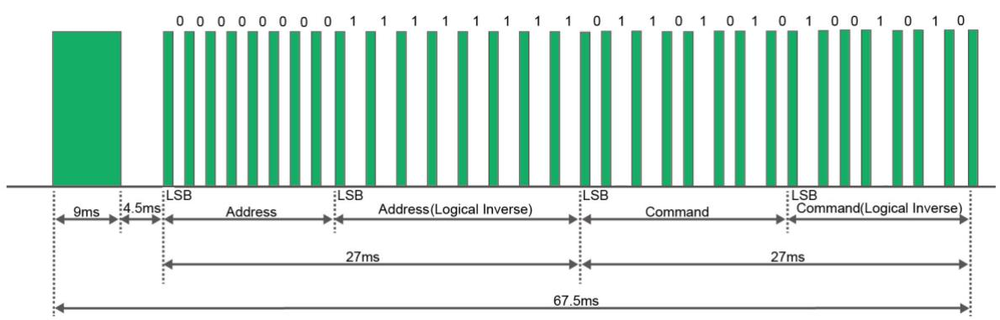  
Figure 5-14 shows a frame of the protocol. Protocol sends a lead code first, which is a 9ms leading pulse burst, followed by a 4.5ms window. The second inversed data is sent to verify the accuracy of the information received. A final $5 6 2 . 5 \mu \mathrm { s }$ pulse burst is sent to signify the end of message transmission. Because the data is sent in pair (original and inverted) according to the protocol, the overall transmission time is constant.   
Figure 5-14 Typical frame of NEC protocol

Note: The signal received by IR Receiver is inverted. For instance, if IR TX Controller sends a lead code 9 ms high and then 4.5 ms low, IR Receiver will receive a 9 ms low and then 4.5 ms high lead code.

# ◼ IR Remote

When a key on the remote control shown in Figure 5-15 is pressed, the remote control will emit a standard frame, as shown in Table 5-5. The beginning of the frame is the lead code, which represents the start bit, followed by the key-related information. The last bit end code represents the end of the frame. The value of this frame is completely inverted at the receiving end.

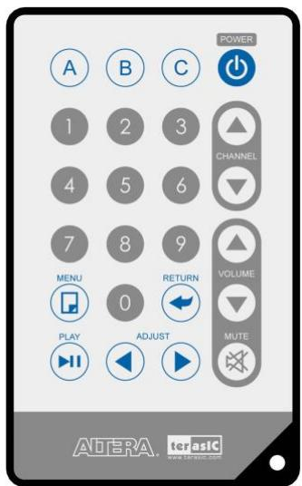  
Figure 5-15 The remote control used in this demonstration

Table 5-5 Key Code Information for Each Key on the Remote Control   

<table><tr><td>Key</td><td>Key Code</td><td>Key</td><td>Key Code</td><td>Key</td><td>Key Code</td><td>Key</td><td>Key Code</td></tr><tr><td>A</td><td>0x0F</td><td>B</td><td>0x13</td><td>C</td><td>0x10</td><td>D</td><td>0x12</td></tr><tr><td>1</td><td>0x01</td><td>2</td><td>0x02</td><td>3</td><td>0x03</td><td>▲</td><td>0x1A</td></tr><tr><td>4</td><td>0x04</td><td>5</td><td>0x05</td><td>6</td><td>0x06</td><td>▼</td><td>0x1E</td></tr><tr><td>7</td><td>0x07</td><td>8</td><td>0x08</td><td>9</td><td>0x09</td><td>▲</td><td>0x1B</td></tr><tr><td></td><td>0x11</td><td>0</td><td>0x00</td><td>←</td><td>0x17</td><td>▼</td><td>0x1F</td></tr><tr><td>II</td><td>0x16</td><td></td><td>0x14</td><td>→</td><td>0x18</td><td></td><td>0x0C</td></tr></table>

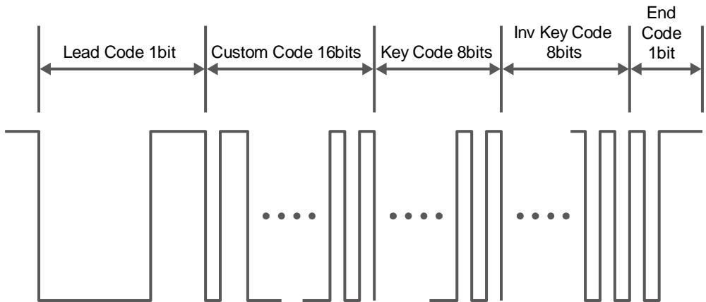  
Figure 5-16 The transmitting frame of the IR remote control

# ◼ IR RX Controller

The following demonstration shows how to implement the IP of IR receiver controller in the FPGA. Figure 5-17 shows the modules used in this demo, including Code Detector, State Machine, and Shift Register. At the beginning the IR receiver demodulates the signal inputs to the Code Detector . The Code Detector will check the Lead Code and feedback the examination result to the State Machine.

The State Machine block will change the state from IDLE to GUIDANCE once the Lead Code is detected. If the Code Detector detects the Custom Code status, the current state will change from GUIDANCE to DATAREAD state. The Code Detector will also save the receiving data and output to the Shift Register and display on the 7-segment. Figure 5-18 shows the state shift diagram of State Machine block. The input clock should be 50MHz.

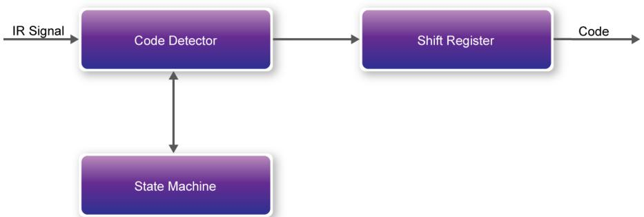  
Figure 5-17 Modules in the IR Receiver controller

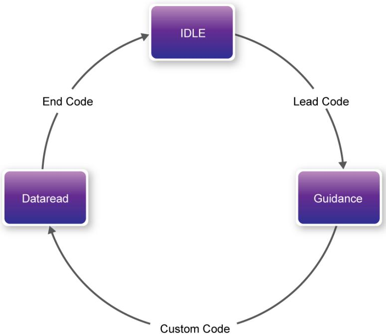  
Figure 5-18 State shift diagram of State Machine block

# Demonstration Source Code

• Project directory: DE1_SoC_IR   
• Bitstream used: DE1_SOC_IR.sof

# Demonstration Batch File

Demo batch file directory: DE1_SoC_IR \demo_batch

The folder includes the following files:

• Batch file: DE1_SoC_IR.bat   
• FPGA configuration file : DE1_SOC_IR.sof

# Demonstration Setup, File Locations, and Instructions

• Load the bitstream into the FPGA by executing DE1_SoC_IR \demo_batch\ DE1_SoC_IR.bat   
• Keep pressing KEY[0] to enable the pattern to be sent out continuously by the IR TX Controller.   
• Observe the six HEXs according to Table 5-6   
• Release KEY[0] to stop the IR TX.   
• Point the IR receiver with the remote control and press any button

• Observe the six HEXs according to Table 5-6

Table 5-6 Detailed Information of the Indicators   

<table><tr><td>Indicator Name</td><td>Description</td></tr><tr><td>HEX5</td><td>Inversed high byte of DATA(Key Code)</td></tr><tr><td>HEX4</td><td>Inversed low byte of DATA(Key Code)</td></tr><tr><td>HEX3</td><td>High byte of ADDRESS(Custom Code)</td></tr><tr><td>HEX2</td><td>Low byte of ADDRESS(Custom Code)</td></tr><tr><td>HEX1</td><td>High byte of DATA(Key Code)</td></tr><tr><td>HEX0</td><td>Low byte of DATA (Key Code)</td></tr></table>

# 5.9 ADC Reading

This demonstration illustrates steps to evaluate the performance of the 8-channel 12-bit A/D Converter LTC2308. The DC 5.0V on the 2x5 header is used to drive the analog signals by a trimmer potentiometer. The voltage should be adjusted within the range between 0 and 4.096V. The 12-bit voltage measurement is displayed on the NIOS II console. Figure 5-19 shows the block diagram of this demonstration.

The default full-scale of ADC is 0~4.096V.

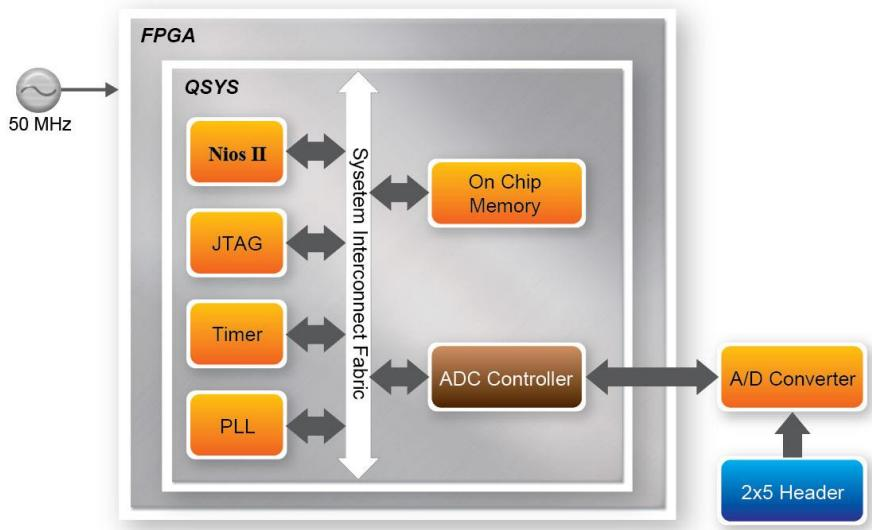  
Figure 5-20 Pin distribution of the 2x5 Header for the ADC

Figure 5-19 Block diagram of ADC reading

Figure 5-20 depicts the pin arrangement of the 2x5 header. This header is the input source of ADC convertor in this demonstration. Users can connect a trimmer to the specified ADC channel (ADC_IN0 ~ ADC_IN7) that provides voltage to the ADC convert. The FPGA will read the associated register in the convertor via serial interface and translates it to voltage value to be displayed on the Nios II console.

The LTC2308 is a low noise, 500ksps, 8-channel, 12-bit ADC with an SPI/MICROWIRE compatible serial interface. The internal conversion clock allows the external serial output data clock (SCK) to operate at any frequency up to 40MHz.In this demonstration, we realized the SPI protocol in Verilog, and packet it into Avalon MM slave IP so that it can be connected to Qsys.

Figure 5-21 is SPI timing specification of LTC2308.

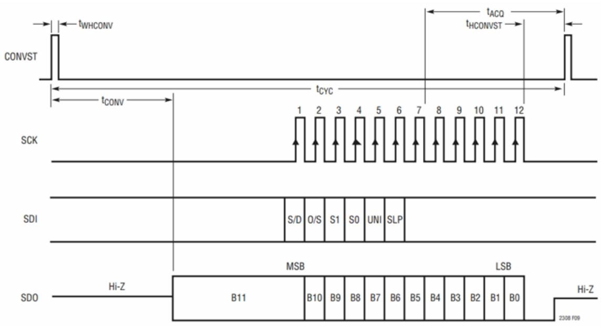  
Figure 5-21 LTC2308 Timing with a Short CONVST Pulse

Important: Users should pay more attention to the impedance matching between the input source and the ADC circuit. If the source impedance of the driving circuit is low, the ADC inputs can be driven directly. Otherwise, more acquisition time should be allowed for a source with higher impedance.

To modify acquisition time tACQ, user can change the tHCONVST macro value in adc_ltc2308.v. When SCK is set to 40MHz, it means 25ns per unit. The default tHCONVST is set to 320, achieving a 100KHz fsample. Thus adding more tHCONVST time (by increasing tHCONVST macro value) will lower the sample rate of the ADC Converter.

<table><tr><td colspan="2">`define tHCONVST 320</td></tr></table>

Figure 5-22 shows the example MUX configurations of ADC. In this demonstration, it is configured as 8 signal-end channel in the verilog code. User can change SW[2:0] to measure the corresponding channel.The default reference voltage is 4.096V.

The formula of the sample voltage is:

Sample Voltage $=$ ADC Data / full scale Data * Reference Voltage.

In this demonstration, full scale is $2 { \land } 1 2 = 4 0 9 6$ . Reference Voltage is 4.096V. Thus

ADC Value $=$ ADC data $/ 4 0 9 6 ^ { \ast } 4 . 0 9 6 = \mathrm { A D C }$ data /1000

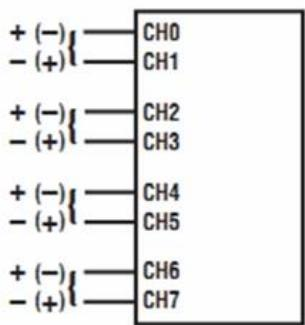  
4Differential

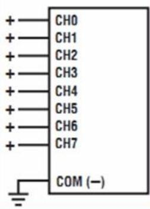  
8Single-Ended

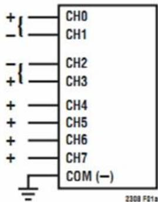  
Combinations of Differential and Single-Ended   
Figure 5-22 Example MUX Configurations

# ◼ System Requirements

The following items are required for this demonstration.

• DE1-SoC board x1   
• Trimmer Potentiometer x1   
• Wire Strip x3

# ◼ Demonstration File Locations

• Hardware project directory: DE1_SoC_ADC   
• Bitstream used: DE1_SoC_ADC.sof   
• Software project directory: DE1_SoC_ADC software   
• Demo batch file : DE1_SoC_ADC\demo_batch\ DE1_SoC_ADC.bat

# ◼ Demonstration Setup and Instructions

• Connect the trimmer to corresponding ADC channel on the 2x5 header, as shown in Figure 5-23, as well as the $+ 5 \mathrm { V }$ and GND signals. The setup shown above is connected to ADC channel 0.   
• Execute the demo batch file DE1_SoC_ADC.bat to load the bitstream and software execution file to the FPGA.   
• The Nios II console will display the voltage of the specified channel voltage result information.   
• Provide any input voltage to other ADC channels and set SW[2:0] to the corresponding channel if user want to measure other channels

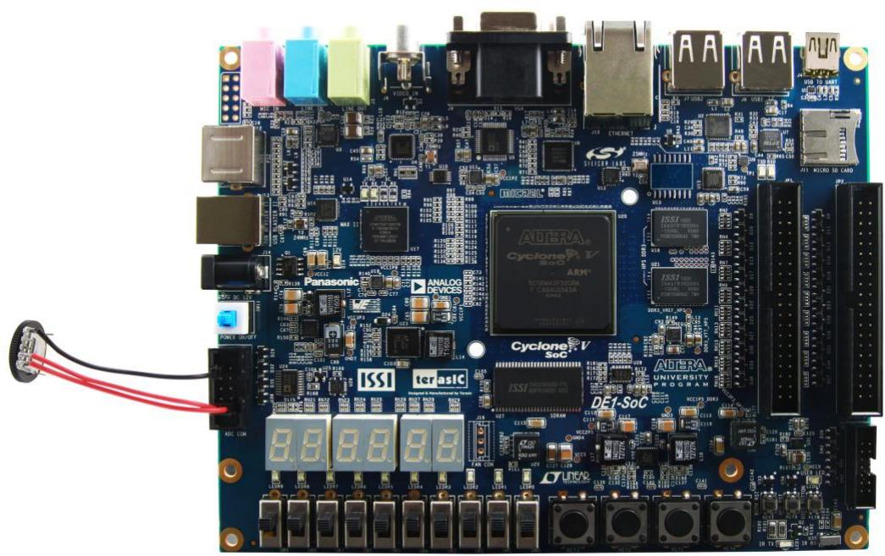  
Figure 5-23 Hardware setup for the ADC reading demonstration

# Chapter 6

# Examples for HPS

# SoC

This chapter provides several C-code examples based on the Altera SoC Linux built by Yocto project. These examples demonstrates major features connected to HPS interface on DE1-SoC board such as users LED/KEY, I2C interfaced G-sensor, and I2C MUX. All the associated files can be found in the directory Demonstrations/SOC of the DE1_SoC System CD. Please refer to Chapter 5 "Running Linux on the DE1-SoC board" from the DE1-SoC_Getting_Started_Guide.pdf to run Linux on DE1-SoC board.

# ◼ Installation of the Demonstrations

To install the demonstrations on the host computer:

Copy the directory Demonstrations into a local directory of your choice. Altera SoC EDS v16.0 is required for users to compile the c-code project.

# 6.1 Hello Program

This demonstration shows how to develop first HPS program with Altera SoC EDS tool. Please refer to My_First_HPS.pdf from the system CD for more details.

The major procedures to develop and build HPS project are:

Install Altera SoC EDS on the host PC.   
Create program .c/.h files with a generic text editor   
Create a "Makefile" with a generic text editor   
Build the project under Altera SoC EDS

# ◼ Program File

The main program for the Hello World demonstration is:

```c
include<stdio.h> int main(int argc, char \*\*argv){ printf("Hello World!\r\n"); return(0); 1 
```

# ◼ Makefile

A Makefile is required to compile a project. The Makefile used for this demo is:

```makefile
#TARGET = my_first_hps
#
CROSS_COMPILE = arm-linux-gnueabihf-
CFLAGS = -g -Wall -I $(SOCEDS_DEST_ROOT)/ip/altera/hps/altera_hps/hvlib/include
LDFLAGS = -g -Wall
CC = $(CROSS_COMPILE)gcc
ARCH= arm
build: $(TARGET)
$(TARGET): main.o
$(CC) $(LDFLAGS) ^ -o $@
% .o : % .c
$(CC) $(CFLAGS) -c $< -o $@
.PHONY: clean
clean:
rm -f $(TARGET) *.a *.o ~ 
```

# ◼ Compile

Please launch Altera SoC EDS Command Shell to compile a project by executing

C:\altera\16.0\embedded\Embedded_Command_Shell.bat

The "cd" command can change the current directory to where the Hello World project is located.

The "make" command will build the project. The executable file "my_first_hps" will be generated after the compiling process is successful. The "clean all" command removes all temporary files.

# ◼ Demonstration Source Code

• Build tool: Altera SoC EDS v16.0   
• Project directory: \Demonstration\SoC\my_first_hps   
• Binary file: my_first_hps   
• Build command: make ("make clean" to remove all temporary files)   
• Execute command: ./my_first_hps

# ◼ Demonstration Setup

• Connect a USB cable to the USB-to-UART connector (J4) on the DE1-SoC board and the host PC.   
• Copy the demo file "my_first_hps" into a microSD card under the "/home/root" folder in Linux.   
• Insert the booting microSD card into the DE1-SoC board.   
• Power on the DE1-SoC board.   
• Launch PuTTY and establish connection to the UART port of Putty. Type "root" to login Altera Yocto Linux.   
• Type "./my_first_hps" in the UART terminal of PuTTY to start the program, and the "Hello World!" message will be displayed in the terminal.

```txt
root@socfpga:~# ./my_first_hps  
Hello World!  
root@socfpga:~# 
```

# 6.2 Users LED and KEY

This demonstration shows how to control the users LED and KEY by accessing the register of GPIO controller through the memory-mapped device driver. The memory-mapped device driver allows developer to access the system physical memory.

# ◼ Function Block Diagram

Figure 6-1 shows the function block diagram of this demonstration. The users LED and KEY are connected to the GPIO1 controller in HPS. The behavior of GPIO controller is controlled by the register in GPIO controller. The registers can be accessed by application software through the memory-mapped device driver, which is built into Altera SoC Linux.

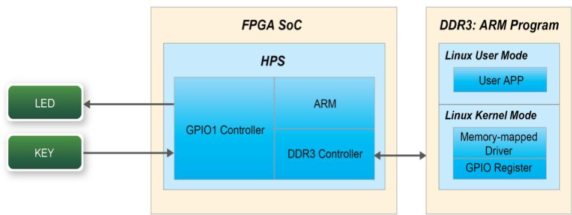  
Figure 6-1 Block diagram of GPIO demonstration

# ◼ Block Diagram of GPIO Interface

The HPS provides three general-purpose I/O (GPIO) interface modules. Figure 6-2 shows the block diagram of GPIO Interface. GPIO[28..0] is controlled by the GPIO0 controller and GPIO[57..29] is controlled by the GPIO1 controller. GPIO[70..58] and input-only GPI[13..0] are controlled by the GPIO2 controller.

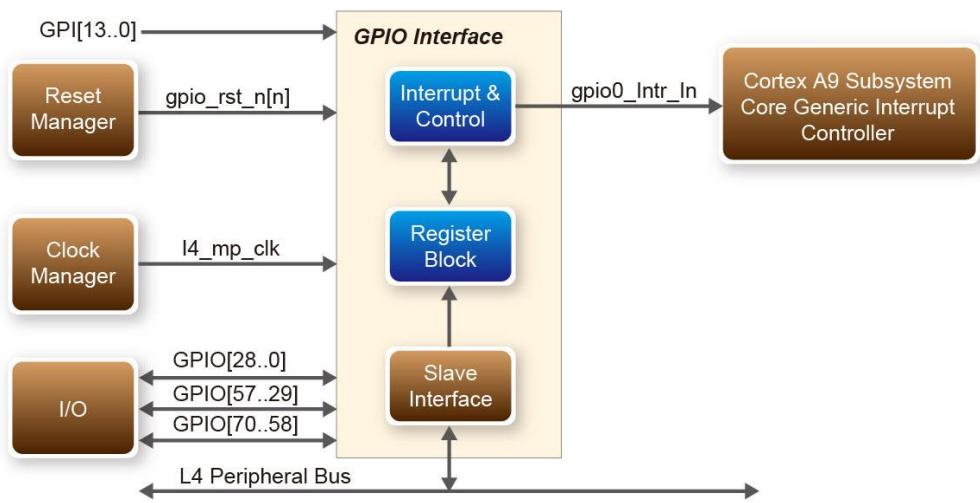  
Figure 6-2 Block diagram of GPIO Interface

# ◼ GPIO Register Block

The behavior of I/O pin is controlled by the registers in the register block. There are three 32-bit registers in the GPIO controller used in this demonstration. The registers are:

⚫ gpio_swporta_dr: write output data to output I/O pin   
⚫ gpio_swporta_ddr: configure the direction of I/O pin   
gpio_ext_porta: read input data of I/O input pin

The gpio_swporta_ddr configures the LED pin as output pin and drives it high or low by writing data to the gpio_swporta_dr register. The first bit (least significant bit) of gpio_swporta_dr controls the direction of first IO pin in the associated GPIO controller and the second bit controls the direction of second IO pin in the associated GPIO controller and so on. The value "1" in the register bit indicates the I/O direction is output, and the value $" 0 "$ in the register bit indicates the I/O direction is input.

The first bit of gpio_swporta_dr register controls the output value of first I/O pin in the associated GPIO controller, and the second bit controls the output value of second I/O pin in the associated GPIO controller and so on. The value "1" in the register bit indicates the output value is high, and the value "0" indicates the output value is low.

The status of KEY can be queried by reading the value of gpio_ext_porta register. The first bit represents the input status of first IO pin in the associated GPIO controller, and the second bit represents the input status of second IO pin in the associated GPIO controller and so on. The value "1" in the register bit indicates the input state is high, and the value "0" indicates the input state is low.

# ◼ GPIO Register Address Mapping

The registers of HPS peripherals are mapped to HPS base address space 0xFC000000 with 64KB size. The registers of the GPIO1 controller are mapped to the base address 0xFF708000 with 4KB size, and the registers of the GPIO2 controller are mapped to the base address 0xFF70A000 with 4KB size, as shown in Figure 6-3.

# HPS

Identifier: HPS

Access: R/W

Description: Addressmap for the HHP HPS system-domain

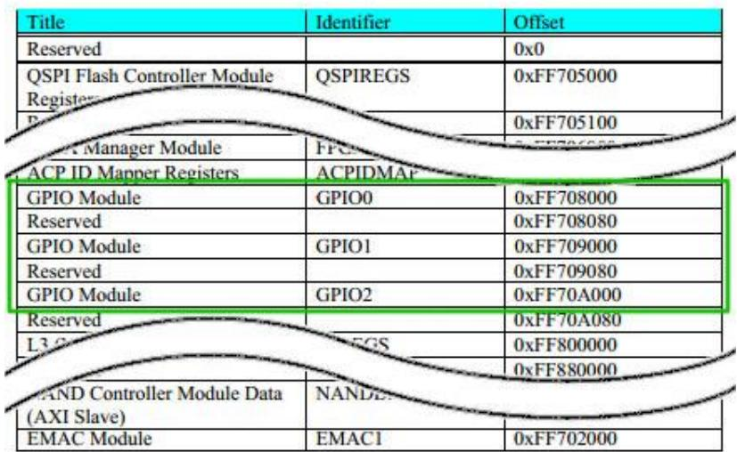  
Figure 6-3 GPIO address map

# Software API

Developers can use the following software API to access the register of GPIO controller.

⚫ open: open memory mapped device driver   
⚫ mmap: map physical memory to user space   
alt_read_word: read a value from a specified register   
alt_write_word: write a value into a specified register   
⚫ munmap: clean up memory mapping   
close: close device driver.

Developers can also use the following MACRO to access the register

alt_setbits_word: set specified bit value to one for a specified register   
alt_clrbits_word: set specified bit value to zero for a specified register

The program must include the following header files to use the above API to access the registers of GPIO controller.

#include <stdio.h>

#include <unistd.h>

#include <fcntl.h>

```c
include <sys/mman.h> #include "hwlib.h" #include "socal/socal.h" #include "socal/hps.h" #include "socal/alt_gpio.h" 
```

# ◼ LED and KEY Control

Figure 6-4 shows the HPS users LED and KEY pin assignment for the DE1_SoC board. The LED is connected to HPS_GPIO53 and the KEY is connected to HPS_GPIO54. They are controlled by the GPIO1 controller, which also controls HPS_GPIO29 ~ HPS_GPIO57.

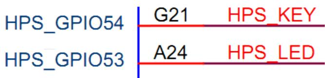  
Figure 6-4 Pin assignment of LED and KEY

Figure 6-5 shows the gpio_swporta_ddr register of the GPIO1 controller. The bit-0 controls the pin direction of HPS_GPIO29. The bit-24 controls the pin direction of HPS_GPIO53, which connects to HPS_LED, the bit-25 controls the pin direction of HPS_GPIO54, which connects to HPS_KEY and so on. The pin direction of HPS_LED and HPS_KEY are controlled by the bit-24 and bit-25 in the gpio_swporta_ddr register of the GPIO1 controller, respectively. Similarly, the output status of HPS_LED is controlled by the bit-24 in the gpio_swporta_dr register of the GPIO1 controller. The status of KEY can be queried by reading the value of the bit-24 in the gpio_ext_porta register of the GPIO1 controller.

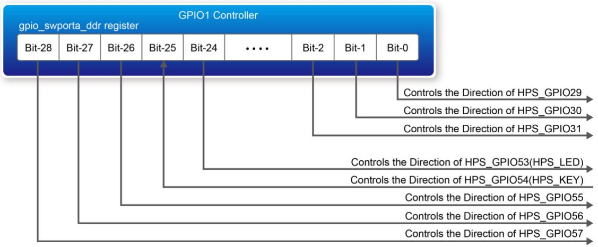  
Figure 6-5 gpio_swporta_ddr register in the GPIO1 controller

The following mask is defined in the demo code to control LED and KEY direction and LED’s output value.

```c
define USER_IO_DIR (0x01000000)  
#define BIT_LED (0x01000000)  
#define BUTTON_MASK (0x02000000) 
```

The following statement is used to configure the LED associated pins as output pins.

```c
alt_setbits_word((virtual_base + ((uint32_t)(ALT_GPIO1_SWPORTA_DDR_ADDR) & (uint32_t)(HW_REGS_MASK))), USER_IO_DIR); 
```

The following statement is used to turn on the LED.

```c
alt_setbits_word((virtual_base + ((uint32_t)(ALT(GPIO1_SWPORTA_DR_ADDR) & (uint32_t)(HW_REGS_MASK))), BIT_LED); 
```

The following statement is used to read the content of gpio_ext_porta register. The bit mask is used to check the status of the key.

```c
alt_read_word((virtual_base + ((uint32_t)(ALT_GPIO1_EXT_PORTA_ADDR) & (uint32_t)(HW_REGS_MASK)))); 
```

# ◼ Demonstration Source Code

• Build tool: Altera SoC EDS V16.0   
• Project directory: \Demonstration\SoC\hps_gpio   
• Binary file: hps_gpio   
• Build command: make ('make clean' to remove all temporal files)   
• Execute command: ./hps_gpio

# ◼ Demonstration Setup

• Connect a USB cable to the USB-to-UART connector (J4) on the DE1-SoC board and the host PC.   
• Copy the executable file "hps_gpio" into the microSD card under the "/home/root" folder in Linux.   
• Insert the booting micro SD card into the DE1-SoC board.   
• Power on the DE1-SoC board.   
• Launch PuTTY and establish connection to the UART port of Putty. Type "root" to login Altera Yocto Linux.   
• Type "./hps_gpio " in the UART terminal of PuTTY to start the program.

```txt
root@socfpga:~# ./hps_gpio led test the led flash 2 times user key test press key to control led 
```

• HPS_LED will flash twice and users can control the user LED with push-button.   
• Press HPS_KEY to light up HPS_LED.   
• Press " $\mathbf { \mathop { C T R L } } + \mathbf { \mathop { C } } ^ { \prime }$ to terminate the application.

# 6.3 I2C Interfaced G-sensor

This demonstration shows how to control the G-sensor by accessing its registers through the built-in I2C kernel driver in Altera Soc Yocto Powered Embedded Linux.

# ◼ Function Block Diagram

Figure 6-6 shows the function block diagram of this demonstration. The G-sensor on the DE1_SoC board is connected to the I2C0 controller in HPS. The G-Sensor I2C 7-bit device address is 0x53. The system I2C bus driver is used to access the register files in the G-sensor. The G-sensor interrupt

signal is connected to the PIO controller. This demonstration uses polling method to read the register data.

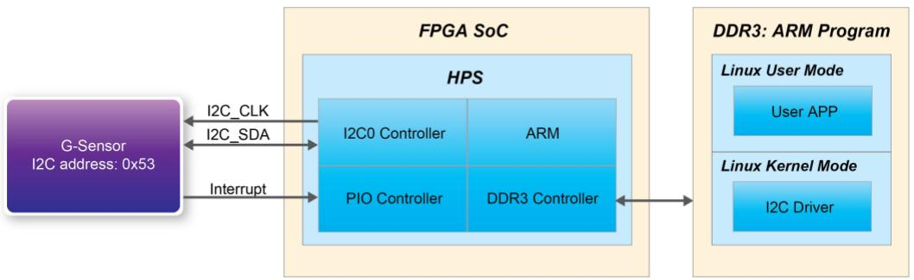  
Figure 6-6 Block diagram of the G-sensor demonstration

# ◼ I2C Driver

The procedures to read a register value from G-sensor register files by the existing I2C bus driver in the system are:

1. Open I2C bus driver "/dev/i2c-0": file $=$ open("/dev/i2c-0", O_RDWR);   
2. Specify G-sensor's I2C address 0x53: ioctl(file, I2C_SLAVE, 0x53);   
3. Specify desired register index in g-sensor: write(file, &Addr8, sizeof(unsigned char));   
4. Read one-byte register value: read(file, &Data8, sizeof(unsigned char));

The G-sensor I2C bus is connected to the I2C0 controller, as shown in the Figure 6-7. The driver name given is '/dev/i2c-0'.

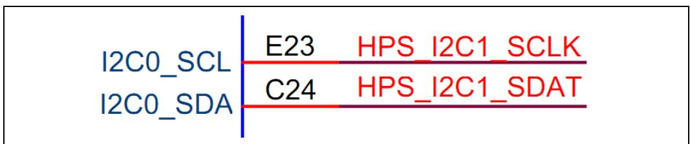  
Figure 6-7 Connection of HPS I2C signals

The step 4 above can be changed to the following to write a value into a register.

write(file, &Data8, sizeof(unsigned char));

The step 4 above can also be changed to the following to read multiple byte values.

read(file, &szData8, sizeof(szData8)); // where szData is an array of bytes

The step 4 above can be changed to the following to write multiple byte values.

write(file, &szData8, sizeof(szData8)); // where szData is an array of bytes

# G-sensor Control

The ADI ADXL345 provides I2C and SPI interfaces. I2C interface is selected by setting the CS pin to high on the DE1_SoC board.

The ADI ADXL345 G-sensor provides user-selectable resolution up to $1 3 \mathrm { - b i t } ~ \pm ~ 1 6 \mathrm { g }$ . The resolution can be configured through the DATA_FORAMT(0x31) register. The data format in this demonstration is configured as:

Full resolution mode   
± 16g range mode   
Left-justified mode

The X/Y/Z data value can be derived from the DATAX0(0x32), DATAX1(0x33), DATAY0(0x34), DATAY1(0x35), DATAZ0(0x36), and DATAX1(0x37) registers. The DATAX0 represents the least significant byte and the DATAX1 represents the most significant byte. It is recommended to perform multiple-byte read of all registers to prevent change in data between sequential registers read. The following statement reads 6 bytes of X, Y, or Z value.

read(file, szData8, sizeof(szData8)); // where szData is an array of six-bytes

# ◼ Demonstration Source Code

• Build tool: Altera SoC EDS v16.0   
• Project directory: \Demonstration\SoC\hps_gsensor   
• Binary file: gsensor   
• Build command: make ('make clean' to remove all temporal files)   
• Execute command: ./gsensor [loop count]

# ◼ Demonstration Setup

• Connect a USB cable to the USB-to-UART connector (J4) on the DE1-SoC board and the host PC.

• Copy the executable file "gsensor" into the microSD card under the "/home/root" folder in Linux.   
• Insert the booting microSD card into the DE1-SoC board.   
• Power on the DE1-SoC board.   
• Launch PuTTY to establish connection to the UART port of DE1-SoC board. Type "root" to login Yocto Linux.   
• Execute "./gsensor" in the UART terminal of PuTTY to start the G-sensor polling.   
• The demo program will show the X, Y, and Z values in the PuTTY, as shown in Figure 6-8.

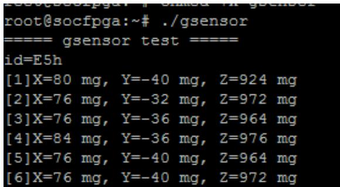  
Figure 6-8 Terminal output of the G-sensor demonstration

• Press "CTRL + C" to terminate the program.

# 6.4 I2C MUX Test

The I2C bus on DE1-SoC is originally accessed by FPGA only. This demonstration shows how to switch the I2C multiplexer for HPS to access the I2C bus.

# ◼ Function Block Diagram

Figure 6-9 shows the function block diagram of this demonstration. The I2C bus from both FPGA and HPS are connected to an I2C multiplexer. It is controlled by HPS_I2C_CONTROL, which is connected to the GPIO1 controller in HPS. The HPS I2C is connected to the I2C0 controller in HPS, as well as the G-sensor.

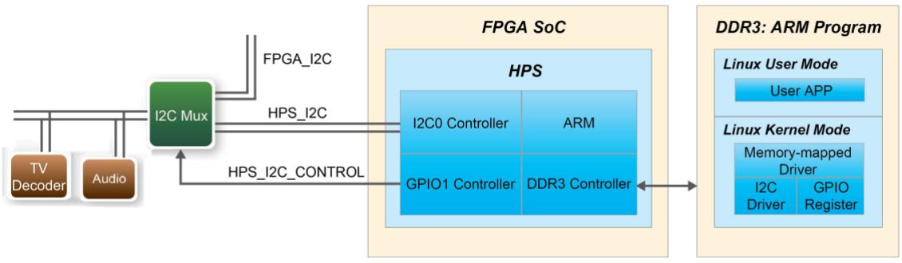  
Figure 6-9 Block diagram of the I2C MUX test demonstration

# ◼ HPS_I2C_CONTROL Control

HPS_I2C_CONTROL is connected to HPS_GPIO48, which is bit-19 of the GPIO1 controller. Once HPS gets access to the I2C bus, it can then access Audio CODEC and TV Decoder when the HPS_I2C_CONTROL signal is set to high.

The following mask in the demo code is defined to control the direction and output value of HPS_I2C_CONTROL.

```m4
define HPS_I2C_CONTROL (0x00080000) 
```

The following statement is used to configure the HPS_I2C_CONTROL associated pins as output pin.

```c
alt_setbits_word((virtual_base + ((uint32_t)(ALT_GPIO1_SWPORTA_DDR_ADDR) & (uint32_t)(HW_REGS_MASK))), HPS_I2C_CONTROL); 
```

The following statement is used to set HPS_I2C_CONTROL high.

```c
alt_setbits_word((virtual_base + ((uint32_t)(ALT_GPIO1_SWPORTA_DR_ADDR) & (uint32_t)(HW_REGS_MASK))), HPS_I2C_CONTROL); 
```

The following statement is used to set HPS_I2C_CONTROL low.

```c
alt_clrbits_word((virtual_base + ((uint32_t)(ALT_GPIO1_SWPORTA_DR_ADDR) & (uint32_t)(HW_REGS_MASK))), HPS_I2C_CONTROL); 
```

# ◼ I2C Driver

The procedures to read register value from TV Decoder by the existing I2C bus driver in the system are:

◼ Set HPS_I2C_CONTROL high for HPS to access I2C bus.   
◼ Open the I2C bus driver "/dev/i2c-0": file $=$ open("/dev/i2c-0", O_RDWR);   
◼ Specify the I2C address 0x20 of ADV7180: ioctl(file, I2C_SLAVE, 0x20);   
◼ Read or write registers;   
◼ Set HPS_I2C_CONTROL low to release the I2C bus.

# ◼ Demonstration Source Code

• Build tool: Altera SoC EDS v16.0   
• Project directory: \Demonstration\SoC\ hps_i2c_switch   
• Binary file: i2c_switch   
• Build command: make ('make clean' to remove all temporal files)   
• Execute command: ./ i2c_switch

# ◼ Demonstration Setup

• Connect a USB cable to the USB-to-UART connector (J4) on the DE1-SoC board and host PC.   
• Copy the executable file " i2c_switch " into the microSD card under the "/home/root" folder in Linux.   
• Insert the booting microSD card into the DE1-SoC board.   
• Power on the DE1-SoC board.   
• Launch PuTTY to establish connection to the UART port of DE1_SoC borad. Type "root" to login Yocto Linux.   
• Execute "./ i2c_switch " in the UART terminal of PuTTY to start the I2C MUX test.   
• The demo program will show the result in the Putty, as shown in Figure 6-10.

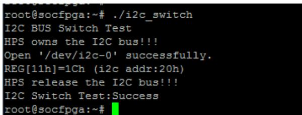  
Figure 6-10 Terminal output of the I2C MUX Test Demonstration

• Press "CTRL + C" to terminate the program.

# Chapter 7

# Examples for using

# both HPS SoC and

# FGPA

Although HPS and FPGA can operate independently, they are tightly coupled via a high-bandwidth system interconnect built from high-performance ARM AMBA $\textsuperscript { \textregistered }$ AXITM bus bridges. Both FPGA fabric and HPS can access to each other via these interconnect bridges. This chapter provides demonstrations on how to achieve superior performance and lower latency through these interconnect bridges when comparing to solutions containing a separate FPGA and discrete processor.

# 7.1 HPS Control LED and HEX

This demonstration shows how HPS controls the FPGA LED and HEX through Lightweight HPS-to-FPGA Bridge. The FPGA is configured by HPS through FPGA manager in HPS.

# ◼ A brief view on FPGA manager

The FPGA manager in HPS configures the FPGA fabric from HPS. It also monitors the state of FPGA and drives or samples signals to or from the FPGA fabric. The application software is provided to configure FPGA through the FPGA manager. The FPGA configuration data is stored in the file with .rbf extension. The MSEL[4:0] must be set to 01010 or 01110 before executing the application software on HPS.

# ◼ Function Block Diagram

Figure 7-1 shows the block diagram of this demonstration. The HPS uses Lightweight HPS-to-FPGA AXI Bridge to communicate with FPGA. The hardware in FPGA part is built into

Qsys. The data transferred through Lightweight HPS-to-FPGA Bridge is converted into Avalon-MM master interface. Both PIO Controller and HEX Controller work as Avalon-MM slave in the system. They control the associated pins to change the state of LED and HEX. This is similar to a system using Nios II processor to control LED and HEX.

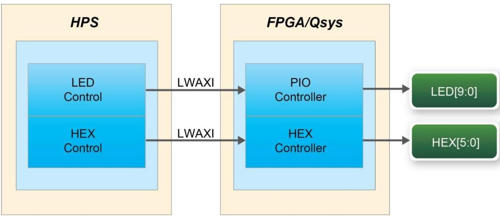  
Figure 7-1 FPGA LED and HEX are controlled by HPS

# ◼ LED and HEX control

The Lightweight HPS-to-FPGA Bridge is a peripheral of HPS. The software running on Linux cannot access the physical address of the HPS peripheral. The physical address must be mapped to the user space before the peripheral can be accessed. Alternatively, a customized device driver module can be added to the kernel. The entire CSR span of HPS is mapped to access various registers within that span. The mapping function and the macro defined below can be reused if any other peripherals whose physical address is also in this span.

```txt
define HW_REGS_BASE (ALT_STM_OFST)  
#define HW_REGS_SPAN (0x04000000)  
#define HW_REGS_MASK (HW_REGS_SPAN - 1) 
```

The start address of Lightweight HPS-to-FPGA Bridge after mapping can be retrieved by ALT_LWFPGASLVS_OFST, which is defined in altera_hps hardware library. The slave IP connected to the bridge can then be accessed through the base address and the register offset in these IPs. For instance, the base address of the PIO slave IP in this system is $0 \mathrm { x } 0 0 0 1 \_ 0 0 4 0$ , the direction control register offset is $0 \mathrm { { x } 0 1 }$ , and the data register offset is $0 \mathrm { { x } 0 0 }$ . The following statement is used to retrieve the base address of PIO slave IP.

```c
h2p_lw_led_addr=virtual_base+(( unsigned long ) ( ALT_LWFPGASLVS_OFST + LED_PIO_BASE ) & ( unsigned long)( HW_REGS_MASK )); 
```

Considering this demonstration only needs to set the direction of PIO as output, which is the default direction of the PIO IP, the step above can be skipped. The following statement is used to set the output state of the PIO.

alt_write_word(h2p_lw_led_addr, Mask );

The Mask in the statement decides which bit in the data register of the PIO IP is high or low. The bits in data register decide the output state of the pins connected to the LEDs. The HEX controlling part is similar to the LED.

Since Linux supports multi-thread software, the software for this system creates two threads. One controls the LED and the other one controls the HEX. The system calls pthread_create, which is called in the main function to create a sub-thread, to complete the job. The program running in the sub-thread controls the LED flashing in a loop. The main-thread in the main function controls the digital shown on the HEX that keeps changing in a loop. The state of LED and HEX state change simultaneously when the FPGA is configured and the software is running on HPS.

# ◼ Demonstration Source Code

• Build tool: Altera SoC EDS V16.0   
• Project directory: \Demonstration\ SoC_FPGA\HPS_LED_HEX   
• Quick file directory:\ Demonstration\ SoC_FPGA\HPS_LED_HEX\ quickfile   
• FPGA configuration file : soc_system_dc.rbf   
• Binary file: HPS_LED_HEX and hps_config_fpga   
• Build app command: make ('make clean' to remove all temporal files)   
• Execute app command:./hps_config_fpga soc_system_dc.rbf and./HPS_LED_HEX

# ◼ Demonstration Setup

• Quartus II and Nios II must be installed on the host PC.   
• The MSEL[4:0] is set to 01010 or 01110.   
• Connect a USB cable to the USB-Blaster II connector (J13) on the DE1-SoC board and the host PC. Install the USB-Blaster II driver if necessary.   
• Connect a USB cable to the USB-to-UART connector (J4) on the DE1-SoC board and the host PC.   
• Copy the executable files "hps_config_fpga" and "HPS_LED_HEX", and the FPGA configuration file "soc_system_dc.rbf" into the microSD card under the "/home/root" folder in Linux.   
• Insert the booting microSD card into the DE1-SoC board. Please refer to the chapter 5

"Running Linux on the DE1-SoC board" on DE1-SoC_Getting_Started_Guide.pdf on how to build a booting microSD card image.

• Power on the DE1-SoC board.   
• Launch PuTTY to establish connection to the UART port of the DE1-SoC board. Type "root" to login Altera Yocto Linux.   
• Execute "./hps_config_fpga soc_system_dc.rbf " in the UART terminal of PuTTY to configure the FPGA through the FPGA manager. After the configuration is successful, the message shown in Figure 7-2Figure72 will be displayed in the terminal.

```txt
root@socfpga:~# ./hps_config_fpga soc_system.dc.rbf INFO: alt_fpga_control_enable(). INFO: alt_fpga_control_enable OK. alt_fpga_control_enable OK next config the fpga INFO: MSEL configured correctly for FPGA image. soc_system(dc.rbf file file open success INFO: FPGA Image binary at 0x72c1c008. INFO: FPGA Image size is 2309848 bytes. INFO: alt_fpga_config() successful on the 1 of 5 retry(s). INFO: alt_fpga_control_disable(). 
```

Figure 7-2 Running the application to configure the FPGA

• Execute "./HPS_LED_HEX " in the UART terminal of PuTTY to start the program.   
• The message shown in Figure 7-3OLE_LINK4, will be displayed in the terminal. The LED[9:0] will be flashing and the number on the HEX[5:0] will keep changing simultaneously.

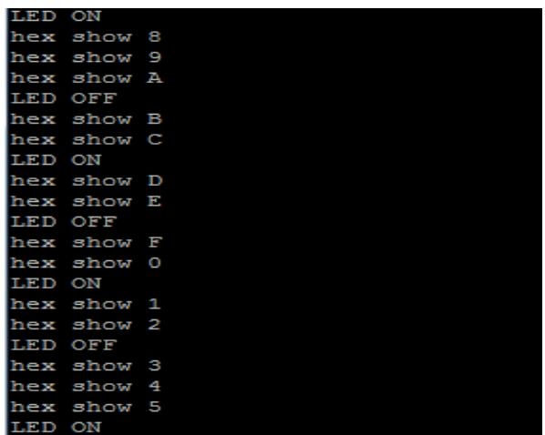  
Figure 7-3 Running result in the terminal of PuTTY

• Press " $\mathrm { ^ { \prime } C T R L + C ^ { \prime \prime } }$ to terminate the program.

# 7.2 DE1-SoC Control Panel

The DE1-SoC Control Panel is a more comprehensive example. It demonstrates:

⚫ Control HPS LED and FPGA LED/HEX   
Query the status of buttons connected to HPS and FPGA   
⚫ Configure and query G-sensor connected to HPS   
⚫ Control Video-in and VGA-out connected to FPGA   
⚫ Control IR receiver connected to FPGA

This example not only controls the peripherals of HPS and FPGA, but also shows how to implement a GUI program on Linux. Figure 7-4OLE_LINK4 is the screenshot of DE1-SOC Control Panel.

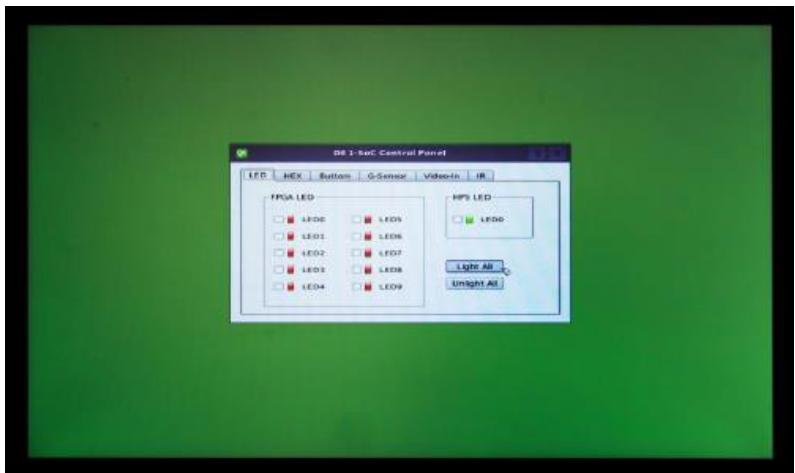  
Figure 7-4 Screenshot of DE1-SoC Control Panel

Please refer to DE1-SoC_Control_Panel.pdf, which is included in the DE1-SOC System CD for more information on how to build a GUI program step by step.

# 7.3 DE1-SoC Linux Frame Buffer Project

The DE1-SoC Linux Frame Buffer Project is a example that a VGA monitor is utilized as a standard output interface for the linux operate system. The Quartus II project is located at this path: Demonstrations/SOC_FPGA/DE1_SOC_Linux_FB. The soc_system.rbf file in the project is used for configuring FPGA through HPS. The .rbf file is converted form DE1_SOC_Linux_FB.sof by clicking the sof_to_rbf.bat. The project is adopted for the following demonstrations.

⚫ DE1_SoC Linux Console with framebuffer   
⚫ DE1_SoC LXDE with Desktop   
⚫ DE1_SoC Ubuntu Desktop

The SD image file for the demonstrations above can be downloaded in the design resources for DE1-SoC at Terasic website.

These examples provide a GUI environment for further developing for the users. For example, a QT application can run on the system.

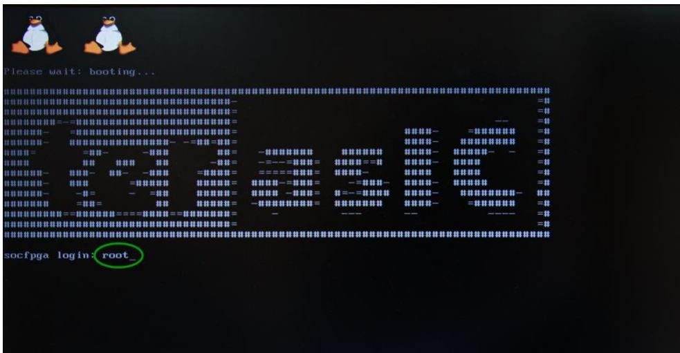  
Figure 7-5 Screenshot of DE1-SoC Linux Console with framebuffer

Please refer to DE1-SoC_Getting_Started_Guide about how to get the SD images and create a boot SD card.

# Chapter 8

# Programming the

# EPCS Device

This chapter describes how to program the quad serial configuration (EPCS) device with Serial Flash Loader (SFL) function via the JTAG interface. Users can program EPCS devices with a JTAG indirect configuration (.jic) file, which is converted from a user-specified SRAM object file (.sof) in Quartus. The .sof file is generated after the project compilation is successful. The steps of converting .sof to .jic in Quartus II are listed below.

# 8.1 Before Programming Begins

The FPGA should be set to AS x1 mode i.e. MSEL[4..0] = “10010” to use the quad Flash as a FPGA configuration device.

# 8.2 Convert .SOF File to .JIC File

1. Choose Convert Programming Files from the File menu of Quartus II, as shown in Figure 8-1.

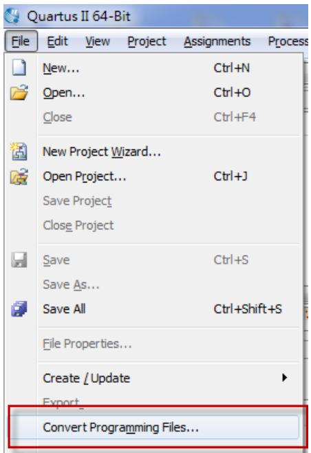  
Figure 8-1 File menu of Quartus II

2. Select JTAG Indirect Configuration File (.jic) from the Programming file type field in the dialog of Convert Programming Files.   
3. Choose EPCS128 from the Configuration device field.   
4. Choose Active Serial from the Mode filed.   
5. Browse to the target directory from the File name field and specify the name of output file.   
6. Click on the SOF data in the section of Input files to convert, as shown in Figure 8-2.

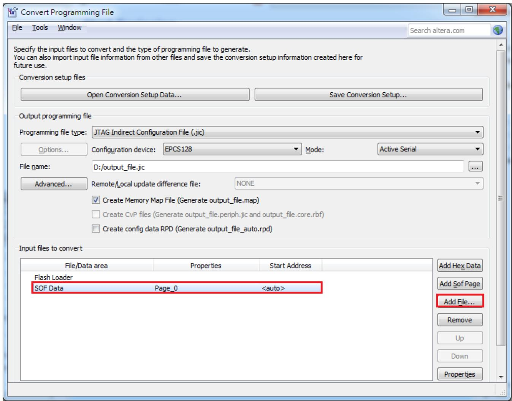  
Figure 8-2 Dialog of “Convert Programming Files”

7. Click Add File.   
8. Select the .sof to be converted to a .jic file from the Open File dialog.   
9. Click Open.   
10. Click on the Flash Loader and click Add Device, as shown in Figure 8-3.   
11. Click OK and the Select Devices page will appear.

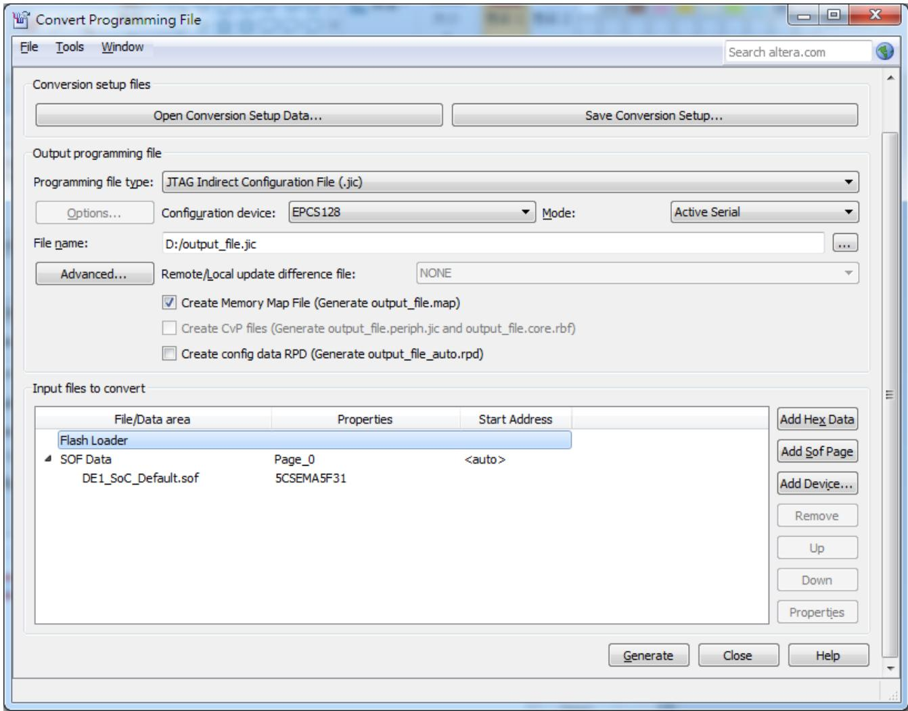  
Figure 8-3 Click on the “Flash Loader”

12. Select the targeted FPGA to be programed into the EPCS, as shown in Figure 8-4.   
13. Click OK and the Convert Programming Files page will appear, as shown in Figure 8-5.   
14. Click Generate.

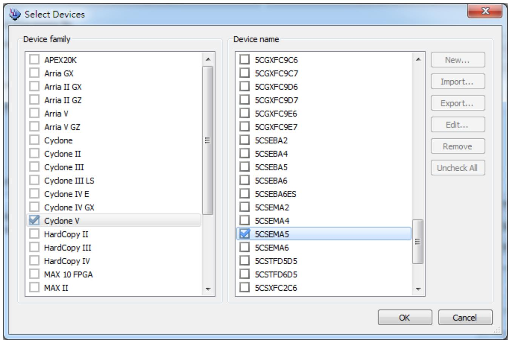  
Figure 8-4 “Select Devices” page

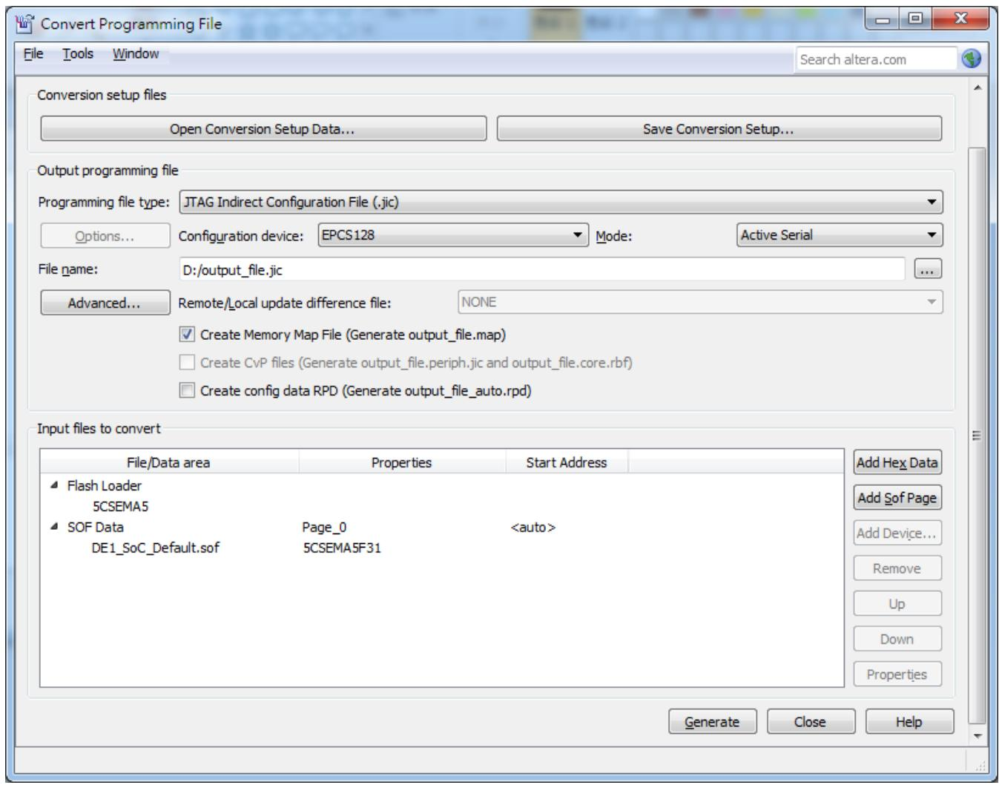  
Figure 8-5 “Convert Programming Files” page after selecting the device

# 8.3 Write JIC File into the EPCS Device

When the conversion of SOF-to-JIC file is complete, please follow the steps below to program the EPCS device with the .jic file created in Quartus II Programmer.

1. Set MSEL[4..0] = “10010”   
2. Choose Programmer from the Tools menu and the Chain.cdf window will appear.   
3. Click Auto Detect and then select the correct device. Both FPGA device and HPS should be detected, as shown in Figure 8-6.

4. Double click the green rectangle region shown in Figure 8-6 and the Select New Programming File page will appear. Select the .jic file to be programmed.   
5. Program the EPCS device by clicking the corresponding Program/Configure box. A factory default SFL image will be loaded, as shown in Figure 8-7.   
6. Click Start to program the EPCS device.

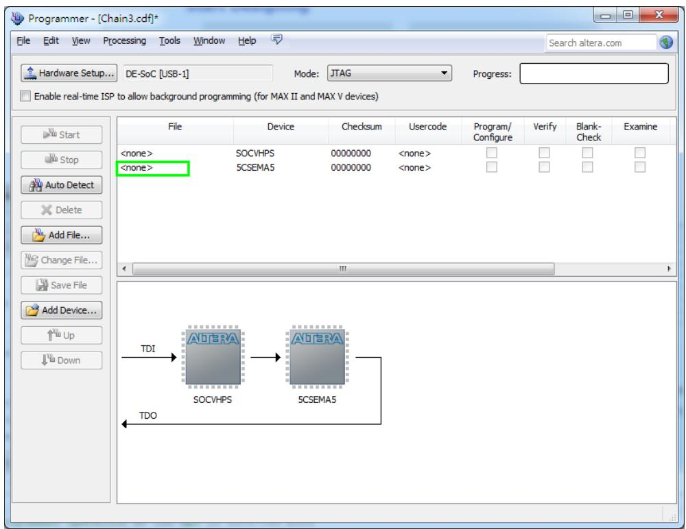  
Figure 8-6 Two devices are detected in the Quartus II Programmer

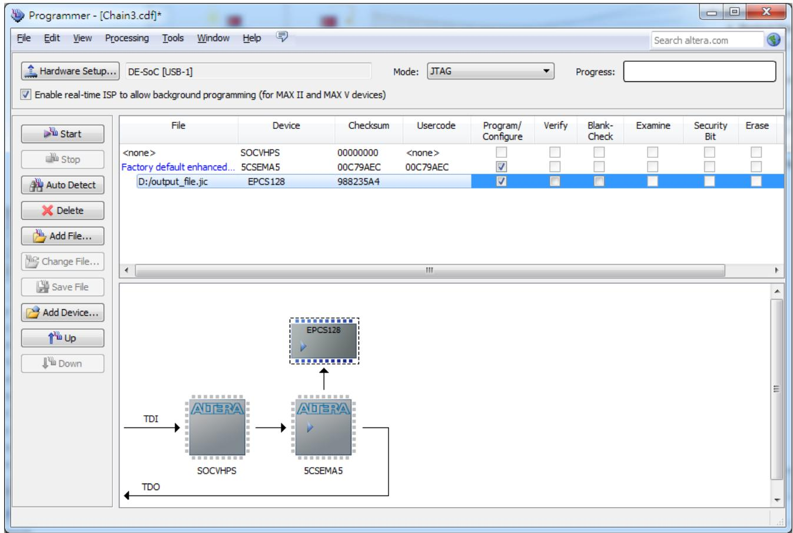  
Figure 8-7 Quartus II programmer window with one .jic file

# 8.4 Erase the EPCS Device

The steps to erase the existing file in the EPCS device are:

1. Set MSEL[4..0] $=$ “10010”   
2. Choose Programmer from the Tools menu and the Chain.cdf window will appear.   
3. Click Auto Detect, and then select correct device, both FPGA device and HPS will detected. (See Figure 8-6)   
4. Double click the green rectangle region shown in Figure 8-6, and the Select New Programming File page will appear. Select the correct .jic file.   
5. Erase the EPCS device by clicking the corresponding Erase box. A factory default SFL image will be loaded, as shown in Figure 8-8.

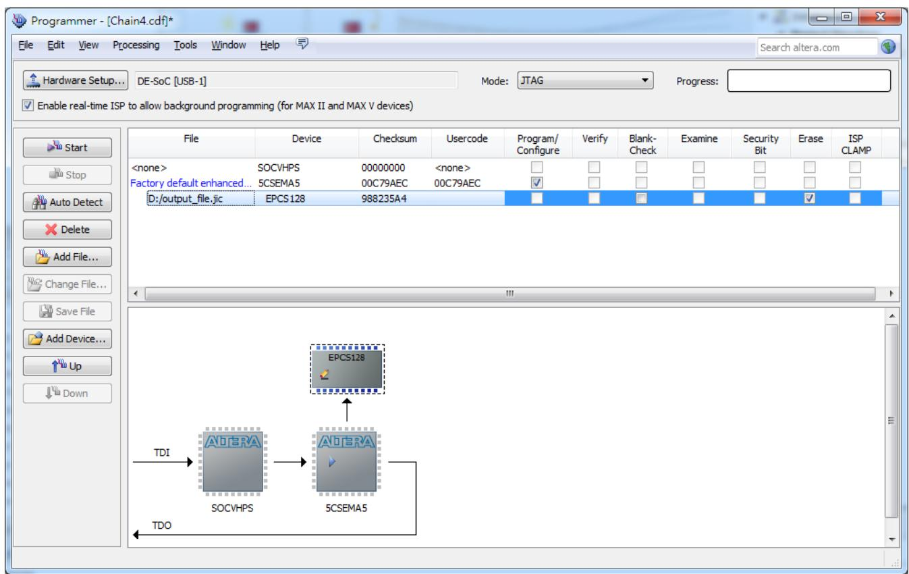  
Figure 8-8 Erase the EPCS device in Quartus II Programmer

6. Click Start to erase the EPCS device.

# 8.5 Nios II Boot from EPCS Device in Quartus II v16.0

There is a known problem in Quartus II software that the Quartus Programmer must be used to program the EPCS device on DE1-SoC board.

Please refer to Altera’s website here with details step by step.

# 9.1 Revision History

<table><tr><td>Version</td><td>Change Log</td></tr><tr><td>V0.1</td><td>Initial Version (Preliminary)</td></tr><tr><td>V0.2</td><td>Add Chapter 5 and Chapter 6</td></tr><tr><td>V0.3</td><td>Modify Chapter 3</td></tr><tr><td>V0.4</td><td>Add Chapter 3 HPS</td></tr><tr><td>V0.5</td><td>Modify Chapter 3</td></tr><tr><td>V1.0</td><td>Modify Chapter 8</td></tr><tr><td>V1.1</td><td>Modify section 3.3</td></tr><tr><td>V1.2</td><td>1. Add Section 7.3
2. Modify Figure 3-2</td></tr><tr><td>V1.2.1</td><td>Modify Figure 3-2</td></tr><tr><td>V1.2.2d</td><td>Modify Figure 5-5 descriptions of remote controller</td></tr><tr><td>V2.0.0</td><td>Replay ADC device and modify demo description</td></tr><tr><td>V2.0.1</td><td>Modify EPCQ256 to EPCS128</td></tr><tr><td>V2.0.2</td><td>Update the remote control part and correct minor spelling</td></tr><tr><td>V2.0.3</td><td>Update demo for Q16.0</td></tr><tr><td>V2.0.4</td><td>Modify Figure 3-31</td></tr></table>

Copyright $\circledcirc$ 2016 Terasic Technologies. All rights reserved.