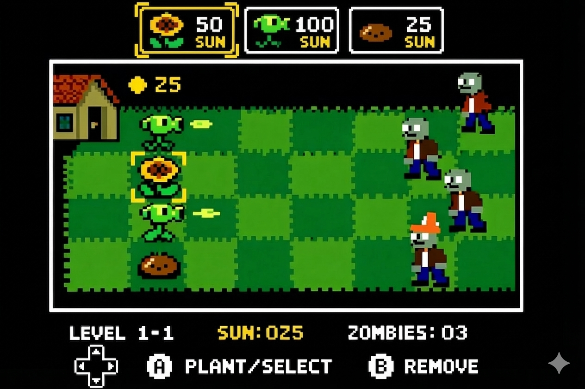

# Plants vs Zombies on FPGA

Member 1 (uni1), Member 2 (uni2), Member 3 (uni3), Member 4 (uni4)

Spring 2026

We are building a simplified version of Plants vs Zombies that runs on the DE1-SoC board, with bitmap sprite graphics driven by a hardware accelerator over VGA and a USB gamepad for input. The game takes place on a 5-row by 9-column grid where the player places plants to fend off waves of zombies approaching from the right side of the screen. The player wins by surviving all waves; a zombie reaching the left edge of the screen ends the game. Figure 1 shows a rough mockup of what the display will look like.

The FPGA handles VGA output, sprite blitting, and frame buffer management -- basically anything that needs to push pixels at deterministic timing. Game logic, collision detection, the sun economy, and input polling all run in a C program under Linux on the HPS, where the code is easier to iterate on.

**Display** will be 640x480 VGA at 60 frames per second. We plan to use an 8-bit indexed color palette, which keeps the frame buffer small enough to fit in on-chip SRAM. The frame buffer will be double-buffered so that rendering into one buffer and displaying the other avoids tearing. We will need to evaluate whether 8-bit color gives us enough range once we have actual sprite artwork -- we may drop to 4-bit if memory is tight, or move to a tile-based approach instead of a raw frame buffer.

**Sprite System** Sprite pixel data will be stored in block RAM or on-chip ROM on the FPGA. A hardware sprite engine will read entries from a sprite table (populated by software) and blit each sprite into the frame buffer at the specified position. The sprite table entries will contain at minimum an x/y position, a sprite index pointing into the pixel data, and a visibility flag. We need sprites for the background grass tiles, each plant type, each zombie type, projectiles, sun drops, the grid cursor, and the top-of-screen UI. The total number of on-screen sprites at once is bounded by the game rules (45 grid cells, plus some number of zombies in transit, plus projectiles), so we expect the sprite table to need at most 80-100 entries. Whether we pack multiple small sprites into one block RAM or use separate ROMs per sprite sheet is something we have not decided yet.

**Game Grid** The playing field is a 5-row by 9-column grid. Each cell maps to a fixed rectangular region on screen. The player moves a cursor to highlight a cell and can place or remove a plant there. The grid state lives in software as a 5x9 array of cell structures.

**Plants** The Peashooter sits in a cell and fires a projectile down its row at a fixed interval. Sunflowers periodically generate sun, adding to the player's resource pool. The Wall-nut has no attack but a large HP pool, so it just sits there absorbing damage. Each plant costs sun to place. We will tune the exact HP values, fire rates, and costs during the software prototype phase, but as rough starting points: Peashooter costs 100 sun and fires every 1.5 seconds, Sunflower costs 50 sun and produces 25 sun every 10 seconds, Wall-nut costs 50 sun and has roughly four times the HP of a Peashooter.

**Zombies** come in three varieties that differ mainly in how much damage they can take. The Basic Zombie goes down quickly. The Conehead Zombie has a traffic cone that absorbs extra hits before falling off, roughly doubling its effective HP. The Buckethead Zombie takes the most punishment. All of them walk leftward at the same speed, and when one reaches a plant it stops and eats it, chewing through the plant's HP until it is destroyed, then keeps walking. Zombie waves are defined by a table in the software specifying which types spawn at what times.

**Sun Economy** The player starts with a fixed amount of sun (probably 150) and sun auto-increments on a timer (roughly 25 sun every 10 seconds). The Sunflower plant adds to this rate. We will cap the maximum sun at some reasonable value (maybe 9990) partly because there is no reason to accumulate more than that and partly because it bounds the number of entities the player can create, which matters for sprite table size and frame-time budgets.

**Controller Input** A USB gamepad connected to the HPS will be read using libusb from the C game program. The D-pad moves the grid cursor. One button (A) places the currently selected plant; another (B) removes a plant from the current cell or cancels the selection. Along the top of the screen, a plant selection bar shows the available plant types with their sun costs. The player cycles through them with shoulder buttons or by pressing left/right on the selection bar. We chose a gamepad over keyboard/mouse because it maps well to the grid-based interface and keeps the control scheme simple.

**Hardware-Software Interface** The hardware accelerator exposes memory-mapped registers accessible from the HPS. Software writes sprite table entries -- each containing a sprite index, x position, y position, and flags -- into a shared region. The hardware reads this table every frame during the vertical blanking interval and blits the listed sprites into the back buffer, then swaps buffers. Software also writes palette data and possibly tile map data through the same interface. A status register lets the software poll for vsync so that it updates the sprite table in lockstep with the display refresh. We have not settled on the register layout yet, or whether to use the lightweight HPS-to-FPGA bridge or a full Avalon interface.

**Collision Detection** is all in software. Each frame, the game logic checks whether any projectile has reached a cell occupied by a zombie, comparing lane and column positions rather than pixel coordinates. If a projectile overlaps a zombie's cell, the zombie takes damage and the projectile is removed. If a zombie's position overlaps a plant's cell, the zombie is eating that plant. Because everything moves on a grid or along fixed rows, this is just arithmetic -- no pixel-level collision needed.

**Audio** The DE1-SoC has a Wolfson audio codec with a 3.5mm line-out jack, and we plan to use it. The main audio feature is background music: an 8-bit arrangement of the Plants vs Zombies theme, stored as PCM sample data (or possibly MIDI note sequences decoded in software) and streamed to the codec during gameplay. Output goes through the 3.5mm jack to an external speaker. We also want to layer in short sound effects -- pea firing, zombie groans, plant placement -- mixed with the music track. The sound effects are lower priority than the background track; if mixing turns out to be too much work we will ship with just the theme music.

## Major Tasks

- Design decisions for all major open points (frame buffer bit depth, sprite storage strategy, hardware-software register interface layout, exact game balance numbers). These will go in the design document.

- Desktop software prototype running under SDL, implementing the full game loop (grid, plants, zombies, sun economy, collision) so we can iterate on gameplay before any hardware is ready.

- Verilator-based testbench for the hardware accelerator, verifying VGA timing, sprite blitting from the sprite table, and double-buffer swapping. The testbench will dump frames as image files for visual inspection.

- Hardware accelerator source code in SystemVerilog: VGA timing generator, frame buffer with double buffering, sprite blitting engine that reads the sprite table and writes pixels, and the memory-mapped register interface for the HPS.

- Linux device driver exposing the hardware registers to userspace, with a C library providing functions like set_sprite(), update_palette(), and wait_vsync().

- Controller integration using libusb to read the USB gamepad and feed input into the game loop.
