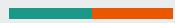

# Bubble Bobble

By Hongzheng Zhu, Qingyuan Liu, Ke Liu, Lance Chou

# Overall structure:

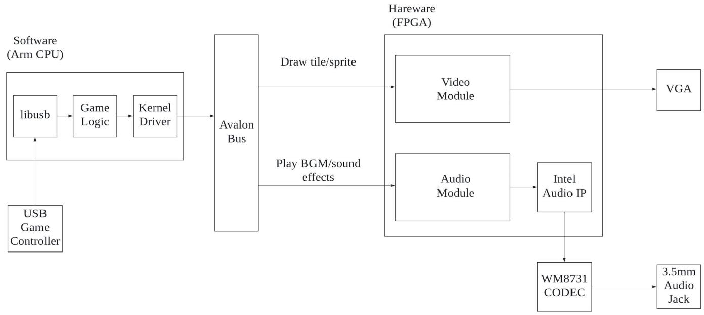

# VGA control: vga top module

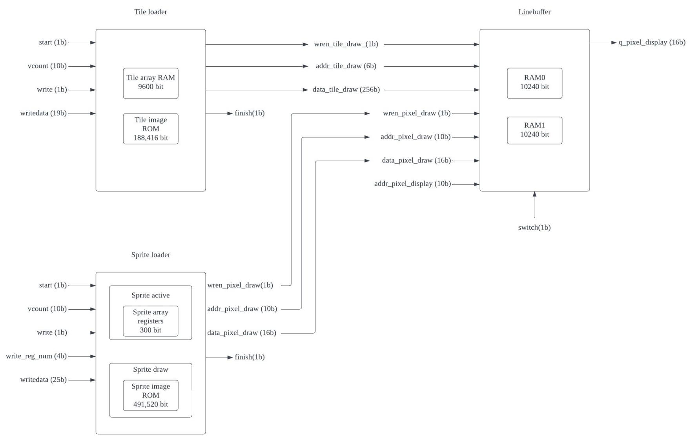

# VGA control: tile drawing

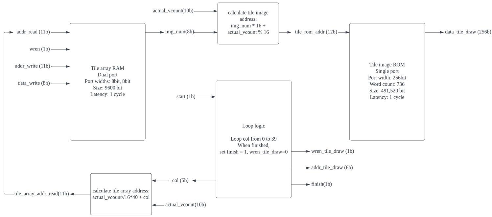

# VGA control: sprite drawing

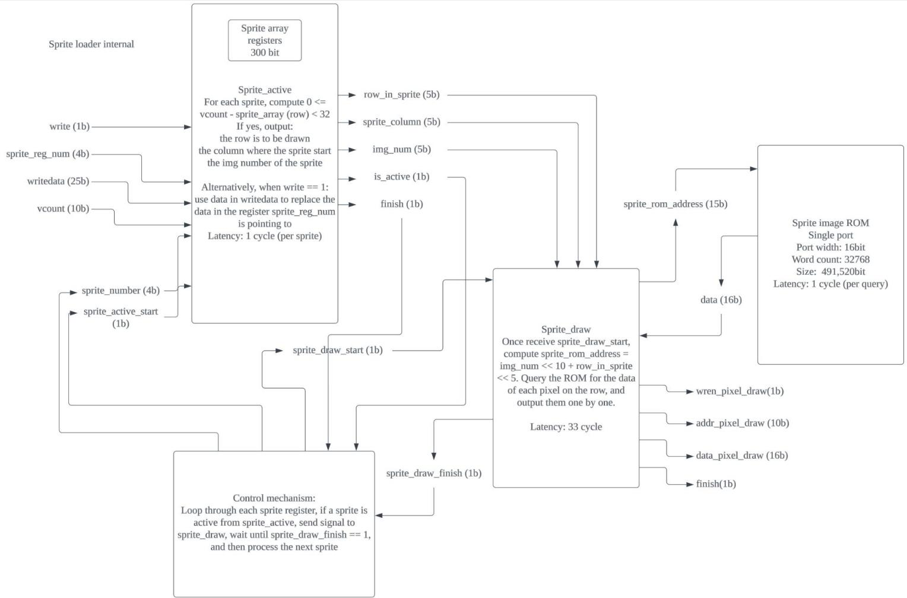

# VGA HW/SW interface

// def of argument for tiles

typedef struct {

unsigned char r;

unsigned char c;

unsigned char n;

} vga_top_arg_t;

<table><tr><td>r 5bit</td><td>c 6bit</td><td>n 8bit</td></tr></table>

Total 19 bit

// def of argument for sprites

typedef struct {

unsigned char active;

unsigned short r;

unsigned short c;

unsigned char n;

unsigned short register_n;

} vga_top_arg_s;

active 1bit

r 9bit

c 10bit

n 5bit

Total 25 bit

# Transparent

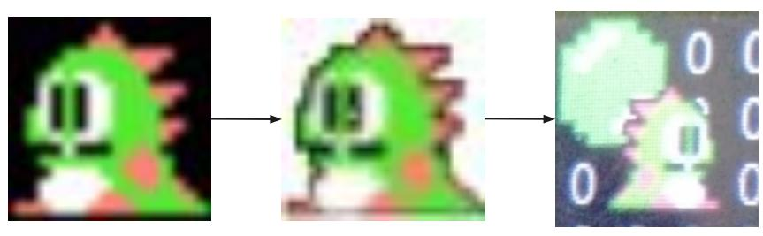

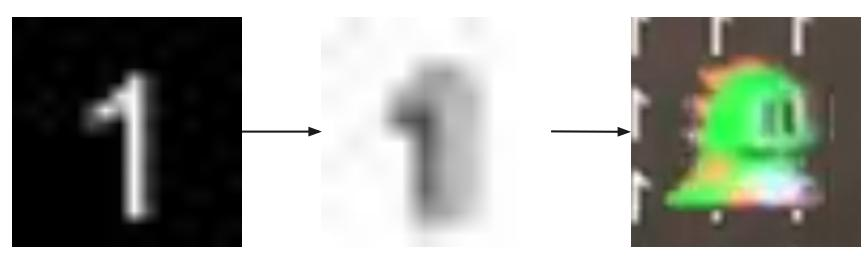

002000   
02100   
0022:00000000000000000000000000000000000000000000000000000000000   
  
0024：0000000000000C9306FED48000000000000000000;  
0025:000000000000000000C93EFFF27EC6C80000000000000000000000   
0026:00000000000000000EC93EFFF6EC9CB7F25A4000000000000;   
0027:000000000000000000000C903EFFF0000C8130124000000000000000000   
0028:00000000000000C93FFF000000000000000   
0029：0000000000000C93EFFF0000000000000000;  
02A：000000000000000000090EFFF00000000000000000000000000  
002B:000000000000000C93EFF00000000000000000   
200   
02D：00000000000000C93EFFF0000000000000000  
  
002F：000  
0030：000000  
0100

021:10001000100010001000100010001000100010001000001000100010001000；  
0022：1000100010001000100010001000100010001000100010001000100010001000;  
023:1000100010001000100010001000100010001000100010001000100010001000;   
)024:100010001000100010001000EC936FED48010001000100010001000100011000;   
0025:100010001000100010001000EC93EFFF27EC6C81000100010001000100011000;   
026：100010001000100010001000EC93EFFF6EC9CB7F25A400010001000100011000；  
)027：100010001000100010001000EC93EFFF0001C813012400010001000100011000；  
0028:100010001000100010001000EC93EFFF00010001000100010001000100011000；  
029:100010001000100010001000EC93EFF00010001000100010001000100011000;   
02A:100010001000100010001000EC93EFF00010001000100010001000100011000;   
)02B:100010001000100010001000EC93EFFF00010001000100010001000100011000;   
)02C：100010001000100010001000EC93EFFF00010001000100010001000100011000；  
D02D:100010001000100010001000EC93EFFF00010001000100010001000100011000；  
02E:1000100010001000100010001000100010001000100010001000100010001000;   
)02F：1000100010001000100010001000100010001000100010001000100010001000;  
）030：1000100010001000100010001000100010001000100010001000100010001000；  
031:1000100010001000100010001000100010001000100010001000100010001000；  
032:1000100010001000100010001000100010001000100010001000100010001000;   
033：1000100010001000100010001000100010001000100010001000100010001000;

# Audio control

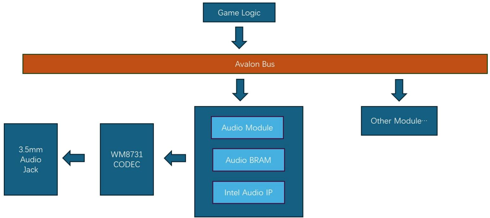

# Audio control

Damage Enemy

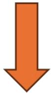

LosesaLife


Interruption

Victory!


BGM

# Audio HW/SW interface

typedef struct {

unsigned char play;

} fpga_audio_arg_t;

#define FPGA_AUDIO_BGM_STARTSTOP _IOW(FPGA_AUDIO_MAGIC, 1, fpga_audio_arg_t *)

#define FPGA_AUDIO_SET_AUDIO_ADDR _IOW(FPGA_AUDIO_MAGIC, 2, fpga_audio_arg_t *)

# Controller

The controller communicates with a 8 bytes protocol via USB, mapped as below

<table><tr><td>Constant</td><td>Constant</td><td>Constant</td><td>Left/right arrow</td><td>Up/down arrow</td><td>X/Y/A/B</td><td>Rib/Select/Start</td><td>Constant</td></tr></table>

These keys are mapped to specific interactions in the game:

Left arrow: move left

Right arrow: move right

A: shoot bubble

B: jump

```c
struct controller_outputPacket {
    short updown;
    short leftright;
    uint8_t select;
    uint8_t start;
    uint8_t left_rib;
    uint8_t right_rib;
    uint8_t x;
    uint8_t y;
    uint8_t a;
    uint8_t b;
} 
```

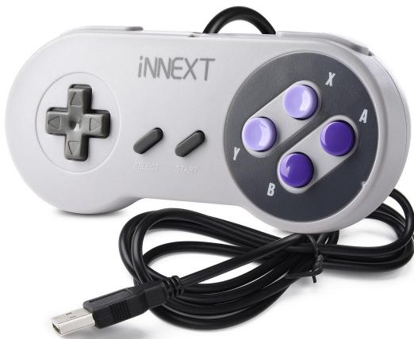

# Game logic

8 levels with different maps.

Enemy generation and movement.

Attack.

Collision detection : Wall, floor, bubbles, enemy, character, reward.

Requirements to move to the next level.

Winning and defeat condition.

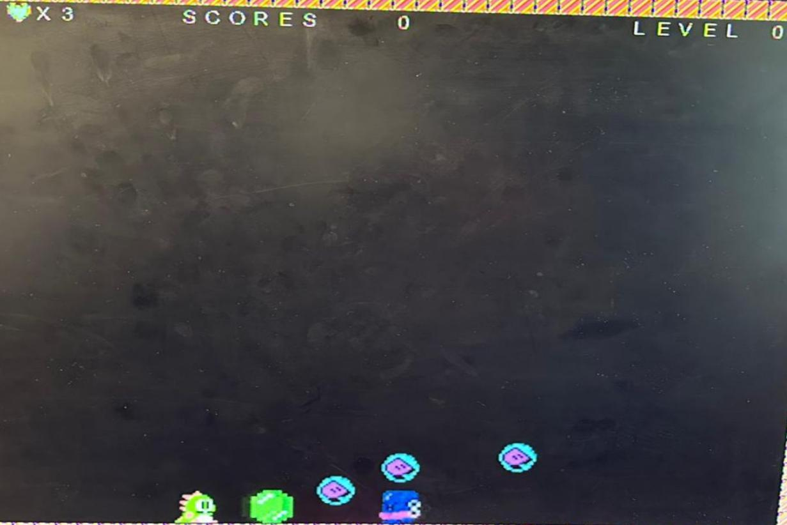

# Demonstration