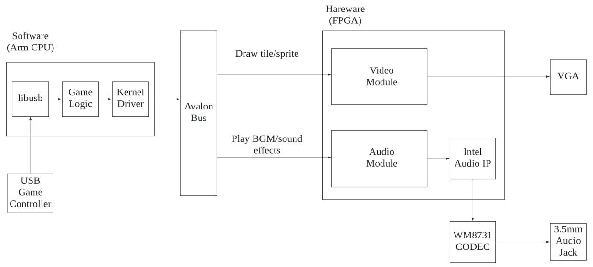
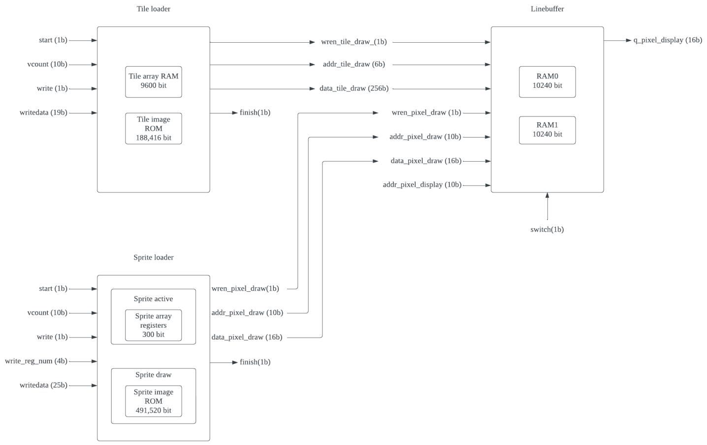
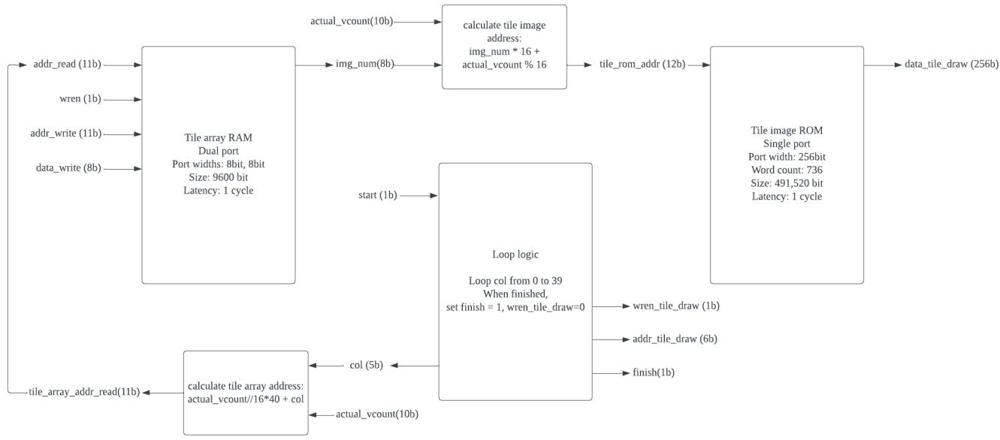
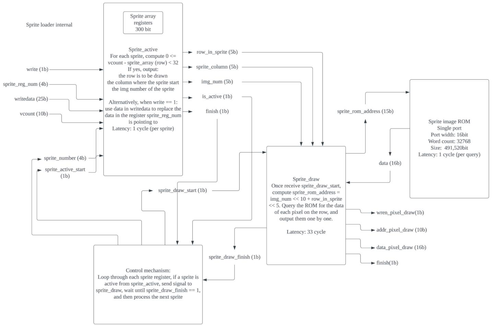
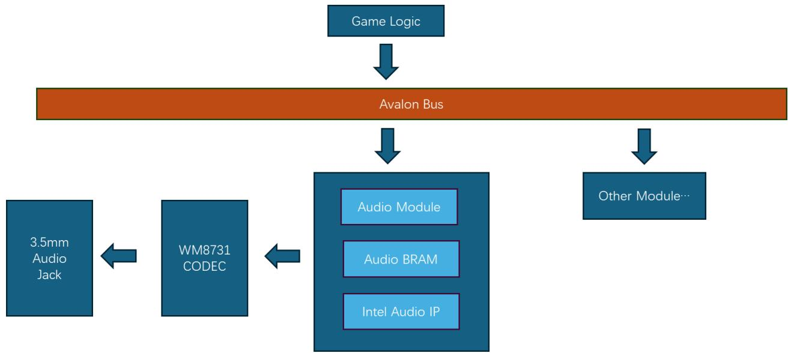
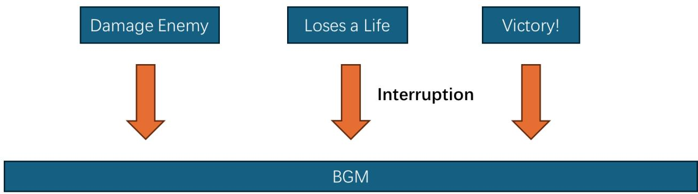
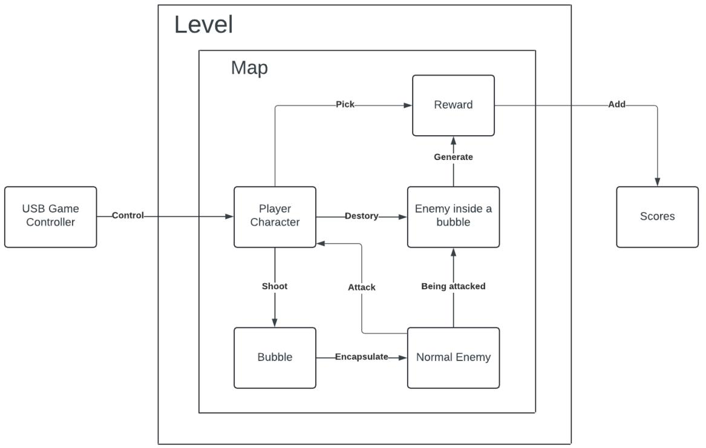
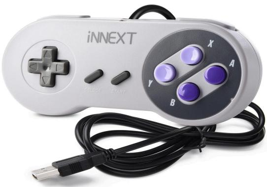
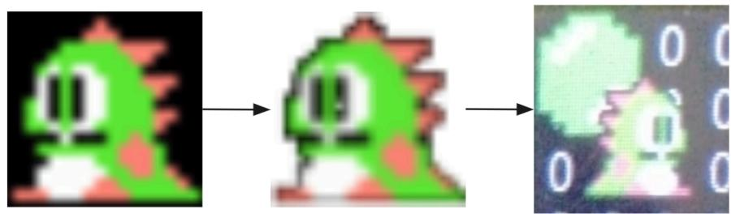
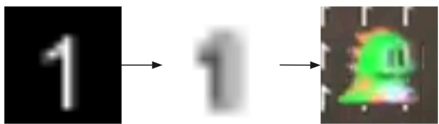

# CSEE4840 Embedded Systems Final Report: Bubble bobble

Hongzheng Zhu (hz2915)

Ke Liu (kl3554)

Qingyuan Liu (ql2505)

Lance Chou (lz2837)

May 13,2024

# 1. System Overview

  
Figure 1.1: Overall System Block Diagram

As shown in Figure 1.1, we utilize both the ARM CPU and the FPGA on the DE1-SoC. On the software (CPU) side, we use libusb to read USB game controller input, handle the input in our game logic, and send video/audio commands to the Avalon bus through kernel drivers. On the Hardware (FPGA) side, we implemented video and audio modules to display graphics through VGA and play audio through the 3.5mm audio jack.

# 2. Hardware design

# 2.1.VGA controller

# 2.1.1. Sprite graphics and VGA

The Bubble Bobble game was originally on the NES console, which uses a sprite graphics system. We decided to implement that system to display our graphics. In this system, a frame is described by an array of tiles and sprites. Tiles are usually used to display the background. The screen is divided into grids, and each grid is called a tile. The content of each tile is chosen from pictures in a fixed tile ROM. We use $6 4 0 ^ { * } 4 8 0$ resolution and each tile is $1 6 ^ { \star } 1 6$ , so there will be $4 0 ^ { \ast } 3 0 = 1 2 0 0$ tiles.

Sprites are usually used to display moving elements, such as the player’s character and enemies. They are drawn on top of tiles. Unlike tiles which can only be displayed in grids, sprites can be displayed anywhere on the screen. We use $3 2 ^ { \star } 3 2$ as sprite size.

# 2.1.2. VGA specifications

We use the standard $6 4 0 ^ { * } 4 8 0$ , 60Hz, 24-bit color VGA mode. To save memory resources, we use 16-bit color and convert it back to the standard RGB888 format. Our 16-bit color includes 5 bits per color and a transparent bit:

<table><tr><td>Bits</td><td>11-15b</td><td>10-6b</td><td>5-1b</td><td>0b</td></tr><tr><td></td><td>Red</td><td>Green</td><td>Blue</td><td>transparency</td></tr></table>

We want to make the tile and sprite system compatible with the VGA specifications. Put simply, the VGA protocol is just outputting pixels at a fixed clock speed, line by line. The VGA clock is 25 MHz and our FPGA clock is 50 MHz. We need to output one pixel per two cycles. If we compute pixel by pixel, we have 2 cycles to compute the color of a pixel, which makes it difficult to handle transparent pixels in sprites. Therefore, we use a linebuffer solution.

Using a linebuffer, we draw the next line while displaying the current one. Linebuffer gives us several merits: First, we are no longer short on clock cycles. On each line, there are 800 pixels, of which 640 are valid pixels (will be displayed). Therefore, we have 1600 cycles to draw the next line. We can also use higher memory width to draw multiple pixels per cycle to save even more cycles.

Second, it is easier to handle overlapping and transparent pixels. If we want to draw a pixel on top of another, we just rewrite the word in RAM. If the top pixel is transparent, we just skip writing it.

# 2.1.3. VGA top-level module

We encapsulate everything needed to display graphics to the vga_top module. This includes 3 major components: line buffer, tile loader, and sprite loader. The connection is shown in Figure 2.1.3.

  
Figure 2.1.3: vga_top module

When it starts to display the first pixel of a line, we start drawing the next line. First, we give a pulse to the start signal of the tile loader. The tile loader will write 40 tile lines to the linebuffer, one per cycle. When it finishes, it sets the finish signal to 1. After we detect the tile finish signal, we start the sprite loader. It will write all sprites on the current line to the linebuffer, one pixel per cycle. When the current line is finished displaying, we give a pulse to the switch signal of the line buffer to switch the displaying and the drawing buffer. Therefore we are always drawing the next line.

# 2.1.4. Linebuffer

The line buffer contains 2 RAM elements, 10240 bits each, one for drawing and another for displaying. Since we use 16 bits per pixel and there are 640 bits per line, each RAM element can store the data of one line. We use dual-port memory with different data widths: 256 bits and 16 bits. Therefore we can draw one tile per cycle or one pixel per cycle. A tile will take 16 pixels*16 bits per pixe $\mathtt { 1 } = 2 5 6$ bits in the buffer.

When it gets a pulse on the switch signal, the _draw signals and the _display signals will be connected to a different RAM, which enables alternative displaying and drawing.

# 2.1.5.Tile drawing

  
Figure 2.1.5: tile_loader module

Figure 2.1.5 expands the tile loader. We have a tile array RAM that stores the image number of each tile and a tile image ROM that stores the actual image data. To draw a tile, we need to first access the tile array RAM to get the image number, use the image number and the current line number (actual_vcount) to calculate the address in the tile image ROM, and access the image ROM. Since both memories take 1 cycle to read, we pipeline the two memories to save cycles.

In our loop logic, we iterate column numbers from 0 to 39 and output the tile data of the corresponding column using the pipeline. Since there is latency in the pipeline, we need to make sure the line buffer address corresponds to the data we want to write.

# 2.1.6.Sprite drawing

# 2.1.6.1. Workflow

Figure 2.1.6: sprite_loader module   
  
Figure 2.1.6 expands the sprite loader. In the control mechanism, we loop through 12 sprite registers. In each iteration, we first check whether the sprite should be displayed on the next line. This is done by the sprite_active module. If the sprite should be displayed, the module outputs 1 on the is_active signal and outputs which row in the sprite should be displayed through the row_in_sprite signal. If is_active is 1, we start the sprite_draw module to draw the sprite.

# 2.1.6.2. Overlap and transparency

Since we draw sprites from sprite 0 to sprite 11, the later sprites will be on top of earlier sprites, if they are overlapping. Software should be aware of this if it wants to specify the overlapping priority of sprites. To handle transparency, we use the LSB of each pixel as the transparent bit. If the bit is 1, we simply set wren_pixel_draw to 0 so that the current pixel will not be written to the buffer.

# 2.1.6.3.Sprite registers

sprite_active.sv contains 12 registers, each used to store the positional and image number data of a sprite. Each register is 25 bits wide.

Mapping:   

<table><tr><td>Register number</td><td>24b</td><td>23-15b</td><td>14-5b</td><td>4-0b</td></tr><tr><td>0-11</td><td>if the sprite is active</td><td>sprite row</td><td>sprite column</td><td>image number</td></tr></table>

# 2.1.7. Timing analysis

Drawing tiles takes 42 cycles. For each sprite, it takes 1 cycle to check if it is active and 33 (considering the 1-cycle delay of the sprite image ROM) cycles to draw its pixels. Drawing the whole line takes at most $4 2 + 1 2 \times 3 4 = 4 5 0$ cycles, which is much less than the 1600-cycle budget we have.

# 2.2.Audio controller

We call the intel audio API to realize the audio control. We realize the audio control kernel drive to indicate the address of the BGM/sound effect, then the hardware will determine whether to interrupt the BGM to play the sound effect or continue to play the BGM. The audio control pipeline is shown in Figure 2.1.7, the audio control logic is shown in Figure 2.1.8.

  
Figure 2.1.7 Audio Control Pipeline

  
Figure 2.1.8 Audio Control Logic

# 3. Software design

# 3.1 Game Logic

# 3.1.1 Overview

The objective of this game is to control the character to destroy all enemies then pick up all rewards and pass all levels finally. In this game, several objects are created: one character, two types of enemies(4 per level), 4 different rewards such as apples, diamonds and necklaces, bubbles, and walls or floors consisting of bricks. According to Figure 3.1.1, the relationships in this game are shown.

  
Figure 3.1.1: Relationships in-game logic

# 3.1.2 Enemies generation and movement

Enemies will be randomly generated in any location on any floor besides the ceiling. A special case is that if an enemy is generated on the bottom border, then the enemy will not be generated near the character generation point.

Enemies can move left or right and jump. Enemies have a $50 \%$ chance of moving left or right when generated, and a randomized chance of moving backward and jumping. The enemies will also move backward when they collide with the left border or right border.

# 3.1.3 Collision detection

In the $6 4 0 \times 4 8 0$ interface, every object is a $3 2 \times 3 2$ grid except a brick is a $1 6 \times 1 6$ grid. By calculating its x, and y coordinates and the length and the width then the occupied area could be known. And the overlapping can be detected.

For character, its vertical velocity will be zero if it collides with a floor or bottom border while it only has gravity when it collides with the ceiling. Meanwhile, it cannot go through the left and right borders. If it collides with any normal enemy, it will lose a life and rebirth at the point of birth. Points will be added when the character collides with a reward. It can destroy an enemy when the enemy is encapsulated by a bubble.

For enemies, collision is detected in the same manner as a character except for the collision with rewards. In addition, it will be encapsulated by a bubble and float up when it collides with a bubble.

For bubbles, it cannot go through the left or right borders and it will disappear when colliding with a border. It will encapsulate the enemy when colliding with an enemy.

For rewards, it will fall on the floor and cannot go through the floor when colliding with a floor. It will disappear when it is picked by the character.

# 3.1.4 Levels and End Game

The player can enter the next level once all the enemies of this level are destroyed and all the rewards of this level are picked up. There are 8 levels starting at level 0. The player wins the game when passing all the levels. However, if the character loses all lives then the game is over. Regardless of whether the player has won or lost, the player has the option of pressing the A button to replay the game or the B button to exit the game.

# 4. HS-interface

# 4.1.USB controller

The player interacts with the game via an iNNEXT SNES gamepad controller to interact with the game. The controller is connected to the SoC via a USB port.

  
Figure 4.1: The iNNEXT SNES gamepad controller

# 4.1.1.Communication protocol

The controller communicates with an 8-byte protocol. Each key maps to one of the bytes in the array passed. The mapping is shown below:

<table><tr><td>Constant</td><td>Constant</td><td>Constant</td><td>Left/right arrow</td><td>Up/down arrow</td><td>X/Y/A/B</td><td>Ribs/Select/Start</td><td>Constant</td></tr></table>

We mapped these keys to specific interactions within the game:

Left arrow: move left

Right arrow: move right

A: shoot bubble (in the direction the PC is facing)

B: jump

# 4.2.SoC-VGA interface

There are 13 registers in the interface, 32 bits each. Register 0 is for writing tiles. The bits are defined below:

<table><tr><td>Bits</td><td>31-19b</td><td>18-14b</td><td>13-8b</td><td>7-0b</td></tr><tr><td></td><td>unused</td><td>tile row</td><td>tile column</td><td>image number</td></tr></table>

Register 1-12 are for writing sprites. The bits are defined below:

<table><tr><td>Bits</td><td>31-25b</td><td>24b</td><td>23-15b</td><td>14-5b</td><td>4-0b</td></tr><tr><td></td><td>unused</td><td>if the sprite is active</td><td>sprite row</td><td>sprite column</td><td>image number</td></tr></table>

# 4.3.SoC-Audio Interface

There are two registers used for the audio interface, 8 bits each. Register one is used for controlling the stop/start of BGM; Register two indicates the number of sound effects.

Stop/Start Register:

<table><tr><td>Bits</td><td>7-1b</td><td>0b</td></tr><tr><td></td><td>unused</td><td>Stop/Start Signal</td></tr></table>

Sound Effect Number Register:

<table><tr><td>Bits</td><td>7-0b</td></tr><tr><td></td><td>Number of Sound Effects</td></tr></table>

# 5. Resource

# 5.1 Resource Allocation

# 5.1.1 Graphics:

<table><tr><td>Category</td><td colspan="4">Graphics</td><td>Size(bits)</td><td># of images</td><td>Total size(bits)</td></tr><tr><td>Characters (including facing both left and right)</td><td></td><td></td><td></td><td></td><td>32x32</td><td>8</td><td>32x32x8x16 =131,072</td></tr><tr><td>Enemy#1 (including facing both left and right)</td><td></td><td></td><td></td><td></td><td>32x32</td><td>4</td><td>32x32x4x16 =65,536</td></tr><tr><td>Enemy#2 (including facing both left and right)</td><td></td><td></td><td></td><td></td><td>32x32</td><td>4</td><td>32x32x4x16 =65,536</td></tr><tr><td>Props#1</td><td></td><td></td><td></td><td></td><td>32x32</td><td>5</td><td>32x32x5x16 =81,920</td></tr><tr><td>Bubble bullets</td><td></td><td></td><td></td><td></td><td>32x32</td><td>1</td><td>32x32x1x16 =16,384</td></tr><tr><td>Character Death Animation</td><td></td><td></td><td></td><td></td><td>32x32</td><td>2</td><td>32x32x2x16 =32,768</td></tr><tr><td>Enemy#1 Death Animation</td><td></td><td></td><td></td><td></td><td>32x32</td><td>3</td><td>32x32x3x16 =49,152</td></tr><tr><td>Enemy#2 Death Animation</td><td></td><td></td><td></td><td></td><td>32x32</td><td>3</td><td>32x32x3x16 =49,152</td></tr><tr><td>Brick</td><td></td><td></td><td></td><td></td><td>16x16</td><td>9</td><td>16x16x9x16 =36,864</td></tr><tr><td>Character</td><td colspan="4">ABCDEFGHJ</td><td>16x16</td><td>36</td><td>16x16x36x16 =147,456</td></tr><tr><td>Category</td><td colspan="4">Graphics</td><td>Size(bits)</td><td># of images</td><td>Total size(bits)</td></tr><tr><td></td><td colspan="4">K L M N O P Q R S T
U V W X Y Z 0 1 2
3 4 5 6 7 8 9</td><td></td><td></td><td></td></tr><tr><td colspan="4">Total</td><td colspan="4">675,840</td></tr></table>

# 5.1.2 Audio:

<table><tr><td>Category</td><td>Times(s)</td><td>Frequency(kHz)</td><td># of Bits</td></tr><tr><td>Background Music</td><td>10s</td><td>8</td><td>10*8000*8
=640,000</td></tr><tr><td>Damage Enemy</td><td>1</td><td>8</td><td>1*8000*8
=64,000</td></tr><tr><td>Enemy Destroyed</td><td>1</td><td>8</td><td>1*8000*8
=64,000</td></tr><tr><td>Player Takes Damage</td><td>1</td><td>8</td><td>1*8000*8
=64,000</td></tr><tr><td>Player Loses a Life</td><td>1</td><td>8</td><td>1*8000*8
=64,000</td></tr><tr><td>Game Over</td><td>2</td><td>8</td><td>2*8000*8
=128,000</td></tr><tr><td>Victory</td><td>2</td><td>8</td><td>2*8000*8
=128,000</td></tr><tr><td colspan="3">Total</td><td>1,152,000</td></tr></table>

The DE1-SoC board provides 4,450 Kbits. Our memory size is only 1827 Kbits, so our initial design should fit well within the provided resources.

# 5.2 Image Processing

# 5.2.1 Image Storage Optimization

Each pixel in the original image contains 24 bits which represent the RGB value. To further reduce the memory usage of image storage, we only take the first five bits for each RGB value, and we leave one transparent value at the end. When we display the pixels later, we will set the lower three bits of RGB value to zero. As a result, We can save 33.3% of image storage space. Our pixel storage structure is shown in the bellow table:

<table><tr><td>Bits</td><td>11-15b</td><td>10-6b</td><td>5-1b</td><td>0b</td></tr><tr><td></td><td>Red</td><td>Green</td><td>Blue</td><td>transparency</td></tr></table>

# 5.2.2 Transparent Process

For the images we collected from the internet, we will resize these images to a certain size first, then we will do the transparent process. We hope to crop the clear object from the original image, thus when two objects like a dragon and a bubble overlap, the black border of the image will be transparent. As shown in Figure 5.1.



  
Figure 5.1 Transparent Process

To achieve the transparent display, we further process the MIF file of each image and set the last bit as the transparent bit. We detect the black border for each image, then set the transparent bit of these pixels as 1. Therefore, when hardware faces such pixels, it will not display it on the screen.

# 6. Closing

# 6.1.Task allocation

Hongzheng Zhu (hz2915): Linebuffer, tile and sprite generator design and implementation. VGA and audio kernel driver design and implementation.

Ke Liu (kl3554): Game logic design, implementation and testing.

Qingyuan Liu (ql2505): Image&audio resource collection; .mif file preprocessing; software/hardware sound module design, and implementation.

Lance Chou (lz2837): joypad controller interface design. Tile and sprite generator design. Sprite generator implementation. VGA h/s interface implementation.

# 6.2 Challenges and Lessons Learned

Hardware timing: Unlike pure software, signal timing is very important in hardware design. We must be aware of the latency introduced by flip-flop logic and memory access. In the beginning we forgot to disable the registered read of memory, which makes memory read latency 2 cycles instead of 1. We spent a lot of time debugging that.   
Interface addressing: When we use 8-bit data width in hw/sw interface, everything works well, but when we change to 32 bit, things do not work as expected. By inspecting the address space in platform designer and the linux iomem info, we realized that the Avalon bus is byte addressed instead of word addressed. Adjusting the memory address we write to in the kernel driver solved the problem.   
Transparent Preprocessing: For a random image collected from the internet, it is hard for us to detect the black border and remove it precisely. So we designed an algorithm that could explore from the four borders(top, bottom, left, right) to the inside to detect the black pixels, it will stop when it meets the first non-black pixel. The black pixels on its route will be set to transparent pixels.   
Collision detection: Collision detection is a key in game logic. There are so many collisions to deal with, such as bubbles and enemies, character and walls, character and reward items and so on. It is hard to deal with multiple objects colliding precisly. To solve it, a coordinate system is designed and each object has its own coordinates, width and length. Then its precise area can be calculated. The collision happens when two objects’ areas overlap.   
Gravity simulation: To make the object jumps and falls more realistic, gravity is designed rather than moving vertically at a constant speed. In other words, the character’s and enemies’ upward speed from jumping and the movement will get slower

and slower until the upward speed is zero. If it doesn't stand on the ground, the speed of falling is also gradually increasing. It is implemented by setting a downward speed for each object including character, enemies and rewards.

● Code management: In a team project, it is necessary to efficiently use a code management tool like github. Meanwhile, we all need to manage the code properly, backup and merge it in time.   
Architectural design is important: Good architectural design establishes a clear organizational structure so that developers can easily understand how the various parts of the code relate and interact with each other. A flexible architecture can also easily integrate new functional modules and content without disruptive effects on the existing code structure.

# 7. Code

# 7.1. Hardware

# 7.1.1 Video

```txt
vga_top.sv
```

```c
Unset   
module vga_top(input logic clk, input logic reset, input logic [31:0] writedata, input logic write, input chipselect, input logic [3:0] address, output logic [7:0] VGA_R,VGA_G,VGA_B, output logic VGA_CLK,VGA_HS,VGA_VS, VGA_BLANK_n, output logic VGA_SYNC_n); logic [10:0] hcount; logic [9:0] vcount; vga_counts counters(.clk50(clk)，\*); // line buffer logic [5:0] address_TILE_display; logic [9:0] addresspixel_display; 
```

logic [5:0] address_TILE_draw; logic [9:0] addresspixel Draws; logic [255:0] data_TILE_display; logic [15:0] datapixel_display; logic [255:0] data_tile Draws; logic [15:0] datapixel Draws; logic wren_TILE_display; logic wrenpixel_display; logic wren_TILE Draws; logic wrenpixel Draws; logic [255:0] q_TILE_display; logic [15:0] qpixel_display; logic [255:0] qtile Draws; logic [15:0] qpixel Draws; logic switch; linebuffer(. $\text{串}$ ); // tile loader logic tile_start; logic tile_finish; logic tile_write; assign tile_write $=$ (chipselect && write && (address $= = 0$ );//address $= 0$ :write tile // low 19 bit of writedata: row(5b), column(6b), tile image number(8b) tile_loaderr(clk, reset, tile_start, tile_write, writedata[18:0], vcount, address_TILE Draws, data_TILE Draws, tile_finish); // sprite loader logic sprite_start; logic sprite_finish; logic sprite_write; assign sprite_write $=$ (chipselect && write && (address >= 1)); // address >= 1:write sprite sprite_loaderr(clk, reset, sprite_start, sprite_write, address, writedata[24:0], vcount, addresspixel Draws, datapixel Draws,sprite_finish, wrenpixel Draws); //logic [4:0] row_in.sprite; //assign row_in.sprite $=$ (vcount+1)%525%32;

//sprite_draw(clk, reset, sprite_start, row_in.sprite, 10'd16, 5'd0,  
wren.sprite.draw, address.sprite.draw, data.sprite.draw, sprite_finish);  
logic drawing.sprite;  
// draw line buffer  
always_ff @(posedge clk) begin  
if (reset) begin  
wren_TILE_display $<= 0$ .  
wrenpixel_display $<= 0$ .  
wren TILEDraw $<= 0$ .  
tile_start $<= 0$ .  
sprite_start $<= 0$ .  
drawing.sprite $<= 0$ .  
tile_start $<= 0$ .  
// only draw active lines  
end else if (vcount < 479 || vcount == 524) begin  
// start the tile loader to write 40 tiles  
if(hcount == 0) begin  
tile_start $<= 1$ .  
wren TILEdraw $<= 1$ .  
drawing.sprite $<= 0$ .  
end else begin  
tile_start $<= 0$ .  
end  
// wait for tile loader to finish  
// careful, setting start=1 takes 1 cycle and resetting tile_finish  
takes another  
// so tile start becomes 1 at hcount=1 and tile_finish becomes 0 at  
hcount=2  
if(hcount > 1 && tile_finish && (drawing.sprite == 0)) begin  
wren TILEdraw $<= 0$ .  
// tile draw done, start sprite  
sprite_start $<= 1$ .  
drawing.sprite $<= 1$ .  
end  
// pull sprite_start back to 0 since it only needs 1 cycle pulse  
if (drawing.sprite) begin  
sprite_start $<= 0$ .  
end

end   
// output always_comb begin if (hcount[10:1] < 639) addresspixel_display $\equiv$ hcount[10:1] $^+$ 1; // account for memory delay else addresspixel_display $\equiv$ 0; if(hcount $\equiv$ 1598 && (vcount $<  479$ || vcount $\equiv$ 524)) // 2 cycles early: 1 cycle for switch, another for reading memory switch $= 1$ else switch $= 0$ . //{VGA_R,VGA_G,VGA_B} $\equiv$ {q_PIXdisplay[15:11]<<3, q_PIXdisplay[10:6]<<3,q_PIXdisplay[4:0]<<3}; // why the one-line assignment does not work? VGA_R $\equiv$ qpixl_display[15:11] $<   <   3$ VGA_G $\equiv$ qPix1_display[10:6] $<   <   3$ VGA_B $\equiv$ qPix1_display[5:1] $<   <   3$ end   
endmodule   
module vga counters( input logic clk50, reset, output logic [10:0] hcount, // hcount[10:1] is pixel column output logic [9:0] vcount, // vcount[9:0] is pixel row output logic VGA_CLK,VGA_HS,VGA_VS,VGA_BLANK_n,VGA_SYNC_n);   
\*/   
\* 640 X 480 VGA timing for a 50 MHz clock: one pixel every other cycle   
\* HCOUNT 1599 0 1279 1599 0   
\* ______________| Video |____________| Video   
\*   
\* |SYNC|BP $<   - -$ HACTIVE $\rightarrow >$ FP|SYNC|BP $<   - -$ HACTIVE   
\* ______________| VGA_HS |____________|

// Parameters for hcount   
parameter HACTIVE $= 11^{\prime}\mathrm{d}1280$ HFRONT_PORCH $= 11^{\prime}\mathrm{d}32$ HSYNC $= 11^{\prime}\mathrm{d}192$ HBACK_PORCH $= 11^{\prime}\mathrm{d}96$ HTOTAL $= \mathrm{HACTIVE + HFRONT\_PORCH + HSYNC + }$ HBACK_PORCH; // 1600   
// Parameters for vcount   
parameter VACTIVE $= 10^{\prime}\mathrm{d}480$ VFRONT_PORCH $= 10^{\prime}\mathrm{d}10$ VSYNC $= 10^{\prime}\mathrm{d}2$ VBACK_PORCH $= 10^{\prime}\mathrm{d}33$ VTOTAL $= \mathrm{VACTIVE + VFRONT\_PORCH + VSYNC + }$ VBACK_PORCH; // 525   
logic endOfLine;   
always_ff @(posedge clk50 or posedge reset) if (reset) hcount $<   = 0$ else if (endOfLine) hcount $<   = 0$ else hcount $<   =$ hcount $+11^{\prime}\mathrm{d}1$ .   
assign endOfLine $=$ hcount $= =$ HTOTAL - 1;   
logic endOfField;   
always_ff @(posedge clk50 or posedge reset) if (reset) vcount $<   = 0$ else if (endOfLine) if (endOfField) vcount $<   = 0$ else vcount $<   =$ vcount $+10^{\prime}\mathrm{d}1$ .   
assign endOfField $=$ vcount $= =$ VTOTAL - 1;   
// Horizontal sync: from 0x520 to 0x5DF (0x57F)   
// 101 0010 0000 to 101 1101 1111   
assign VGA_HS $= !$ (hcount[10:8] $= =$ 3'b101)& !(hcount[7:5] $= =$ 3'b111));   
assign VGA_VS $= !$ (vcount[9:1] $= =$ (VACTIVE + VFRONT_PORCH) / 2);   
assign VGA_SYNC_n $= 1^{\prime}\mathrm{b}0$ ; // For putting sync on the green signal; unused   
// Horizontal active: O to 1279 Vertical active: O to 479

```verilog
// 101 0000 0000 1280 01 1110 0000 480  
// 110 0011 1111 1599 10 0000 1100 524  
assign VGA_BLANK_n = ! (hcount[10] & (hcount[9] | hcount[8])) &  
!(vcount[9] | (vcount[8:5] == 4'b1111));  
/* VGA_CLK is 25 MHz  
* -- -- --  
* clk50 -- | -- | -- | --  
*  
*  
*  
* hcount[0] -- | -- -- | --  
*/  
assign VGA_CLK = hcount[0]; // 25 MHz clock: rising edge sensitive  
endmodule 
```

linebuffer.sv   
```txt
Unset   
module linebuffer( clk, reset, switch, address_TILE_display, addresspixel_display, address_TILE_draw, addresspixel.draw, data_TILE_display, datapixel_display, data_TILE Draws, datapixeldraw, wren_TILE_display, wrenpixel_display, wren_TILE Draws, wrenpixel.draw, q_TILE_display, qpixel_display, q_TILE Draws, qpixeldraw 
```

);

```verilog
input clk;   
input reset;   
input switch; // switch drawing and displaying buffer   
input [5:0] address_TILE_display; input [9:0] addresspixel_display; input [5:0] address_tile_draw; input [9:0] addresspixel Draws; input [255:0] data_TILE_display; input [15:0] datapixel_display; input [255:0] data_TILE Draws; input [15:0] datapixel Draws; 
```

```txt
input wren_TILE_display;  
input wrenpixel_display;  
input wren_TILE_draw;  
input wrenpixel.draw;  
output [255:0] q_TILE_display;  
output [15:0] qpixel_display;  
output [255:0] q_TILE Draws;  
output [15:0] qpixel Draws; 
```

```txt
wire [5:0] address_TILE[1:0];  
wire [9:0] addresspixel[1:0]; 
```

```txt
wire [255:0] data_TILE[1:0];  
wire [16:0] datapixel[1:0]; 
```

```txt
wire wren_TILE[1:0];  
wire wrenpixel[1:0];
```

```javascript
wire[255:0]q_TILE[1:0];   
wire[16:0]qpixel[1:0];
```

```txt
logic display_index;  
logic draw_index; 
```

```javascript
linebufferer_ram ram0(address_TILE[0], addresspixel[0], clk, data_TILE[0], datapixel[0], wren_TILE[0], wrenpixel[0], q_TILE[0], q_PIX1[0]); linebufferer_ram ram1(address_TILE[1], addresspixel[1], clk, data_TILE[1], datapixel[1], wren_TILE[1], wrenpixel[1], q TILE[1], q_PIX1[1]); 
```

```verilog
always_ff @(posedge clk) begin
if(reset) begin
    draw_index <= 0;
    display_index <= 1;
end else if (switch) begin // currently only accept single-cycle pulse on switch
    draw_index <= display_index;
    display_index <= draw_index;
end
end
always_comb begin
    address_TILE[display_index] = address Tile_display;
    addresspixel[display_index] = addresspixel_display;
    address tile[draw_index] = address tile.draw;
    addresspixel[draw_index] = addresspixel.draw;
    data tile[display_index] = data tile_display;
    datapixel[display_index] = datapixel_display;
    data tile[draw_index] = data tile.draw;
    datapixel[draw_index] = datapixel.draw;
    wrenTile[display_index] = wrenTile_display;
    wrenpixel[display_index] = wrenpixel_display;
    wrenTile[draw_index] = wrenTile_draw;
    wrenpixel[draw_index] = wrenpixel.draw;
    qtile_display = qtile(display_index];
    qpixel_display = qpixel[display_index];
    qtile_draw = qtile[draw_index];
    qpixel.draw = qpixel[draw_index];
end
endmodule 
```

tile_loader.sv   
```txt
Unset  
module tileloader(input logic clk, input logic reset, input logic start, 
```

input logic write, input logic [18:0] writedata, input logic [9:0] vcount, output logic [5:0] address_TILE.draw, // = column of a tile output logic [255:0] data_TILE.draw, output logic finish // output logic wren_TILE.draw, // should I add this?   
); logic [5:0] col; logic [10:0] tile_array_address_read; logic [10:0] tile_array_address_write; assign tile_array_address_write $=$ writedata[18:14]*40 + writedata[13:8]; logic [9:0] actual_vcount; // the next line to draw logic [7:0] tile.img_num; logic [11:0] tile_rom_address; // adjusted according to the actual rom size // row $=$ actual_vcount / 16 $=$ actual_vcount $\gg 4$ // address of the beginning of that row $=$ row \* 40 assign tile_array_address_read $=$ (actual_vcount $\gg 4$ $*40+$ col; tile_array(.address_a(tile_array_address_read), // port a for read .address_b(tile_array_address_write), // port b for write .clock(clk), .data_b(writedata[7:0]), .wren_a(1'b0), .wren_b(write), .q_a(tile.img_num)); // 16 rows (words) per image, vcount%16 is the row (word) in the tile // tile.img_num $\ast 16+$ actual_vcount % 16 assign tile ROM_address $=$ (tile.img_num $<   <   4$ ) $^+$ actual_vcount[3:0]; // $^+$ has higher priority than << tile_rom(tile ROM_address, clk, data TILE_draw); always_ff @(posedge clk) begin if reset) begin //wren $<   = 0$ .. finish $<   = 1$ end else if (start) begin finish $<   = 0$

col $<  =$ 0; //calculate actual vcount if (vcount $<  479$ ) begin actual_vcount $<   =$ vcount $+1$ . end else if (vcount $> =$ 479 && vcount $<  524$ )begin finish $<   =$ 1; //inactive lines, nothing to draw end else if (vcount $= =$ 524)begin actual_vcount $<   =$ 0; //draw the first line end end else if (!finish) begin if (col $<  39$ ) col $<   =$ col+1; if(address_TILE_draw $= =$ 38) finish $<   =$ 1; //wren_TILE.Draw $<   =$ 0;   
end   
//output linebuffer address to draw always_ff @(posedge clk) begin if(col $<   =$ 1)begin // wait 2 cycles to sync with data_TILE.draw address_TILE.Draw $<   =$ 0; //wren_TILE.draw $<   =$ 1; end else if (!finish) begin address_TILE.Draw $<   =$ address_TILE.Draw +1;   
end   
end module

sprite_loader.sv   
```txt
Unset  
module spriteloader(input logic clk,  
    input logic reset,  
    input logic start,  
    input logic write,  
    input logic [3:0] sprite register number,  
    input logic [24:0] writedata,  
    input logic [9:0] vcount,  
    output logic [9:0] addresspixel_draw,  
    output logic [15:0] datapixel_draw, 
```

output logic finish, output logic wrenpixel.draw   
); logic sprite.active_start; logic [3:0] sprite_number; logic [9:0] actual_vcount; logic [4:0] row_in.sprite; logic [9:0] sprite_column; logic [4:0] img_num; logic is.active; logic sprite.active_finish; logic checking; logic checked; sprite.active(clk, reset, write, sprite_register_number, sprite_number, writedata, sprite.active_start, actual_vcount, row_in.sprite, sprite_column, img_num, is_active, sprite.active_finish); logic sprite_draw_start; logic sprite.draw_finish; logic drawing; spritedraw(clk, reset, sprite.draw_start, row_in.sprite, sprite_column, img_num, wrenpixel.draw, addresspixel.draw, datapixel.draw, sprite.draw_finish); always_ff @(posedge clk) begin if (reset) begin finish $<  = 1$ drawing $<   = 0$ checked $<   = 0$ checking $<   = 0$ sprite.active_start $<   = 0$ ; sprite.draw_start $<   = 0$ end else if (start) begin sprite_number $<   = 0$ finish $<   = 0$ checked $<   = 0$ checking $<   = 0$ drawing $<   = 0$ //calculate actual vcount if (vcount < 479)begin

actual_vcount $<  =$ vcount + 1;   
end else if (vcount $> =$ 479 && vcount < 524) begin finish $<   = 1$ ; // inactive lines, nothing to draw end else if (vcount $= =$ 524) begin actual_vcount $<   = 0$ ; // draw the first line end   
end else if (!finish) begin if (sprite_number < 12) begin // check sprite active if (!checked) begin if (!checking) begin sprite.active_start $<   = 1$ checking $<   = 1$ end else begin sprite.active_start $<   = 0$ . if (sprite.active_finish) begin checking $<   = 0$ checked $<   = 1$ end end end else begin // start drawing if active if (is_active) begin if (!drawing) begin drawing $<   = 1$ sprite_draw_start $<   = 1$ end else begin sprite.Draw_start $<   = 0$ end // sprite.draw_start $= 0$ happens in the same cycle as sprite.draw_finish $= 0$ // need to check sprite.draw_start $= 0$ , otherwise will detect old finish value that haven't been set to O if (drawing && (sprite.draw_start $= = 0$ ) && sprite.draw_finish) begin drawing $<   = 0$ . sprite_number $<   =$ sprite_number + 1; checked $<   = 0$ end // skip if not active end else begin sprite_number $<   =$ sprite_number + 1; checked $<   = 0$

end end end else begin finish $<  = 1$ end end end   
end   
end   
end module

sprite_active.sv   
Unset   
module sprite.active(input logic clk, input logic reset, input logic write.sprite, input logic [3:0] sprite_number_write, input logic [3:0] sprite_number, input logic [24:0] sprite_register, input logic write_vcount, input logic [9:0] actual_vcount, // the line being drawn output logic [4:0] row_in.sprite, // the row needed to be drawn in the sprite output logic [9:0] sprite_column, // where the sprite is located output logic [4:0] img_num, output logic is.active, // input sprite is indeed, active output logic finish // finish the sprite); // sprite array access logic [11:0][24:0] sprite_array; // indexing: 24 is active, 23-15 is v/row, 14-5 is h/col 4-0 is image number always_ff @(posedge clk) begin if(delay) begin finish $<   = 1$ . is_active $<   = 0$ end else if (write_vcount) begin finish $<   = 0$

```verilog
if (actual_vcount < 480) begin
// check corresponding sprite register
if (sprite_array[sprite_number][24] == 1) begin
// if this sprite is active at somewhere on the screen
if (actual_vcount >= sprite_array[sprite_number][23:15] && actual_vcount - sprite_array[sprite_number][23:15] < 32) begin
// is within range, output sprite
row_in.sprite <= (actual_vcount - sprite_array[sprite_number][23:15]);
sprite_column <= sprite_array[sprite_number][14:5];
img_num <= sprite_array[sprite_number][4:0];
is.active <= 1;
finish <= 1;
end else begin
// is not within range
is.active <= 0;
finish <= 1;
end
end else begin
// sprite not active
is.active <= 0;
finish <= 1;
end
end else if (actual_vcount >= 480) begin
is.active <= 0;
finish <= 1; // inactive lines, nothing to do
end
end
end
// for when needing to change sprite_register value
// -1 because incoming number because sprite register base is base + 1 always_ff @(posedge clk) begin
if (write.sprite) begin
sprite_array[sprite_number_write - 1][24:0] <= spriteRegister[24:0];
end
end
endmodule 
```

Unset   
module sprite_draw(input logic clk, input logic reset, input logic start, input logic [4:0] row_in.sprite, // the row needed to be   
drawn in the sprite input logic [9:0] sprite_column, // where the sprite is   
located input logic [4:0] img_num, output logic wren, output logic [9:0] pixel_hcount, // where the pixel goes on   
the row output logic [15:0] data, // pixel data output logic finish   
); logic [14:0] sprite_rom_address; sprite_rom(sprite_rom_address, clk, data); logic [5:0] col; assign wren $=$ (!finish) && (col $>$ 0) && (data[0] == 0); // write only not   
transparent always_ff @(posedge clk) begin if (reset) begin finish $<   = 1$ end else if (start) begin // img_num $\ast$ 1024 (# of pixels per img) + row_in.sprite $\ast$ 32 (# of pixels   
per row) sprite_rom_address $<   =$ (img_num $<   <   10$ ) + (row_in.sprite $<   = 5$ ); col $<   = 0$ ; finish $<   = 0$ . pixel_hcount $<   = 0$ end else if (!finish) begin // get pixel data from rom if (col $<  32$ && pixel_hcount < 639) begin col $<   =$ col + 1; sprite_rom_address $<   =$ sprite.sprite_address + 1; end else finish $<   = 1$ .. // output linebuffer address to draw if (col $= = 0$ ) begin // wait 1 cycle to sync with data_TILE_draw pixel_hcount $<   =$ sprite_column; end else if (pixel_hcount < 639) begin

pixel_hcount $<  =$ pixel_hcount + 1; end end end end   
endmodule

# 7.1.2 Audio

fpga_audio.sv  
```verilog
Unset
`define BGM_BEGIN 18'h0
`define BGM_END 18'h1387f
module fpga.audio(input logic clk,
input logic reset,
// input from the intel audio ip module
input left chan_ready,
input right chan_ready,
// avalanche slave
input logic [7:0] writedata,
input logic write,
input chipselect,
input logic [3:0] address,
output logic [15:0] sample_data_l,
output logic sample_valid_l,
output logic [15:0] sample_data_r,
output logic sample_valid_r);
logic [17:0] sound_begin_addresses [5:0] = {'{18'h13880, 18'h17700, 18'h1b580, 18'h1dc52, 18'h1fb92, 18'h21ad2};
logic [17:0] sound_end_addresses [5:0] = {'{18'h176ff, 18'h1b57f, 18'h1dc51, 18'h1fb91, 18'h21ad1, 18'h23fd3};
logic [17:0] sound_address;
logic [17:0] sound_end_address; 
```

```txt
logic [17:0] bgm_address;   
logic [7:0] sound_data;   
logic left_busy;   
logic right_busy;   
logic bgm-playing;   
logic sfx-playing;   
//assign sample_valid_1 = bgm-playing || sfx-playing;   
//assign sample_valid_r = bgm-playing || sfx-playing;   
audio_rom(sound_address, clk, sound_data);   
// 8bit to 16bit   
assign sample_data_1 = sound_data << 8;   
assign sample_data_r = sound_data << 8;   
always_ff @(posedge clk) begin if (reset) begin sample_valid_1 <= 0; sample_valid_r <= 0; left_busy <= 0; right_busy <= 0; sound_address <= `BGM_BEGIN; bgm_address <= `BGM_BEGIN; sound_end_address <= `BGM_END; bgm-playing <= 0; sfx-playing <= 0; end else if (chipselect && write) begin case (address) // control bgm start/stop 0: begin bgm-playing <= writedata; bgm_address <= `BGM_BEGIN; if(!sfx-playing) begin sound_address <= `BGM_BEGIN; sound_end_address <= `BGM_END; end end 1: begin // start playing sound effect sound_address <= sound_begin_addresses[writedata]; sound_end_address <= sound_end_addresses[writedata]; sfx-playing <= 1; end 
```

endcase   
end if (bgm-playing || sfx-playing) begin if(left chan ready $= = 1$ && right chan ready $= = 1$ )begin // our fpga clock is much faster than sampling rate if(left_busy $= = 0$ && right_busy $= = 0$ )begin//only feed data when audio is ready // current sound ends if的声音_address $\rightharpoondown$ sound_end_address)begin //if sound effect ends,continue playing bgm if(sfx-playing)begin sound_address $<   =$ bgm_address; sound_end_address $<   =$ 'BGM_END; sfx-playing $<   = 0$ . //repeat bgm end else begin bgm_address $<   =$ 'BGM_BEGIN; sound_address $<   =$ 'BGM_BEGIN; sound_end_address $<   =$ 'BGM_END; end end else begin sound_address $<   =$ sound_address +1; if(!sfx-playing) bgm_address $<   =$ bgm_address +1; end//if的声音_address $> =$ sound_end_address) end//if(left_busy $= = 0$ && right_busy $= = 0$ left_busy $<   = 1$ right_busy $<   = 1$ sample_valid_1 $<   = 1$ sample_valid_r $<   = 1$ end else if(left chan_ready $= = 0$ && right chan_ready $= = 0$ )begin//wait until ready becomes O left/busy $<   = 0$ right BUSy $<   = 0$ sample_valid_1 $<   = 0$ sample_valid_r $<   = 0$ end end else begin sample_valid_1 $<   = 0$ sample_valid_r $<   = 0$ end//if(left chan_ready $= = 1$ && right chan_ready $= = 1$ end//if(bgm-playing||sfx-playing)

endmodule

# 7.2. Software

# 7.2.1 Kernel modules

vga_top.h

```c
C/C++   
#ifndef_VGA_TOP_H   
#define_VGA_TOP_H   
#include <linux/ioct1.h>   
// def of argument for tiles typedef struct { unsigned char r; unsigned char c; unsigned char n; } VGA_top_arg_t;   
// def of argument for sprites typedef struct { unsigned char active; unsigned short r; unsigned short c; unsigned char n; unsigned short register_n; // the corresponding sprite register, start from 0 } VGA_top_arg_s;   
#define VGA_TOP_MAGIC 'q'   
/* ioclts and their arguments */   
#define VGA_TOP_WRITE_TILE _IOW(VGA_TOP_MAGIC, 1, vga_top_arg_t *)   
#define VGA_TOP_WRITE_SPRITE _IOW(VGA_TOP_MAGIC, 2, vga_top_arg_s *)   
#endif 
```

vga_top.c   
C/C++   
// adapted from vga Ball.c   
#include <linux/module.h> #include <linux/start.h> #include <linux/errno.h> #include <linux-version.h> #include <linux/kernel.h> #include <linux/platform_device.h> #include <linux/miscdevice.h> #include <linux/slab.h> #include <linux/io.h> #include <linux/of.h> #include <linux/of_address.h> #include <linux/fs.h> #include <linux/uaccess.h> #include "vga_top.h"   
#define DRIVER_NAME "vga_top"   
/\* Device registers \*/   
#define WRITE_TILE(x) (x)   
#define WRITE_SPRITE(x) $(x + 4)$ // it's byte addressed   
\*/ \* Information about our device   
\*/   
struct vga_top_dev { struct resource res; /* Resource: our registers */ void __iomem *virtbase; /* Where registers can be accessed in memory */ } dev;   
static void write_TILE(unsigned char r, unsigned char c, unsigned char n)   
{ // 5bit r, 6bit c, 8bit n iowrite32((unsigned int) r << 14) + ((unsigned int) c << 8) + n, WRITE_TILE(dev.virtbase));   
}   
static void write_sprit(unsigned char active, unsigned short r, unsigned short c, unsigned char n, unsigned short register_n)   
{

```c
unsigned int r_mask = (1 << 9) - 1;  
unsigned int c_mask = (1 << 10) - 1;  
unsigned int n_mask = (1 << 5) - 1;  
printk("act:%i r:%i c:%i n:%i register_n:%i address:%i\n", active, r, c, n, register_n, WRITE_SPRITE(dev.virtbase + register_n) - dev.virtbase);  
printk("Hex form: %x\n", ((unsigned int) active << 24) + ((unsigned int) ((r & r_mask) << 15)) + ((unsigned int) ((c & c_mask) << 5)) + ((unsigned int) (n & n_mask)); // 1bit active, 9bit r, 10bit c, 5bit n  
iowrite32((unsigned int) active << 24) + ((unsigned int) ((r & r_mask) << 15)) + ((unsigned int) ((c & c_mask) << 5)) + ((unsigned int) (n & n_mask)),  
WRITE_SPRITE(dev.virtbase + register_n*4)); // byte addressed  
}  
/*  
* Handle ioct1() calls from userspace:  
* Read or write the segments on single digits.  
* Note extensive error checking of arguments  
*/  
static long vga_top_iocl(struct file *f, unsigned int cmd, unsigned long arg) {  
vga_top_arg_t vlat;  
vga_top_arg_s vlas;  
switch (cmd) {  
case VGA_TOP_WRITE_TILE: if (copy_from_user(&vlat, (vga_top_arg_t *) arg, sizeof(vga_top_arg_t))) return -EACCES;  
write_tile(vlat.r, vlat.c, vlat.n);  
break;  
case VGA_TOP_WRITE_SPRITE:  
printk("writing sprite: ");  
if (copy_from_user(&vlas, (vga_top_arg_s *) arg, sizeof(vga_top_arg_s))) return -EACCES;  
write.sprite(vlas.active, vlas.r, vlas.c, vlas.n, vlas.register_n);  
break;  
default: return -EINVALID; 
```

} return 0;   
}   
/\* The operations our device knows how to do \*/ static const struct file_operations fops = { .owner $=$ THIS_MODULE, .unlockied_ioctl1 $=$ vga_top_ioctl1,   
}；   
/\* Information about our device for the "misc" framework -- like a char dev \*/ static struct miscdevice misc_device = { .minor $=$ MISC_DYNAMIC_MINOR, .name $=$ DRIVER_NAME, .fops $=$ &fops,   
}；   
/\* \* Initialization code: get resources (registers) and display \* a welcome message \*/ static int __init probe(struct platform_device *pdev)   
{ int ret; /\* Register ourselves as a misc device: creates /dev/vga_top \*/ ret $=$ misc_register(&misc_device); /\* Get the address of our registers from the device tree \*/ ret $=$ of_address_to_resource(pdev->dev.of_node, 0, &dev.res); if (ret){ ret $=$ -ENOENT; goto out_deregister; } /\* Make sure we can use these registers \*/ if (request_mem_region(dev.res.start, resource_size(&dev.res), DRIVER_NAME) $= =$ NULL）{ ret $=$ -EBUSY; goto out_deregister;   
}   
/\* Arrange access to our registers \*/

```c
dev.virtbase = of_iomap(pdev->dev.of_node, 0); if (dev.virtbase == NULL) { ret = -ENOMEM; goto out_release_mem_region; } return 0;   
out_release_mem_region: release_mem_region(dev.res.start, resource_size(&dev.res)); out_deregister: misc_deregister(&misc_device); return ret;   
}   
/* Clean-up code: release resources */ static int vga_top_remove(struct platform_device *pdev) { iounmap(dev.virtbase); release_mem_region(dev.res.start, resource_size(&dev.res); misc_deregister(&misc_device); return 0;   
}   
/* Which "compatible" string(s) to search for in the Device Tree */ #ifdef CONFIG_OF static const struct of_device_id device_of-match[] = { {.compatible = "csee4840,vga_top-1.0" }, }, }; MODULE_DEVICE_TABLE(of, device_of-match); #endif   
/* Information for registering ourselves as a "platform" driver */ static struct platform_driver driver = { .driver = { .name = DRIVER_NAME, .owner = THIS_MODULE, .of_MATCH_table = of_MATCH_ptr(device_of-match), }, .remove = __exit_p(vga_top_remove), };   
/* Called when the module is loaded: set things up */ 
```

```c
static int __init vga_top_init(void)   
{ pr_info(DRIVER_NAME":init\n"); return platform_driverprobe(&driver, probe);   
}   
/\* Calball when the module is unloaded: release resources \*/ static void __exit vga_top_exit(void) { platform_driver_unregister(&driver); pr_info(DRIVER_NAME": exit\n");   
}   
module_init(vga_top_init);   
module_exit(vga_top_exit);   
MODULELICENSE("GPL");   
MODULE_AUTHOR("zhz");   
MODULE_DESCRIPTION("vga_top driver"); 
```

fpga_audio.h   
fpga_audio.c   
```c
C/C++   
#ifndef_FPGA=AUDIO_H   
#define_FPGA=AUDIO_H   
#include <linux/ioct1.h>   
typedef struct { unsigned char play; } fpga.audio_arg_t;   
#define FPGA=AUDIO_MAGIC 'a'   
/\* ioctls and their arguments \*/   
#define FPGA=AUDIO_BGM_STARTSTOP _IOW(FPGA=AUDIO_MAGIC, 1, fpga.audio_arg_t \*)   
#define FPGA=AUDIO_SETAUDIO_ADDR _IOW(FPGA=AUDIO_MAGIC, 2, fpga.audio_arg_t \*)   
#endif 
```

C/C++   
// adapted from vga BALL.c   
#include <linux/module.h>   
#include <linux/start.h>   
#include <linux/errno.h>   
#include <linux/version.h>   
#include <linux/kernel.h>   
#include <linux/platform_device.h>   
#include <linux/miscdevice.h>   
#include <linux/slab.h>   
#include <linux/io.h>   
#include <linux/of.h>   
#include <linux/of_address.h>   
#include <linux/fs.h>   
#include <linux/uaccess.h>   
#include "fpga.audio.h"   
#define DRIVER_NAME "fpga.audio"   
/* Device registers */   
#define BGM Play(x) (x)   
#define AUDIO_DATA_ADDR_REG(x) $(x + 1)$ \*/   
\* Information about our device   
\*/   
struct fpga.audio_dev { struct resource res; /* Resource: our registers */ void __iomem *virtbase; /* Where registers can be accessed in memory */ } dev;   
static void bgm_startstop(unsigned char s)   
{ //pr_info("writing %d\n",s); iowrite8(s,BGM Play(dev.virtbase));   
}   
static void set.audio_data_address(unsigned char addr)   
{ iowrite8(addr,AUDIO_DATA_ADDR_REG(dev.virtbase));   
}

\* Handle ioct1() calls from userspace: \* Read or write the segments on single digits. \* Note extensive error checking of arguments \*/ static long fpga.audio_ioctl(struct file $^{\ast}\mathrm{f}$ unsigned int cmd, unsigned long arg) { fpga.audio_arg_t vla; switch (cmd) { case FPGA AUDIO_BGM_STARTSTOP: if (copy_from_user(&vla, (fpga.audio_arg_t \*) arg, sizeof(fpga.audio_arg_t))) return -EACCES; bgm_startstop(vla.play); break; case FPGA=AUDIO_SETAUDIO_ADDR: if (copy_from_user(&vla, (fpga.audio_arg_t \*) arg, sizeof(fpga.audio_arg_t))) return -EACCES; set.audio_data_address(vla.play); break; default: return -EINVALID; } return 0; } /* The operations our device knows how to do */ static const struct file_operations fabs = { .owner = THIS_MODULE, .unlockied_ioctl = fpga.audio_ioctl, }; /* Information about our device for the "misc" framework -- like a char dev */ static struct miscdevice misc_device = { .minor = MISC_DYNAMICMinor, .name = DRIVER_NAME, .fops = &fops, };

\* a welcome message   
\*/   
static int __init probe(struct platform_device \*pdev)   
{ int ret; /\*Register ourselves as a misc device: creates /dev/fpga.audio \*/ ret $=$ misc_register(&misc_device); /\*Get the address of our registers from the device tree \*/ ret $=$ of_address_to_resource(pdev->dev.of_node,0,&dev.res); if (ret){ ret $=$ -ENOENT; goto out_deregister; } /\*Make sure we can use these registers \*/ if (request_mem_region(dev.res.start,resource_size(&dev.res), DRIVER_NAME) $= =$ NULL){ ret $=$ -EBUSY; goto out_deregister; } /\*Arrange access to our registers \*/ dev.virtbase $=$ of_iomap(pdev->dev.of_node,0); if (dev.virtbase $= =$ NULL){ ret $=$ -ENOMEM; goto out_release_mem_region; } return 0;   
out_release_mem_region: release_mem_region(dev.res.start,resource_size(&dev.res)); out_deregister: misc_deregister(&misc_device); return ret;   
}   
/\* Clean-up code: release resources \*/ static int fpga.audio_remove(struct platform_device \*pdev) { iounmap(dev.virtbase); release_mem_region(dev.res.start,resource_size(&dev.res));

```c
misc_deregister(&misc_device);
return 0;
}
/* Which "compatible" string(s) to search for in the Device Tree */
#ifdef CONFIG_OF
static const struct of_device_id device_of_match[] = {
    {.compatible = "csee4840, fpga.audio-1.0"},
    {
        },,
};
MODULE_DEVICE_TABLE(of, device_of_match);
#include <stdio.h>
/* Information for registering ourselves as a "platform" driver */
static struct platform_driver driver = {
    .driver = {
        .name = DRIVER_NAME,
        .owner = THISMODULE,
        .of_match_table = of_match_ptr(device_of_match),
   },
    .remove = __exit_p(fpga.audio_remove),
};
/* Called when the module is loaded: set things up */
static int __init fpga.audio_init(void)
{
    pr_info(DRIVER_NAME ': init\n');
    return platform_driverprobe(&driver, probe);
}
/* Calball when the module is unloaded: release resources */
static void __exit fpga.audio_exit(void)
{
    platform_driver_unregister(&driver);
    pr_info(DRIVER_NAME ': exit\n');
}
module_init(fpga.audio_init);
module_exit(fpga.audio_exit);
MODULE_LICENSE("GPL");
MODULE_AUTHOR("zhz");
MODULE_DESCRIPTION("fpga.audio driver"); 
```

# 7.2.2 Game logic and other userspace code

demo.c

C/C++   
#include<stdio.h>   
#include<stdlib.h>   
#include<stdlib.h>   
#include<unistd.h>   
#include<pthread.h>   
#include<time.h>   
#include<fcntl1.h>   
#include"usbcontroller.h"   
#include"vga-interface.h"   
#include"audio-interface.h"   
#define LENGTH 640   
#defineWIDTH480   
#defineMAX_ENEMIES4   
#defineMAX_BUBBLEs7   
#defineBUBBLE_SPEED8   
#defineBUBBLE_RADIUS16   
#defineMIN(x，y） $(x) <   (y)$ ?(x)：(y))   
#defineWALL16   
#defineHVEC8   
int level $= 0$ ·   
int numEnergy $=$ MAX_ENEMIES;   
int numOfReward $= 0$ ：   
int grade $= 0$ ：   
int life $= 3$ ·   
bool restart $=$ true;   
int vga_fd;   
int audio_fd;   
typedef struct { int x，y; int width,height; int vx，vy; bool jumping; bool facingRight; bool active; bool canFire; } Character;   
typedef struct

```txt
{ int x, y; int width, height; int vx, vy; bool jumping; bool surrounded; bool active; bool facingRight; int type; int reg; int enemyARight; int enemyALeft; int enemyBRight; int enemyBLeft; } Enemy; typedef struct { int x, y; int radius; int dx; int dy; bool active; int reg; } Bubble; typedef struct { int x, y; int width, height; int vy; bool onTheFloor; bool active; int reg; int seq; } Reward; typedef struct { int x, y; int width, height; } Wall; 
```

```txt
{ character->width = 32; character->height = 32; character->x = 64; character->y = WIDTH - character->height - 16; character->vx = 0; character->vy = 0; character->jumping = false; character->facingRight = true; character->active = true; character->canFire = false; } void initEnemy(Enemy *enemy, int reg, Wall wall[]) { enemy->width = 32; enemy->height = 32; int h = rand() % 5 + 3; if (h == 3) { enemy->x = 160 + rand() % 14 * 32; } else { enemy->x = wall[h].x + 16 + rand() % (wall[h].width - 16); } enemy->y = wall[h].y - enemy->height; enemy->vx = HVEC; enemy->vy = 0; enemy->jumping = false; enemy->surrounded = false; enemy->active = true; enemy->facingRight = true; enemy->type = rand() % 2; enemy->reg = reg; enemy->enemyARight = 14; enemy->enemyALeft = 16; enemy->enemyBRight = 21; enemy->enemyBLeft = 23; } void initReward(Reward *reward, int x, int y, int reg) { reward->x = x; reward->y = y + 10; 
```

reward->width = 32;   
reward->height = 32;   
reward->vy = 20;   
reward->active = true;   
reward->onTheFloor = false;   
reward->reg = reg;   
reward->seq = rand( $\%$ 4 + 26;   
}   
void initBubble(Bubble *bubble, int x, int y, int bubbleSequence)   
{ bubble->x = x; bubble->y = y; bubble->radius = BUBBLE_RADIUS; bubble->dx = BUBBLE_SPEED; bubble->active = false; bubble->reg = bubbleSequence;   
}   
void shootBubble(Bubble *bubbles, int maxBubbles, const Character *character)   
{ for (int i = 0; i < maxBubbles; ++i) { if (!bubbles[i].active) { if (character->facingRight) { bubbles[i].x = character->x + (character->facingRight ? character->width : 0); } else { bubbles[i].x = character->x - character->width; } bubbles[i].y = character->y; bubbles[i].active = true; bubbles[i].dx = character->facingRight ? BUBBLE_SPEED : -BUBBLE_SPEED; break; } }

```c
void moveCharacter (Character *character, int dx, int dy, const Wall *walls, int numWalls)   
{ if (character->active == false) { // return; } int newX = character->x + dx; int newY = character->y + dy; if (newX <= WALL && dx < 0) { newX = WALL; } if (newX >= LENGTH - character->width - WALL && dx > 0) { newX = LENGTH - character->width - WALL; } if (newY >= WIDTH - character->height - WALL) { newY = WIDTH - character->height - WALL; character->jumping = false; } if (newY <= WALL) { newY = WALL; } for (int i = 4; i < numWalls; ++i) { if (newX < walls[i].x + walls[i].width && newX + character->width > walls[i].x && newY < walls[i].y + walls[i].height && newY + character->height > walls[i].y) { if (dy > 0) { newY = walls[i].y - character->height; character->vy = 0; character->jumping = false; } 
```

```txt
else if (dy < 0) { } else if (dx > 0) { newX = MIN(newX, LENGTH - WALL - character->width); character->vx = 0; } else if (dx < 0) { newX = WALL; character->vx = 0; } } { character->x = newX; character->y = newY; } void moveReward(Reward *reward, const Wall *walls, int numWalls) { int newY = reward->y + reward->vy; for (int i = 0; i < numWalls; ++i) { if (reward->x < walls[i].x + walls[i].width && reward->x + reward->width > walls[i].x && newY < walls[i].y + walls[i].height && newY + reward->height > walls[i].y) { newY = walls[i].y - reward->height; reward->vy = 0; reward->onTheFloor = true; } } reward->y = newY; } void moveEnemy(Energy *enemy, int dx, int dy, const Wall *walls, int numWalls) { int newX = enemy->x + enemy->vx; int newY = enemy->y + enemy->vy; if (enemy->surrounded) 
```

```c
{   
    enemy->vy = -1;   
    for (int i = 4; i < numWalls; ++i) {   
        if (newX < walls[i].x + walls[i].width && newX + enemy->width > walls[i].x && newY < walls[i].y + walls[i].height && newY + enemy->height > walls[i].y) {   
            if (newY >= walls[i].y) { 
                newY = walls[i].y + WALL; 
                enemy->vy = 0; }   
            }   
        }   
    enemy->y = newY; return;   
}   
if (rand() % 70 == 0) {   
    enemy->vx *= -1; enemy->facingRight = !enemy->facingRight;   
}   
if (rand() % 200 == 0) {   
    if (!enemy->jumping) {   
        enemy->vy = -13; enemy->jumping = true; }   
}   
if (newX <= WALL && dx < 0) {   
    newX = WALL; enemy->vx *= -1; enemy->facingRight = true;   
}   
if (newX >= LENGTH - enemy->width - WALL && dx > 0) {   
    newX = LENGTH - enemy->width - WALL; 
```

```c
enemy->vx *= -1;
enemy->facingRight = false;
}
if (newY >= WIDTH - enemy->height - WALL)
{
    newY = WIDTH - enemy->height - WALL;
    enemy->jumping = false;
}
if (newY <= WALL)
{
    newY = WALL;
}
for (int i = 4; i < numWalls; ++i)
{
    if (newX < walls[i].x + walls[i].width && newX + enemy->width > walls[i].x && newY < walls[i].y + walls[i].height && newY + enemy->height > walls[i].y)
    {
        if (dy > 0)
            {
                newY = walls[i].y - enemy->height;
                enemy->vy = 0;
                enemy->jumping = false;
            }
        else if (dy < 0)
            {
                else if (dx > 0)
                    newX = MIN(newX, LENGTH - WALL - enemy->width);
                    enemy->vx *= -1;
                    enemy->facingRight = false;
            }
        else if (dx < 0)
            {
                newX = WALL;
            } 
```

```c
enemy->vx *= -1;
    enemy->facingRight = true;
}
}
}
enemy->x = newX;
enemy->y = newY;
}
void moveBubble(Bubble *bubble, Enemy *enemies, int numEnemies)
{
    if (bubble->active)
        {
            static int distanceMoved = 0;
            bubble->x += bubble->dx;
            distanceMoved += abs(bubble->dx);
            if (bubble->x + bubble->radius <= WALL || bubble->x - bubble->radius >= LENGTH - WALL)
                {
                    bubble->active = false;
                    distanceMoved = 0;
            }
        }
    for (int i = 0; i < numEnemies; ++i)
        {
            if (enemies[i].active && !enemies[i].surrounded && enemies[i].x < bubble->x + bubble->radius && enemies[i].x + enemies[i].width > bubble->x - bubble->radius && enemies[i].y < bubble->y + bubble->radius && enemies[i].y + enemies[i].height > bubble->y - bubble->radius)
                {
                    distanceMoved = 0;
                    bubble->active = false;
                    enemies[i].active = false;
                    enemies[i].surrounded = true;
                    break;
            }
        }
    if (distanceMoved >= 350 || bubble->x <= WALL || bubble->x >= LENGTH - WALL - BUBBLE_RADIUS * 2)
        {
            bubble->active = false;
        }
} 
```

distanceMoved $= 0$ { if (bubble->active $= =$ false) { write.sprite_to_kernel(0,0,0,0,bubble->reg); }   
}   
bool checkCollisionCharacterReward(const Character \*character, const Reward \*reward) { if (reward->onTheFloor $= =$ false) { return false; } return (character->x < reward->x + reward->width && character->x + character->width > reward->x && character->y < reward->y + reward->height && character->y + character->height > reward->y);   
}   
bool checkCollisionCharacterEnemy(const Character \*character, const Enemy \*enemy) { return (character->x < enemy->x + enemy->width && character->x + character->width > enemy->x && character->y < enemy->y + enemy->height && character->y + character->height > enemy->y);   
}   
void handleCollisionCharacterReward(CharACTER \*character, Reward \*reward) { for (int i $= 0$ ; i $<$ MAX_ENEMIES; ++i) { if(checkCollisionCharacterReward(character,&reward[i])) { if (reward[i].active) { play_sfx(2); reward[i].active = false; write.sprite_to_kernel(0,0,0,0,reward[i].reg); numOfReward--; grade $+ = 10$ ; write_score(grade); break;

```c
}   
}   
}   
void handleCollisionCharterEnemy(CharACTER \*character, Enemy \*enemies, int numEnemies, Reward \*reward)   
{ for (int i = 0; i < MAX_ENEMIES; ++i) { if(checkCollisionCharacterEnemy(character, &enemies[i])) { if (enemies[i].surrounded) { enemies[i].active = false; numOfReward++; initReward(&reward[numOfReward - 1], enemies[i].x, enemies[i].y, enemies[i].reg); for (int j = i; j < numEnemies - 1; ++j) { enemies[j] = enemies[j + 1]; } enemies[numEnemies - 1] = (Enemy){0}; numEnemies--; numEnemy--; } else { if (character->active) { play_sfx(0); character->active = false; life--; if (life == 0) { bgm_startstop(0); write_TILE_to_kernel(1, 6, 1); clearSprites(); write.sprite_to_kernel(1, character->y, character->x, 1, 11); sleep(1); write.sprite_to_kernel(1, character->y, character->x, 2, 11); sleep(1); 
```

```c
return;   
} initCharacter(character); 1 break; 1 } void loadNextLevel(Character \*character, Enemy \*enemies, Wall \*walls) level++; play_sfx(1); clearSprites(); write_text("next",4，14，15); write_text("level",5，14，20); character->x = 64; character->y = WIDTH - character->height - 16; sleep(2); cleartiles(); switch (level) { case 1: walls[4].x = 208; walls[4].y = 320; walls[4].width = 240; walls[4].height = WALL; walls[5].x = 208; walls[5].y = 192; walls[5].width = 240; walls[5].height = WALL; walls[6].x = 208; walls[6].y = 80; walls[6].width = 240; walls[6].height = WALL; walls[7].x = 208; walls[7].y = 80; walls[7].width = 240; walls[7].height = WALL; break; 
```

```txt
case 2:  
    walls[4].x = 0;  
    walls[4].y = 336;  
    walls[4].width = 160;  
    walls[4].height = WALL;  
    walls[5].x = 160;  
    walls[5].y = 224;  
    walls[5].width = 160;  
    walls[5].height = WALL;  
    walls[6].x = 320;  
    walls[6].y = 144;  
    walls[6].width = 160;  
    walls[6].height = WALL;  
    walls[7].x = 480;  
    walls[7].y = 64;  
    walls[7].width = 144;  
    walls[7].height = WALL;  
    break;  
case 3:  
    walls[4].x = 80;  
    walls[4].y = 160;  
    walls[4].width = 160;  
    walls[4].height = WALL;  
    walls[5].x = 80;  
    walls[5].y = 320;  
    walls[5].width = 160;  
    walls[5].height = WALL;  
    walls[6].x = 384;  
    walls[6].y = 160;  
    walls[6].width = 160;  
    walls[6].height = WALL;  
    walls[7].x = 384;  
    walls[7].y = 320;  
    walls[7].width = 160;  
    walls[7].height = WALL;  
    break;  
case 4:  
    walls[4].x = 0; 
```

```txt
walls[4].y = 160;
walls[4].width = 192;
walls[4].height = WALL;
walls[5].x = 0;
walls[5].y = 320;
walls[5].width = 192;
walls[5].height = WALL;
walls[6].x = 432;
walls[6].y = 160;
walls[6].width = 192;
walls[6].height = WALL;
walls[7].x = 432;
walls[7].y = 320;
walls[7].width = 192;
walls[7].height = WALL;
break;
case 5:
    walls[4].x = 160;
    walls[4].y = 96;
    walls[4].width = 320;
    walls[4].height = WALL;
    walls[5].x = 160;
    walls[5].y = 352;
    walls[5].width = 320;
    walls[5].height = WALL;
    walls[6].x = 80;
    walls[6].y = 224;
    walls[6].width = 32;
    walls[6].height = WALL;
    walls[7].x = 508;
    walls[7].y = 224;
    walls[7].width = 32;
    walls[7].height = WALL;
    break;
case 6:
    walls[4].x = 0; 
```

```txt
walls[4].y = 400;  
walls[4].width = 480;  
walls[4].height = WALL;  
walls[5].x = 144;  
walls[5].y = 288;  
walls[5].width = 480;  
walls[5].height = WALL;  
walls[6].x = 0;  
walls[6].y = 192;  
walls[6].width = 480;  
walls[6].height = WALL;  
walls[7].x = 144;  
walls[7].y = 80;  
walls[7].width = 480;  
walls[7].height = WALL;  
break;  
case 7:  
walls[4].x = 80;  
walls[4].y = 320;  
walls[4].width = 32;  
walls[4].height = WALL;  
walls[5].x = 240;  
walls[5].y = 240;  
walls[5].width = 32;  
walls[4].height = WALL;  
walls[6].x = 400;  
walls[6].y = 160;  
walls[6].width = 32;  
walls[6].height = WALL;  
walls[7].x = 96;  
walls[7].y = 80;  
walls[7].width = 546;  
walls[7].height = WALL;  
break;  
}  
for (int i = 0; i < MAX_ENEMIES; i++) 
```

```c
{ initEnemy(&enemies[i], MAX_BUBBLEs + i, walls); } numEnemy = MAX_ENEMIES; write_score(grade);   
}   
struct controller_outputPacket controller_state;   
void *controller_input_thread(void *arg)   
{ uint8_t endpoint_address; struct libusb_device_handle *controller = opencontroller(&endpoint_address); if (controller == NULL) { fprintf(stderr, "Failed to open USB controller device.\n"); pthread_exit(NULL); } while (1) { unsigned char output_buffer[GAMEPAD_READ_LENGTH]; int bytes_transferred; int result = libusb_interrupt_transfer_controller, endpoint_address, output_buffer, GAMEPAD_READ_LENGTH, &bytes_transferred, 0); if (result == 0) { usb_to_output(&controller_state, output_buffer); } if (restart == false) { break; } } libusb_close.controller); libusb_exit(NULL); pthread_exit(NULL); } bool press() 
```

```txt
{ if (controller_state.updown != 0 || controller_state.leftright != 0 || controller_state.select || controller_state.left_rib || controller_state.right_rib || controller_state.x || controller_state.y || controller_state.a || controller_state.b) { return true; } return false;   
}   
int main(int argc, char *argv[])   
{ static const char filename[] = "/dev/vga_top"; if ((vga_fd = open(filename, O_RDWR)) == -1) { fprintf(stderr, "could not open %s\n", filename); return -1; } static const char filename1[] = "/dev/fpga.audio"; if ((audio_fd = open(filename1, O_RDWR)) == -1) { fprintf(stderr, "could not open %s\n", filename); return -1; } pthread_t controller_thread; if (pthread_create(&controller_thread, NULL, controller_input_thread, NULL) != 0) { fprintf(stderr, "Failed to create controller input thread.\n"); return 1; } while (true) { play_sfx(5); cleartiles(); clearSprites(); int index = 8; write_text("bubble", 6, 14, 13); write_text("bobble", 6, 14, 20); write_text("press", 5, 20, index); write_text("any", 3, 20, index + 6); write_text("key", 3, 20, index + 10); write_text("to", 2, 20, index + 14); 
```

```c
write_text("start", 5, 20, index + 17);  
int characterLeftSequence = 3;  
int characterRightSequence = 7;  
int enemyS = 14;  
bool initialMove = true;  
while (true)  
{  
    for (int i = 0; i < 648; i++)  
    {  
        write_sprite_to_kernel(1, 448, i, characterRightSequence, 11);  
        characterRightSequence++;  
        write_sprite_to_kernel(1, 448, i - 140, enemyS, 0); // 14-15 enemyS = (enemyS == 14) ? 15 : 14;  
        if (characterRightSequence == 11)  
            {  
                characterRightSequence = 7;  
            }  
        }  
    if (press())  
    {  
        initialMove = false;  
        break;  
    }  
    asleep(5000);  
}  
if (initialMove == false)  
{  
    break;  
}  
}  
usleep(500);  
bgm_startstop(1);  
cleartiles();  
clearSprites();  
srand(time(NULL));  
Character character;  
initCharacter(&character);  
Wall walls[] = {  
{0, 0, LENGTH, WALL},  
{0, 0, WALL, WIDTH},  
{LENGTH - WALL, 0, WALL, WIDTH},  
{0, WIDTH - WALL, LENGTH, WALL}, 
```

```txt
{240, 352, 240, WALL}, {560, WIDTH - WALL, 32, WALL}, {400, WIDTH - WALL, 32, WALL}, {352, WIDTH - WALL, 32, WALL}; Enemy enemies[MAX_ENEMIES]; for (int i = 0; i < MAX_ENEMIES; ++i) { initEnemy(&enemies[i], 5 + i, walls); } Bubble bubbles[MAX_BUBBLESS]; int bubbleSequence = 0; for (int i = 0; i < MAX_BUBBLESS; ++i) { initBubble(&bubbles[i], 0, 0, bubbleSequence++) if (bubbleSequence == 7) { bubbleSequence = 0; } } Reward reward[MAX_ENEMIES]; // draw wall; 37-44 int wallSequence = 37; for (int i = 0; i < sizeof(walls) / sizeof(walls[0]); ++i) { if (walls[i].width > walls[i].height) { for (int k = walls[i].x; k < walls[i].width + walls[i].x; k += 16) { write_TILE_to_kernel(walls[i].y / 16, k / 16, wallSequence); } else { for (int k = walls[i].y; k < walls[i].height + walls[i].y; k += 16) { write_TILE_to_kernel(k / 16, walls[i].x / 16, wallSequence); } } 
```

```c
}   
write_TILE_to_kernel(1, 20, 1);   
while (true)   
{ write_text("level", 5, 1, 30); write_TILE_to_kernel(1, 36, level + 1); write_TILE_to_kernel(1, 4, 45); write_TILE_to_kernel(1, 5, 34); write_TILE_to_kernel(1, 6, life + 1); write_TILE_to_kernel(1, 11, 29); write_TILE_to_kernel(1, 12, 13); write_TILE_to_kernel(1, 13, 25); write_TILE_to_kernel(1, 14, 28); write_TILE_to_kernel(1, 15, 15); write Tiles_to_kernel(1, 16, 29); if (numEnemy == 0 && numOfReward == 0) { // draw wall; 37-44 cleartiles(); wallSequence++; if (wallSequence == 45) { break; } loadNextLevel(&character, enemies, walls); for (int i = 0; i < sizeof(walls) / sizeof(walls[0]); ++i) { if (walls[i].width > walls[i].height) { for (int k = walls[i].x; k < walls[i].width + walls[i].x; k += 16) { write TILE_to_kernel(walls[i].y / 16, k / 16, wallSequence); } } else { for (int k = walls[i].y; k < walls[i].height + walls[i].y; k += 16) { write TILE_to_kernel(k / 16, walls[i].x / 16, wallSequence); } 
```

} } } if (controller_state.lefttright $= = 1$ ） { character.vx $=$ -HVEC; character.facingRight $=$ false; } else if (controller_state.lefttright $= = -1$ ） { character.vx $=$ HVEC; character.facingRight $=$ true; } else { character.vx $= 0$ ； } if (controller_state.a $= = 1$ ） { character.canFire $=$ true; } else { if (character.canFire $= =$ true) { shootBubble(bubbles, MAX_BUBBLES, &character); character.canFire $=$ false; } } if (controller_state.b $= = 1$ && !character+jumping) { character.vy $= -13$ ; character.jumping $=$ true; } moveCharacter(&character, character.vx, character.vy, walls, sizeof(walls) / sizeof(walls[0])); character.y $+ =$ character.vy; character.vy $+ = 1$ ; if (character.y >= WIDTH - character.height - WALL) { character.y $=$ WIDTH - character.height - WALL;

```txt
character.vy = 0;
character+jumping = false;
}
if (character.y <= WALL)
{
    character.y = WALL;
    character.vy = 1;
}
for (int i = 0; i < MAX_ENEMIES; ++i)
{
    moveEnemy(&enemies[i], enemies[i].vx, enemies[i].vy, walls, sizeof(walls) / sizeof(walls[0]);
    enemies[i].y += enemies[i].vy;
    enemies[i].vy += 1;
    if (enemies[i].y >= WIDTH - enemies->height - WALL)
        {
            enemies[i].y = WIDTH - enemies->height - WALL;
            enemies[i].vy = 0;
            enemies[i].jumping = false;
        }
    }
    if (enemies[i].y <= WALL)
        {
            enemies[i].y = WALL;
            enemies[i].vy = 1;
        }
}
for (int i = 0; i < MAX_BUBBLESS; ++i)
{
    moveBubble(&bubbles[i], enemies, MAX_ENEMIES);
}
for (int i = 0; i < MAX_ENEMIES; i++)
{
    moveReward(&reward[i], walls, sizeof(walls) / sizeof(walls[0]);
} 
```

```javascript
{ break; printf("GG\n"); } handleCollisionCharcterReward(&character, reward); if (character.facingRight) { if (character.vx == 0) { write_sprit_to_kernel(1, character.y, character.x, 7, 11); } else { write_sprit_to_kernel(1, character.y, character.x, characterRightSequence, 11); charaterRightSequence++; if (characterRightSequence == 11) { characterRightSequence = 7; } } else { if (character.vx == 0) { write_sprit_to_kernel(1, character.y, character.x, 3, 11); } else { write_sprit_to_kernel(1, character.y, character.x, characterLeftSequence, 11); charaterLeftSequence++; if (characterLeftSequence == 7) { characterLeftSequence = 3; } } } for (int i = 0; i < numEnemy; ++i) { if (enemies[i].surrounded) 
```

```txt
{ // draw surrounded bubble write.sprite_to_kernel(1, enemies[i].y, enemies[i].x, 13, enemies[i].reg); } // draw enemy else { if (enemies[i].type == 0) { if (enemies[i].facingRight) { write.sprite_to_kernel(1, enemies[i].y, enemies[i].x, enemies[i].enemyARight, enemies[i].reg); enemies[i].enemyARight = (enemies[i].enemyARight == 14) ? 15 : 14; } else { write.sprite_to_kernel(1, enemies[i].y, enemies[i].x, enemies[i].enemyALeft, enemies[i].reg); enemies[i].enemyALeft = (enemies[i].enemyALeft == 16) ? 17 : 16; } } else { if (enemies[i].facingRight) { write.sprite_to_kernel(1, enemies[i].y, enemies[i].x, enemies[i].enemyBRight, enemies[i].reg); enemies[i].enemyBRight = (enemies[i].enemyBRight == 21) ? 22 : 21; } else { write.sprite_to_kernel(1, enemies[i].y, enemies[i].x, enemies[i].enemyBLeft, enemies[i].reg); enemies[i].enemyBLeft = (enemies[i].enemyBLeft == 23) ? 24 : 23; } } } 
```

```c
// draw bubble
for (int i = 0; i < MAX_BUBBLES; ++i)
{
    if (bubbles[i].active)
    {
        write_sprit_to_kernel(1, bubbles[i].y, bubbles[i].x, 0,
bubbles[i].reg);
    }
}
for (int i = 0; i < MAX_ENEMIES; ++i)
{
    if (reward[i].active)
    {
        // draw reward
        write_sprit_to_kernel(1, reward[i].y, reward[i].x,
reward[i].seq, reward[i].reg);
    }
}
usleep(50000);
}
cleartiles();
clearSprites();
if (life >= 1)
{
    play_sfx(1);
    write_text("you", 3, 14, 16);
    write_text("win", 3, 14, 20);
}
else
{
    play_sfx(4);
    write_text("game", 4, 14, 15);
    write_text("over", 4, 14, 20);
}
int index1 = 11;
write_text("press", 5, 21, index1);
write_text("a", 1, 21, index1 + 6);
write_text("to", 2, 21, index1 + 8);
write_text("restart", 7, 21, index1 + 11);
write_text("press", 5, 23, index1 + 1);
write_text("b", 1, 23, index1 + 7); 
```

```c
write_text("to", 2, 23, index1 + 9);  
write_text("exit", 4, 23, index1 + 12);  
while (true)  
{  
    if (controller_state.a == 1 || controller_state.b == 1)  
    {  
        if (controller_state.a == 1)  
            restart = true;  
        }  
    else  
            restart = false;  
    }  
    break;  
}  
}  
if (!restart)  
{  
    break;  
}  
level = 0;  
numEnemy = MAX_ENEMIES;  
numOfReward = 0;  
grade = 0;  
life = 3;  
}  
pthread_join_controller_thread, NULL);  
bgm_startstop(0);  
printf("You exit\n");  
return 0; 
```

usbcontroller.h   
```c
C/C++  
#ifndef _USBKEYBOARD_H  
#define _USBKEYBOARD_H  
#include "libusb.h" 
```

```c
define VENDOR_ID 0x079  
#define PRODUCT_ID 0x011  
#define GAMEPAD_ENDPOINT_ADDRESS 0x81  
#define GAMEPAD_CONTROL_PROTOCOL 0  
#define GAMEPAD_READ_LENGTH 8 
```

```c
define IND_UPDOWN 4  
#define IND_LEFTRIGHT 3  
#define IND_SELSTARIB 7  
#define IND_XYAB 5 
```

```c
define UP 1
#define DOWN -1
#define LEFT 1
#define RIGHT -1 
```

```c
struct controller_outputPacket {
    short updown; // 0 for no change, 1 for up, -1 for down
    short leftright; // 0 for no change, 1 for left, -1 for right
    uint8_t select; // for the rest, 1 is true/active, 0 is false/not active
    uint8_t start;
    uint8_t left_rib;
    uint8_t right_rib;
    uint8_t x;
    uint8_t y;
    uint8_t a;
    uint8_t b;
}; 
```

/\* Find and open a USB controller device, argument should point to space to store an endpoint address. Returns NULL if no controller was found \*/ extern struct libusb_device_handle \*opencontroller(void $\mathbf{8\_t}$ \*);

```txt
/* convert the usb controller output into a packet for access */
extern struct controller_outputPacket *usb_to_output(struct controller_outputPacket *, unsigned char*); 
```

```c
C/C++ #include "usbcontroller.h" #include<stdio.h> #include<stdlib.h> // find and return a usb controller via the argument, or NULL if not found struct libusb_device_handle *opencontroller(void8_t *endpoint_address) { //initialize libusb int initReturn = libusb_init(NULL); if(initReturn < 0) { printf("libusb initialization error!\n"); exit(1); } // for searching for descriptor info struct libusb_deviceDescriptor desc; struct libusb_device_handle *controller = NULL; libusb_device **devs; ssize_t num_devs, d; uint8_t i, k; if ( (num_devs = libusb_get_device_list(NULL, &devs)) < 0 ) { fprintf(stderr, "Error: libusb_get_device_list failed\n"); exit(1); } // iterate over all devices list to find the one with the right protocol for (d = 0; d < num_devs; d++) { libusb_device *dev = devs[d]; if ( libusb_get_device Descriptor(dev, &desc) < 0 ) { fprintf(stderr, "Error: libusb_get_deviceDescriptor failed\n"); libusb_free_device_list(devs, 1); exit(1); } if (desc.bDeviceClass == LIBUSB_CLASS_PER_INTERFACE) { struct libusb_configDescriptor *config; libusb_get_configDescriptor(dev, 0, &config); for (i = 0; i < config->bNumInterfaces; i++) { for (k = 0; k < config->interface[i].num_altsetting; k++) { const struct libusb-interfaceDescriptor *inter = 
```

```c
config->interface[i].altsetting + k; if (inter->bInterfaceClass == LIBUSB_CLASS HID && inter->bInterfaceProtocol == GAMEPAD_CONTROL_PROTOCOL) { int r; if ((r = libusb_open(dev, &controller)) != 0) { fprintf(stderr, "libusb_open failed: %s\n", libusb_error_name(r)); exit(1); } if (libusb_kernel_driver_active controller, i) { libusb_detach_kernel_driver(controler, i); } libusb_set_AUTO_detach_kernel_driver(controler, i); if ((r = libusb_claim/interface(controler, i)) != 0) { fprintf(stderr, "claim interface failed: %s\n", libusb_error_name(r)); exit(1); } // endpoint address *endpoint_address = inter->endpoint[0].bEndpointAddress; goto found; } // printf("d:%zd i:%d k:%d interface class:%x interface protocol: %x endpoint address: %x\n", d, i, k, inter->bInterfaceClass, inter->bInterfaceProtocol, inter->endpoint[0].bEndpointAddress); } } } } found: libusb_free_device_list(devs, 1); return controller; } struct controller_outputPacket *usb_to_output(struct controller_outputPacket *packet, unsigned char* output_array) { /* check up and down arrow */ 
```

```c
switch(output_array[IND_UPDOWN]) { case 0x0: packet->updown = 1; break; case 0xff: packet->updown = -1; break; default: packet->updown = 0; break; } /* check left and right arrow */ switch(output_array[IND_LEFTRIGHT]) { case 0x0: packet->leftright = 1; break; case 0xff: packet->leftright = -1; break; default: packet->leftright = 0; break; } /* check select and start with bitshifting */ switch(output_array[IND_SELSTARIB] >> 4) { case 0x03: packet->select = packet->start = 1; break; case 0x02: packet->start = 1; packet->select = 0; break; case 0x01: packet->start = 0; packet->select = 1; break; case 0x00: packet->start = 0; packet->select = 0; break; } /* check left and right rib with bitmasking */ switch(output_array[IND_SELSTARIB] & 0x0f) { case 0x03: packet->left_rib = packet->right_rib = 1; break; case 0x02: packet->right_rib = 1; packet->left_rib = 0; break; case 0x01: packet->right_rib = 0; packet->left_rib = 1; break; case 0x00: packet->right_rib = 0; 
```

```c
packet->left_rib = 0; break;   
} packet->x = packet->y = packet->a = packet->b = 0; /\* check if x, y, a, b is pressed \*/ if ((output_array[IND_XYAB] >> 4) & 0x01) { // x packet->x = 1; } if ((output_array[IND_XYAB] >> 4) & 0x02) { // a packet->a = 1; } if ((output_array[IND_XYAB] >> 4) & 0x04) { // b packet->b = 1; } if ((output_array[IND_XYAB] >> 4) & 0x08) { // y packet->y = 1; } return packet; 
```

vga_interface.h   
C/C++   
#define BLANKTILE 0 // img number of blank tile   
//Todo: Change the offset according to the actual mapping   
// which tile corresponding to which number, ideally the tile img containing   
the numbers   
// are 0 to 9 starting from a offset from the base by a specific number   
#define NUMBEROFFSET 1   
#define NUMBERTILE(x) (unsigned char) $(x +$ NUMBEROFFSET)   
// same principle as the number tiles, a to z offset from a specific number   
#define LETTEROFFSET 11   
#define LETTERTILE(x) (unsigned char) $(x +$ LETTEROFFSET)   
// assume score is displayed at a specific location, coordinate is using the   
tile grid rather than the pixels   
// tile grid 0, 0 at the top left corner   
#define SCORE Coord_R 1

```c
define SCORECOORD_C 20  
#define SCORE_MAX_LENGTH 4 
```

```txt
extern int vga_fd; // vga file descriptor, define in main file 
```

```javascript
void write_TILE_to_kernel(unsigned char r, unsigned char c, unsigned char n); 
```

```txt
void write.sprite_to_kernel(unsigned char active, unsigned short r, unsigned short c, unsigned char n, unsigned short register_n); 
```

```txt
void write_number(unsigned int num, unsigned int row, unsigned int col); // for writing numbers, input corresponding tile row and column 
```

```c
void write_letter(unsigned char letter, unsigned int row, unsigned int col); // for writing letters at specific coordinates 
```

```txt
// write multiple numbers given the number of digits  
void writeNumbers(unsigned int nums, unsigned int digits, unsigned int row, unsigned int col); 
```

```txt
void write_score(int new_score); // for writing new scores 
```

```c
void write_text(unsigned char *text, unsigned int length, unsigned int row, unsigned int col); // for writing text at a specific coordinate, the coordinate of the text is the start of the text on the left 
```

```txt
void cleartiles(); // for setting all tiles to empty 
```

```txt
void clearSprites(); 
```

vga_interface.c   
```c
C/C++  
#include "vga_top.h"  
#include "vga_INTERFACE.h"  
#include <stdio.h>  
#include <sys/ioct1.h>  
#include <sys/types.h>  
#include <sys/stat.h> 
```

include <fcntl.h> #include <string.h> #include <unistd.h> #include <stdlib.h> //r*c:40\*30 r:0-29 c:0-39 //n means image number, number of the image stored in memory void write_TILE_to_kernel(unsigned char r, unsigned char c, unsigned char n) { vga_top_arg_t vla; vla.r = r; vla.c = c; vla.n = n; if (ioct1(vga_fd,VGA_TOP_WRITE_TILE, &vla)){ perror("ioct1(VGA_TOP_WRITE_TILE) failed"); return; } } // sprite r and c is pixel, r range is 0 - 639, c range is 0-479 void write_scrite_to_kernel(unsigned char active, //active $= = 1$ display, active $= = 0$ not display unsigned short r, unsigned short c, unsigned char n, unsigned short register_n) { vga_top_arg_s vla; vla.active = active; vla.r = r; vla.c = c; vla.n = n; vla.register_n = register_n; //printf("act:%i r:%i c:%i n:%i register_n:%i\n",active,r,c,n, register_n); if (ioct1(vga_fd,VGA_TOP_WRITE_SCRITE,&vla)){ perror("ioct1(VGA_TOP_WRITE_SCRITE) failed"); return; } } //tile operations:r*c:40\*30 r:0-29 c:0-39

```c
// for when needing to reset the background to empty  
void cleartiles()  
{  
    int i, j;  
    for(i=0;i<30;i++)  
    {  
        for(j=0;j<40;j++)  
        {  
            write_TILE_to_kernel(i,j,BLANKTILE);  
        }  
    }  
}  
void clearSprites(){  
    for(int i = 0; i < 12; i++)  
    {  
        write.sprite_to_kernel(0,0,0,0,i);  
    }  
}  
// write a single digit number at a specific tile  
void write_number(unsigned int num, unsigned int row, unsigned int col)  
{  
    write TILE_to_kernel((unsigned short) row, (unsigned short) col, NUMBERTILE(num));  
}  
// write a letter at a specific tile, only works with lower case  
void write_letter(unsigned char letter, unsigned int row, unsigned int col)  
{  
    letter = letter - 97; //ascii conversion  
    write TILE_to_kernel(row,col, LETTERTERTILE(letter));  
}  
// if digits longer than actual number, the front will be padded with zero  
void writeNumbers(unsigned int nums, unsigned int digits, unsigned int row, unsigned int col)  
{  
    if ((col + digits) > 40) {  
        printf("number too long!\n");  
    }  
    else {  
        for (unsigned int i = col + digits - 1; i >= col; i--)  
        { 
```

```txt
write_number(nums % 10, row, i);  
    nums = nums / 10;  
}  
}  
} 
```

audio_interface.h

```c
C/C++   
extern int audio_fd; // vga file descriptor, define in main file   
void bgm_startstop(const unsigned char play);   
void play_sfx(const unsigned char audio_num); 
```

audio_interface.c

C/C++   
#include "fpga.audio.h"   
#include "audio/interface.h"   
#include <stdio.h>   
#include <sys/ioct1.h>   
#include <sys/types.h>   
#include <sys/stat.h>   
#include <fcntl.h>   
#include <string.h>   
#include <unistd.h>   
#include <stdlib.h>   
void bgm_startstop(const unsigned char play)   
{ fpga.audio_arg_t vla; vla.play $=$ play; if (ioct1.audio_fd,FPGA=AUDIO_BGM_STARTSTOP,&vla)){ perror("ioct1(FPGA=AUDIO_BGM_STARTSTOP)failed"); return; }   
}   
void play_sfx(const unsigned char audio_num)   
{ fpga.audio_arg_t vla; vla.play $=$ audio_num; if (ioct1(audio_fd,FPGA=AUDIO_SETAUDIO_ADDR,&vla)){ perror("ioct1(FPGA=AUDIO_SETAUDIO_ADDR)failed"); return; }